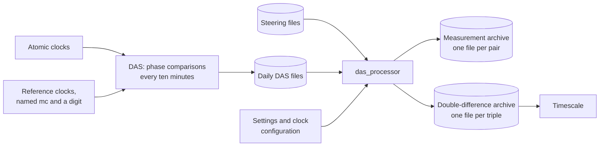

# masterclock

**Date:** 2026-10-05 02:27:34 UTC

masterclock is software for a timekeeping laboratory that runs many atomic clocks.
It turns the laboratory's raw, continuous record of clock comparisons into clean data that a timescale can be built from.
Its one program today is `das_processor`.

This page explains the subject for a reader new to it, says what is in the repository, and shows how to install, run and work on the project.
The [documents](#documents) at the end go into full detail.

## The subject in brief

### Clocks, and why one is never enough

An atomic clock produces a signal whose frequency is set by a transition inside an atom.
The laboratory runs several kinds:

| Kind of clock | What sets its frequency | What it does well | What it does poorly |
| --- | --- | --- | --- |
| Hydrogen maser | Hydrogen atoms in a storage bulb | Very steady from minutes to days | Its frequency drifts slowly over weeks |
| Cesium beam | A beam of cesium atoms | No drift; steady over months | Noisier than a maser over short times |
| Rubidium fountain | Rubidium atoms tossed upward in a vacuum | Very accurate over long times | Complex, so not always running |

Every clock runs at its own slightly different rate, and every clock wanders in its own way.
No single clock can be trusted on its own.
A *timescale* is a weighted average of many clocks, built so that it is steadier than any one of them.
Building one needs, for every clock, a long and clean record of how its time compares with the others.

### Phase, and how clocks are compared

Each clock puts out a 5 MHz sine wave.
Comparing two clocks means measuring how far apart their waves are in time: their *phase* difference.
One period of a 5 MHz wave lasts <!-- figure: PHASE_PERIOD -->200 000<!-- end figure --> picoseconds (ps).
A measurement can only say where in that period the difference falls, so a reading near the end of one period looks the same as a reading near the start of the next.
Putting back the whole periods a reading cannot show is called *decycling*.

```latex
\varphi = (x_a - x_b) \bmod P, \qquad P = 200\,000\ \mathrm{ps}
```

Here x_a and x_b are the times kept by clocks a and b, φ is what the instrument reads, and P is one period.

### The measurement system

The laboratory's Data Acquisition System (DAS) compares every clock with a small set of *reference* clocks once every ten minutes.
A reference is a steered output named `mc` and a digit.
*Steering* means deliberately changing a reference's phase or rate to keep it near the timescale; those changes are logged in steering files.
Each ten-minute interval is an *epoch*.
The DAS is built twice, as RF channels `a` and `b`, so every comparison is made twice by independent hardware.

The record runs for years, and it is never clean: there are gaps, restarted clocks, deliberate steering, instrument faults and sudden jumps.



### What das_processor does

`das_processor` reads the DAS's daily files, one ten-minute epoch at a time, and for every comparison:

1. puts back the whole periods each reading lost (decycling);
2. refers each reading back to the start of its epoch, so all readings of an epoch line up;
3. screens the reference clocks against each other and drops measurements that disagree;
4. finds and corrects readings that came out a whole period wrong;
5. runs a small estimator for every series, which follows the clock's phase, rate and drift, and rejects readings that do not fit;
6. combines measurements to compare every clock with every reference, near or far (a *double difference*);
7. appends one fixed-width row per epoch to the file of each series.

A *pair* (a, b) is reference a measured against clock b.
A *triple* (r, s, c) is clock c measured against reference r through c's local reference s.
The timescale reads the triples.

`das_processor` is built for being run every ten minutes by a scheduler, and equally for working through years of data in one run.
Both give byte-for-byte the same output files.

## What is in this repository

| Path | What it holds |
| --- | --- |
| `src/masterclock/app/` | What every program needs just to be a program: command line, settings, logging, errors, the run lock and signal handling. It knows nothing about clocks. |
| `src/masterclock/domain/` | The subject matter: phases, steering, the estimator, screening, slips and double differences. It reads and writes no files. |
| `src/masterclock/das_processor/` | The `das_processor` program: its settings, file formats, reading, recovery and the epoch loop. |
| `scripts/` | Tools for working on the project; each script's docstring says what it does and how to run it. |
| `tests/` | The tests, laid out as a mirror of `src/` and `scripts/`. |
| `docs/` | The documents listed below. |
| `etc/` | Configuration. Only the `.example` files, which hold invented values, are part of the repository. |

A test, `tests/masterclock/test_layout.py`, holds the packages to their layers: `app` imports nothing else of the project, `domain` imports only `app` and itself, and a program imports `app`, `domain` and itself.

## Installing

The project needs Python 3.14 and [uv](https://docs.astral.sh/uv/), which installs everything else from the committed lock file `uv.lock`.

```sh
git clone <repository> masterclock
cd masterclock
uv sync
```

Every command that runs project code goes through `uv run --frozen`, so the environment always matches the lock file.

## Running das_processor

```sh
uv run --frozen das_processor --help
uv run --frozen das_processor --config-file /srv/masterclock/etc/das_processor.ini --rf a
```

A run takes its settings from an INI file, the command line, or both, and needs a YAML file describing the clocks.
`etc/clock_config.yaml.example` is a complete example of the second, with invented values.
The [user manual](docs/das_processor/user_manual.md) explains every setting, how to schedule runs, how to catch up and reprocess, and how to read the output.

## Working on the project

The project holds itself to a strict standard, and every check runs on every commit through the hooks in `.pre-commit-config.yaml`:

| Check | Tool |
| --- | --- |
| Formatting | ruff format |
| Linting, including security rules | ruff check |
| Types, strictly | mypy |
| Security | bandit |
| Complexity | radon and xenon |
| A docstring on every module, class and function | `scripts/check_docstrings.py` |
| Tests, doctests and 100% line and branch coverage of `src`, `scripts` and `tests`, each reported on its own | pytest with coverage |
| Every test module passes on its own | `scripts/check_test_modules_alone.py` |
| The documents hold what the code gives, and their dates match git | `scripts/documents.py --check` |
| The lock file matches `pyproject.toml` | uv lock --check |

To run the checks by hand:

```sh
uv run --frozen pytest
uv run --frozen pre-commit run --all-files
```

A change starts with a test that fails for the reason the change exists.
mutmut, run by hand, tests the tests by changing the code in small ways and checking that some test fails each time.

### Keeping the documents true

Tables and numbers in the documents that come from the code sit between marker comments, which do not show when a document is read.
`scripts/documents.py` writes them from the code, and stamps the `**Date:**` line of every document that has changed:

```sh
uv run --frozen python scripts/documents.py .
```

The commit hook runs the same script with `--check`, and fails if any document no longer says what the code says.

## Documents

| Document | What it is for |
| --- | --- |
| [das_processor requirements](docs/das_processor/requirements.md) | What `das_processor` must do, as numbered requirements |
| [das_processor design](docs/das_processor/design.md) | How it does it: the data, the algorithms and the mathematics |
| [das_processor user manual](docs/das_processor/user_manual.md) | How to configure it, run it and read what it writes |
