# das_processor design

**Date:** 2026-10-05 20:53:32 UTC

This document describes how `das_processor` turns the laboratory's raw clock comparisons into the measurement and double-difference archives: the data, the algorithms, the mathematics and the files.
It is written for a reader new to the project; the [README](../../README.md) gives the subject in brief, and the [requirements](requirements.md) say what the program must do.
The code follows this document, and a change to either is made to both in the same commit.

## 1. Introduction

### 1.1 Purpose

das_processor conditions raw ten-minute phase comparisons between the 5 MHz outputs of a collection of atomic clocks: hydrogen masers, cesium beams and rubidium fountains.
For every reference and every clock it produces a stream of screened phase measurements, all aligned to the same instants, and the filtered state of each clock, for the timescale.

The outputs are two append-only archives.
The double-difference archive has one file per triple and is what the timescale reads.
The measurement archive has one file per pair and is an intermediate product that feeds the triples.

### 1.2 Scope

In scope:

- reading the DAS daily files and the steering files;
- decycling each pair measurement and referring it to its epoch start;
- reference screening, and the handling of outliers, steps and cycle slips;
- the estimator, for every pair and every triple;
- double differencing;
- writing the two archives, and run control.

Outside das_processor:

- the DAS itself;
- the computation of the steering applied to the references;
- the timescale algorithm;
- the offline characterization that chooses each clock's time constants, which §15.3 describes.

### 1.3 Invariants

An invariant is a property the program keeps at all times.
§17 says how each one is tested.

| ID | Invariant |
| --- | --- |
| I1 | Append-only. A row is never changed after it is written. A row is deleted only when the archives are kept in step: the rows of that epoch and of every later epoch are deleted from every file of the RF channel. |
| I2 | Contiguous. Every series has at most one row per epoch, in time order. Rows are missing only while the series is dormant with no measurement (§13.3), while a pair is disabled with no reading (§13.6), while a triple's s and c are not both placed in one building, or while the series' clock side has no entry in the clock configuration or is ignored (§15.2). |
| I3 | Lock-step. Each epoch's rows enter the day buffer together, all or none (§5.8), so the files are written one whole epoch at a time; a series with no row at an epoch (I2) adds none. |
| I4 | Self-contained rows. The work of epoch e reads only the DAS lines of epoch e, steering events in (E − T, E + T], the configuration, and the last row of each series: from its file, or from the day buffer when the same run processed epoch e − 1 (§5.8). |
| I5 | Deterministic. Identical inputs give byte-identical data files, whether a series of epochs is processed one epoch per run or all in one run, whether or not a run was interrupted, and with or without worker processes. No state carries between epochs except what the rows hold. Log files are not compared. |
| I6 | In order. Epochs are processed in strictly increasing order and none is skipped. |
| I7 | Whole-number phase. Every phase is a whole number of picoseconds, except the estimator's phase x, a whole number of femtoseconds. Where a phase is combined with a float, the sum is formed exactly and rounded once, ties to even (§2.5). |
| I8 | Atomic write. Everything that can be checked is checked before the first byte is written (§5.8). A run that stops before its final write has flushed every file leaves its write journal, and the next run rolls every file back to before the first epoch the journal names (§6.7). A damaged line found when a run starts cuts every file back to the last good row of the earliest damaged file, and the rows after it are computed again, byte for byte; with no write stopped part way, a file that holds no whole row, or whose first row is damaged, stops the run with no file changed. |

### 1.4 Document conventions

Pseudocode is Python 3.14 and shows the algorithm.
The code follows the project's standards (§4.4), so it is split into smaller functions and carries checks the pseudocode leaves out.
Data entering from outside is checked by pydantic models where it enters, and the values passed between steps are frozen dataclasses or named tuples (§4.3), so where the pseudocode assigns to a field of a row, the code builds a new row instead.
The one exception is the row being built for an epoch: a `RowDraft` in `domain/filter.py`, which each step changes in place, and from which `finish` builds the row once and checks it with `check_row` in `domain/series.py`.
A helper not defined in the text is a one-line accessor whose behaviour follows from its name.
"§n" refers to section n of this document.
Tables and numbers taken from the code are written from it by `scripts/documents.py`, and the commit check fails when one no longer matches.

## 2. Notation, units and numeric conventions

### 2.1 Sign convention

A measurement pair (a, b) is the phase of reference a relative to clock or reference b:

```latex
z(a,b) = x_a - x_b \quad [\mathrm{ps}]
```

Every derived quantity keeps this convention.
A triple (r, s, c) is a measurement of x_r − x_c.

### 2.2 Units

| Quantity | Unit | Note |
| --- | --- | --- |
| Phase: φ, z, x, offsets | ps | A whole number in the files; x to the femtosecond (§2.5) |
| Time within an epoch: δ, t | s | |
| Rate: y | ps/s | Fractional frequency × 10¹² |
| Drift: d | ps/s² | |
| Counts: epochs_in_segment, epochs_since_accept, consecutive_rejects, M, M_σ, G_max, N_break | epochs | One epoch is T = <!-- figure: EPOCH_SECONDS -->600<!-- end figure --> s |
| Instants | UTC datetime | The MJD is written beside it for people to read |

### 2.3 Symbols

| Symbol | Meaning |
| --- | --- |
| T | Epoch length, <!-- figure: EPOCH_SECONDS -->600<!-- end figure --> s |
| P | One period of the 5 MHz signal, <!-- figure: PHASE_PERIOD -->200 000<!-- end figure --> ps |
| E | Epoch start: the ten-minute mark, `interpolated_datetime` |
| δ | Measurement time after E, 0 ≤ δ < T |
| φ | Measured phase, `measured_phase`, 0 ≤ φ ≤ <!-- figure: PHASE_MAX -->199 999<!-- end figure --> |
| n | Cycle count: whole periods added to φ |
| x_u | Decycled phase at the measurement time, φ + nP |
| w(t) | Steering applied between E and the measurement time |
| z_E | Decycled phase referred back to E: the measurement given to the estimator |
| X = (x, y, d) | Estimator state at E: phase, rate, drift |
| X⁻ | Predicted state at E, before the update |
| Φ | State transition matrix over one epoch |
| u | Known input: reference steering over the previous epoch |
| g, h, k | Estimator gains |
| λ | Estimator pole, e^(−1/M) |
| M | Estimator time constant, epochs |
| M_σ | Averaging constant of the innovation scale, epochs |
| ν | Innovation, z_E − x⁻ |
| σ_ν | Innovation scale |
| σ_dd | Measurement σ of a double difference |
| Δ_step | Accepted phase step |
| ρ, r̄, C, D | Screening and slip statistics (§10, §11) |
| (a, b) | Pair: reference a measured against b |
| (r, s, c) | Triple: remote reference r, reference s local to c, clock c |

### 2.4 Time and epochs

Time follows the project's `das_processor/epochs.py` and `app/timeutil.py` modules.

- Measurement time: `DASMeasurement` works out `measurement_datetime` from the MJD the DAS writes.
- Epoch start: `floor_to_ten_minutes` gives E, which `DASMeasurement` and `DASData` carry as `interpolated_datetime`, with `interpolated_mjd` beside it.
- Comparisons: every lookup of a series' row by epoch, and every comparison of epochs in the estimator and the files, uses the `interpolated_datetime` mark. The DAS reader also compares MJDs as the DAS wrote them, to check a line's day and order and to find where reading starts.
- Offsets: δ = `measurement_datetime` − `interpolated_datetime`, in seconds. Datetime arithmetic is exact to the microsecond, and δ is kept as an exact fraction of seconds (§2.5). The DAS writes six decimal places of MJD, which is 86.4 ms.
- In the files: each epoch is written with `format_epoch`, as the UTC mark and its MJD.

### 2.5 Numeric types and rounding

A float holds every whole number only up to 2⁵³, and a sum done in floats rounds at every step.
Phases run to millions of picoseconds and are summed every epoch for years, so they are held exactly.

- Phases are Python whole numbers, in the files and in memory: φ, z_E, dd, step_offset and Δ_step in picoseconds, and the estimator's phase x in femtoseconds (<!-- figure: FS_PER_PS -->1000<!-- end figure --> to a picosecond). x is held more finely because the next prediction starts from it: a series' rate moves its phase by a fraction of a picosecond each epoch, and a stored x rounded to whole picoseconds would bring that rounding back every epoch, which a 3-state estimator takes into its rate and drift.
- Rates, drifts, gains and scales are floats: y, d, g, h, k, σ_ν and σ_dd.
- Mixed sums: a phase combined with a float term, such as x⁻ = x + yT + ½dT² or x = x⁻ + gν, is formed as a `gmpy2.mpq`, an exact rational number. An mpq holds every float exactly, so the sum is exact at any size. A float is made an mpq before it is combined with one, since an mpq and a float together give an inexact float. Values such as x⁻, x̂(t), w(t) and ν stay exact within the epoch.
- `round_even(v)` rounds an exact value to the nearest whole number, a tie to the even one. A phase is rounded once, when it becomes z_E, a stored x, dd or Δ_step.
- Time offsets in seconds are taken from datetimes as a whole number of microseconds, so they are exact too.
- Statistics: the screening and slip statistics (§10, §11) and the innovation scale update (§9.2) may be floats. They decide whether a measurement is used, and never become a phase.
- Float columns are written as `{:+.16e}`, seventeen significant digits, which give every float back exactly when read (I5). An innovation is written as the float of the exact value.
- A value that is not finite raises `FilterError` (§16).

## 3. Measurement topology

This section describes what the DAS measures and how das_processor names and organizes it.

### 3.1 References and clocks

A reference is the steered output of a generator driven by a hydrogen maser, named <!-- figure: REFERENCE_PREFIX -->`mc`<!-- end figure --> and one digit.
A reference is its own clock type, <!-- figure: REFERENCE_TYPE -->`mc`<!-- end figure -->, with noise distinct from that of the maser that drives it.
At each epoch, the reference set REFS(e) is every clock in that epoch's DAS data whose name is a reference's, but for a reference the clock configuration disables then (§13.6).
A name that only starts with `mc` is not a reference's.

```python
def refs_of(das_block):
    """REFS(e): every clock of the epoch's block named as a reference: 'mc' and one digit."""
    return frozenset(
        das_measurement.clock
        for das_measurement in das_block.measurements
        if is_reference(das_measurement.clock)
    )
```

The DAS measures once every ten minutes.
Each reference is measured against itself and against every other reference, and each clock against at least one reference.
Measurements are made one after another, so each has its own time within the epoch.

The measurement system is built twice, as RF channel `a` and RF channel `b`.
Both measure the same references and clocks, each with its own DAS files.
das_processor processes one RF channel per run (`--rf`), with its own files, lock and state.
The two channels never share a row, a prediction or a screening decision, and every file carries its channel in its name: a data file starts with `das_a` or `das_b`, and the lock and journal are `das_processor_a` or `das_processor_b`.
The names (mc2, hm7), mc2-hm7 and mc2.hm7 all name the pair whose measurement file in channel a is `das_a.mc2.hm7.dat`.

### 3.2 Pairs

A pair (a, b) exists for every reference a and clock b that appear together in the DAS data.
Clock b may itself be a reference.

| Kind | Form | Role |
| --- | --- | --- |
| Self | (r, r) | Health check of the measurement system (§10.1) |
| Link | (r, s), r ≠ s, both references | Comparisons of references, for triples and screening |
| Clock | (s, c), c not a reference | Measurements of the clocks |

The self pair (r, r) compares reference r with itself through the measurement system.
Both inputs carry the same signal, so any change in (r, r) comes from the measurement system, never from a clock.
It has three roles:

1. A health check of r's measurement system. A jump in (r, r) means r's measurement path shifted, for example a delay changed in a comparator or a distribution amplifier. The same shift appears in every pair measured against r, and §10.1 excludes, for that epoch, only the pairs of r that show it.
2. The noise floor. Its scatter is the measurement system's own noise, free of clock noise.
3. Local triples. Because (r, r) always exists, the definition of a triple needs no special case, and a clock local to r gets the triple (r, r, c), whose link term cancels exactly (§12.4).

### 3.3 Triples

A clock is measured against the references in its own building.
To compare it with a reference elsewhere, das_processor adds the two-way comparison of the two references to the clock's local measurement.

```latex
\mathcal{T} = \left\{ (r, s, c) \;:\; r \in \mathrm{REFS},\; (s,c) \text{ is a pair},\; (r,s),\,(s,r) \text{ are pairs},\; \mathrm{loc}_E(s) = \mathrm{loc}_E(c) \neq \text{none} \right\}
```

A triple (r, s, c) adds the two-way comparison of r and s to the pair (s, c), whatever c is.
The result is a measurement of x_r − x_c (§12).
When r = s it is a local triple and comes out as the pair (r, c) exactly (§12.4); both (r, s) and (s, r) are then the self pair (r, r), which always exists.
A triple is in an epoch only while s and c are in the same building at that epoch: loc_E is a clock's location at E as the clock configuration gives it (§15.2).
A clock with no location has no triple through it, as s or as c; r may be in any building.

The local triple (r, r, c) has three roles:

1. One path to the timescale. Every measurement of a clock against r reaches the timescale as a triple, whether the clock is local or remote, so the timescale reads one archive in one format (§4.1, §14).
2. The same treatment. A local clock's measurement passes through the same code, estimator and flags as a remote one, so local and remote measurements of r can be compared directly.
3. A check built in. The local triple evaluates the general double-difference formula, which must give z(r, c) exactly. Every epoch, every local triple checks that code, and a mismatch stops the run (§12.4).

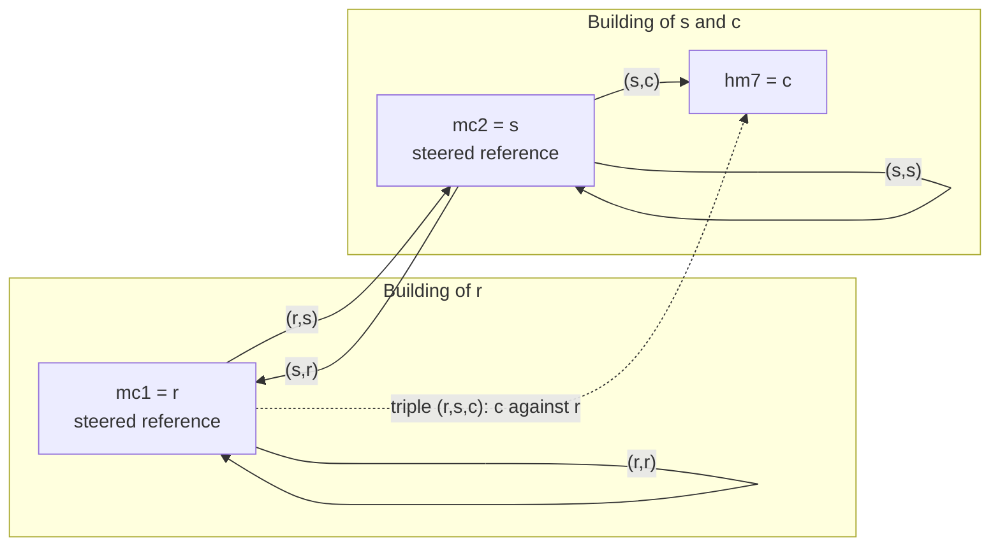

How many series there are follows from these rules.
With R references all measured against each other and C clocks each measured against one reference, all in one building, there are R² + C pairs and R(R² + C) triples: every pair, a link or a self pair as much as a clock pair, through each reference.
For example, 3 references and 20 clocks give 29 pairs and 87 triples.
A triple whose clock is a reference carries what the measurement system adds: (r, r, r) is the self pair's noise, and (r, s, r) half the round trip of the link between r and s.

### 3.4 Series registry

The registry is the set of pairs and triples that exist at an epoch.
Each epoch rebuilds it from the series that already exist, the epoch's DAS data, its references, and every clock's location at the epoch.

- A series whose clock side, its last name, has no entry in the clock configuration, or is ignored, is left out of every epoch (§15.2).
- A new pair is created at the first epoch with a measurement for it. It starts dormant and starts its estimator once it acquires (§13.3).
- A new triple is created at the first epoch at which the definition in §3.3 holds, and writes its first row at its first measurement. It also starts dormant.
- A series is never removed. When its measurements stop, it goes on with predicted rows up to its gap limit, and then writes no row until it is measured again (§13.3). A triple whose s and c are not in one building, or one of which has no location, is left out of the epoch and writes no row; when they are in one building again, it starts cold, in the segment after its file's last row's (§6.7).

```python
def build_registry(das_block, refs, earlier_series, locations):
    pairs = set(earlier_series.pairs)
    for das_measurement in das_block.measurements:
        pairs.add((das_measurement.reference, das_measurement.clock))
    triples = set(earlier_series.triples)
    # Every pair seeds triples, a link or self pair too; for r = s, (r, s) is
    # the self pair (r, r).
    for s, c in pairs:
        for r in refs:
            if (r, s) in pairs and (s, r) in pairs:
                triples.add((r, s, c))
    # s and c both placed, in one building (§3.3).
    triples = {
        (r, s, c)
        for r, s, c in triples
        if locations.get(s) is not None and locations.get(s) == locations.get(c)
    }
    # Sorted, so the order is the same every time (I5).
    return tuple(sorted(pairs)), tuple(sorted(triples))
```

## 4. Software architecture

### 4.1 Pipeline

The pipeline runs in one direction.
Every clock reaches the timescale through triples, a clock local to r through its local triple (r, r, c).
The measurement archive feeds only the triples.

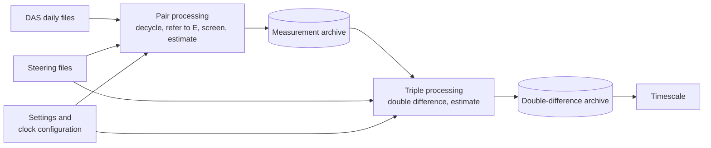

### 4.2 Packages and modules

das_processor follows the project's layers, which `tests/masterclock/test_layout.py` enforces:

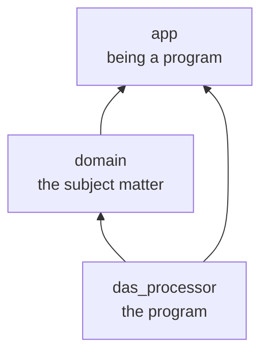

- `app/` holds what any program needs just to be a program, and imports nothing else of the project.
- `domain/` holds the subject matter, the measurements and the clocks, and imports only `app/` and itself. It reads and writes no file and logs no data; its functions take and give plain values.
- `das_processor/` is the program. It imports `app/`, `domain/` and itself, never another program.

Every module, with the first paragraph of its docstring:

<!-- generated: modules -->

| Package | Module | What it holds |
| --- | --- | --- |
| app | (the package) | The modules every masterclock program shares. |
| app | `cli` | The command line every program in the project shares. |
| app | `config` | Merging a program's settings from its file and its command line. |
| app | `exceptions` | What can go wrong, and how a failure describes itself. |
| app | `lock` | Keeping two runs from writing the same output at once. |
| app | `log` | Application logging built on the standard `logging` module. |
| app | `shutdown` | Graceful-shutdown signal handling. |
| app | `timeutil` | Datetime conversion utilities. |
| domain | (the package) | The subject matter: the measurements and the clocks, not any one program. |
| domain | `double_difference` | Double differences: a clock measured against a remote reference. |
| domain | `exceptions` | The errors of the subject matter: the measurements and the clocks. |
| domain | `filter` | The forward estimator every pair and triple runs, and the rows it writes. |
| domain | `measurements` | What each series measured at an epoch, as the two output files record it. |
| domain | `phase` | The phase of a 5 MHz signal, as the measurements give it, and exact sums of it. |
| domain | `references` | How the reference clocks are named. |
| domain | `screening` | Screening of the reference measurements before any pair is filtered. |
| domain | `series` | What one series of the forward estimator holds: its state, settings and rows. |
| domain | `slips` | The cross-reference cycle-slip check: a wrong whole period, found and put right. |
| domain | `steering` | Steering of the reference clocks: a known input to every series they are in. |
| das_processor | (the package) | das_processor: the masterclock program that conditions the DAS phase data. |
| das_processor | `__main__` | Run das_processor with `python -m masterclock.das_processor`. |
| das_processor | `channels` | The RF channels of the DAS, one of which a run processes. |
| das_processor | `cli` | The command line of das_processor. |
| das_processor | `clock_config` | The clock configuration: each clock's estimator settings and each pair's RMS limit. |
| das_processor | `config` | das_processor's settings, merged from its INI file and its command line. |
| das_processor | `epochs` | The ten-minute epochs das_processor steps through, and their text. |
| das_processor | `exceptions` | The errors of das_processor: its data files, and its worker processes. |
| das_processor | `files` | The two output files: their columns, headers and rows. |
| das_processor | `read_cd5m5m` | Reading DAS 5 MHz phase measurement files. |
| das_processor | `read_steering` | The steering files: what was done to each reference clock, and when. |
| das_processor | `registry` | The series registry: which pairs and triples exist at an epoch, and their files. |
| das_processor | `run` | Running das_processor: the start of a run, each epoch, the loop, the log. |
| das_processor | `workers` | Working an epoch's series in worker processes (design 6.8). |

<!-- end generated -->

### 4.3 Data structures

Data that enters from outside is checked where it enters by frozen pydantic models that refuse unknown fields: the command line and the configuration files, the DAS lines (`DASMeasurement`, `DASData`), the steering files, and rows read back from the output files.
The values passed between the steps are frozen dataclasses or named tuples, built without checks from values already checked; the few objects that hold a run's working state, such as the day buffer and the worker pool, change as the run goes.
A row alone is checked against the rules a row keeps (`check_row`, `domain/series.py`), when the estimator finishes it and when it is read back.
A value a record works out from its other fields is a property or, in a pydantic model, a field filled in when the record is built; either way it may not be passed in.

```python
type PairKey = tuple[str, str]  # (a, b)
type TripleKey = tuple[str, str, str]  # (r, s, c)
type SeriesKey = PairKey | TripleKey


@dataclass(frozen=True, slots=True)
class SteerEvent:
    applied_datetime: datetime  # with its timezone
    dx: float  # ps: change applied to the reference's phase
    dy: float  # ps/s: change applied to the reference's rate


@dataclass(frozen=True, slots=True)
class SeriesParams:  # everything one series needs this epoch (§8.1, §15.2)
    filter_states: int  # 1, 2 or 3
    M: float | None  # None for a 1-state series
    M_sigma: float
    sigma0: float
    gmax: int
    n_break: int
    rms_max: int | None  # pairs only
    disabled: bool  # a pair one of whose clocks is disabled; never a triple (§13.6)


@dataclass(frozen=True, slots=True)
class Epoch:  # everything one epoch needs (§6.3)
    interpolated_datetime: datetime  # E
    das_block: DASData | None  # None: the DAS measured nothing this epoch
    refs: frozenset[str]  # REFS(e)
    # Each reference's steering events in (E - T, E + T].
    steering: dict[str, tuple[SteerEvent, ...]]
    pairs: tuple[PairKey, ...]
    triples: tuple[TripleKey, ...]
    series_params: dict[SeriesKey, SeriesParams]  # every series at E
    locations: dict[str, int | None]  # every clock's building at E (§15.2)
    # The clocks the configuration neither names nor ignores.
    clocks_without_entry: frozenset[str]
    disabled: frozenset[str]  # the clocks disabled at E (§13.6)


@dataclass(frozen=True, slots=True)
class State:
    x: mpq  # exact within the epoch; rounded once when stored (§2.5)
    y: float
    d: float = 0.0  # always 0.0 for a 1- or 2-state estimator


@dataclass(frozen=True, slots=True)
class DisabledReading:  # a disabled pair's reading, never decycled (§13.6)
    measurement_mjd: float  # as the DAS gave it
    measured_phase: int
    rms: int
    z: int | None  # carried from the pair's newest row


@dataclass(frozen=True, slots=True)
class PairMeasurement:  # one measurement file row (§5.4)
    measurement_mjd: float  # as the DAS gave it
    measured_phase: int  # the reading φ, ps
    rms: int
    cycle_count: int
    z: int
    slip: bool = False
    # measurement_datetime, interpolated_datetime and delta are properties,
    # worked out from the MJD.


@dataclass(frozen=True, slots=True)
class TripleMeasurement:  # one double-difference file row (§5.5)
    z: int
    double_difference_sigma: float
    components_used: Literal["111", "110", "101"]
    pair_cold_started: bool  # a pair it was built from restarted this epoch


@dataclass(frozen=True, slots=True)
class Row:  # the estimator columns of a row (§5.4, §5.5)
    interpolated_datetime: datetime
    innovation: float | None  # z - x⁻; None without a measurement or a prediction
    x_fs: int | None  # whole femtoseconds (§2.5)
    y: float | None
    d: float | None
    innovation_scale: float | None
    segment: int
    step_offset: int
    epochs_in_segment: int
    epochs_since_accept: int
    consecutive_rejects: int
    # At most three (epoch, value), oldest first.
    rejects: tuple[tuple[datetime, float], ...]
    filter_states: int
    time_constant: float | None  # None for a 1-state series
    scale_time_constant: float
    flags: str
```

`State`, `SeriesParams` and `Row` are in `domain/series.py`.
Whether a row is a cold start is not a field of the row: `filter_step` gives it beside the row, in a `StepResult`, and §12.6 reads it there.
The filter step takes a series' measurement as a `FilterInput`: z, a pair's rms or a triple's σ_dd, the slip mark, and whether a pair the triple was built from restarted.
Screening gives a `Screening`, the slip check a `Slips`, and a double difference a `TripleValue`, each holding plain values and the events das_processor logs.

### 4.4 Code standards

The project's code standards apply to every module:

- Typing: mypy in strict mode, with the pydantic plugin; every function, attribute and module variable annotated.
- Constants: every module-level constant is `Final`, with a docstring of its own.
- Docstrings: the numpy convention on every module, class and function, checked by ruff and by `scripts/check_docstrings.py`.
- Complexity: McCabe 12 at most per function; xenon rank B at most per block, rank A per module and on average. The longer algorithms below, such as `filter_step`, `screen_references` and `slip_check`, are split along their numbered steps.
- Errors: every error the project defines is a subclass of `MasterClockError`, kept in its package's `exceptions` module, and a function that raises one logs it first, at ERROR (§16.1 gives the exceptions). A few internal checks raise `ValueError` for a value no input can give.
- Paths: every path is absolute.
- Lint and security: ruff with the project's rule set, and bandit.
- Dependencies: the standard library and the run-time packages in `pyproject.toml`: pydantic, PyYAML and gmpy2.

## 5. Files and formats

### 5.1 Directory layout

```
<processed_path>/                              [PROCESSED] processed_path (§15.1)
    meas/das_<rf>.<a>.<b>.dat                  measurement files, one per pair
    ddiff/das_<rf>.<r>.<s>.<c>.dat             double-difference files, one per triple
    das_processor_<rf>.lock                    run lock of RF channel <rf>
    das_processor_<rf>.writing                 write journal, there from a run's first write until its final write has flushed every file
<cd5m5m_path>/cd5m5m_<MJD>.dat                 DAS daily files, read only
<steering_path>/steer_<mc>.dat                 steering files, read only, shared by both RF channels
```

The files of one subdirectory form an archive: the measurement archive and the double-difference archive.
A series' file is named for its channel and its key (`series_file` in `das_processor/registry.py`), and the series that exist before a run are read back from the names of the channel's files (`series_key_of`, `existing_series`); other channels' files and other names are left out.
A clock name that is empty or holds a dot or a slash cannot name a file that reads back as the same key, and raises `DataFileError`.

### 5.2 Fixed-width line format

Every line of an output file has the same width W, fixed for each kind of file, not counting the newline:

<!-- generated: line-widths -->

| File | Line width W (characters, newline not counted) | Header lines |
| --- | --- | --- |
| Measurement file | 477 | 33 |
| Double-difference file | 455 | 31 |

<!-- end generated -->

Fixed-width lines make a file's soundness a matter of arithmetic, and let the program find any row by its position.

- Characters and lines: ASCII only. Every line ends with `\n`.
- Header: lines starting with `#`, padded with spaces to W, written once with the file's first row. In order: the kind of file and its format version; a warning not to modify the file; the RF channel and the pair or triple; the series in words; the line format; then one line per column with its name and meaning. The header is for people; the program never reads it.
- Columns: each column is exactly as wide as its values need (§5.4, §5.5). Values are right-justified, and columns are separated by a comma and one space.
- Empty field: `-`, right-justified.
- Overflow: a value too wide for its column raises `DataFileError` while the row is formatted, before anything is written (§5.8).
- Reading back: a row read from a file is formatted again and refused unless it gives back exactly the same line, so a row is accepted only in the one form das_processor writes. The measurement file holds no innovation, so a measurement row reads back without one; a triple's cold-start mark is not written either.

A file is *sound* when its length is exactly (h + n)(W + 1) bytes for its h header lines and n ≥ 1 rows, and its last row is good: a whole line, ending in its newline, that parses.
The program checks every file when a run starts.
A sound file is found with one short read of its last line.
A file that is not sound is *damaged*: it is scanned for its first line that is not a good row, and every file of the channel is cut back to the row before it, so the files stay in step. With no write stopped part way, a file that holds no whole row, or whose first row is damaged, stops the run; after a stopped write such a file is deleted (§6.7).

### 5.3 DAS daily files (input)

The DAS writes one file per MJD day, <!-- figure: DATA_FILE_TEMPLATE -->`cd5m5m_<mjd>.dat`<!-- end figure --> in `cd5m5m_path`, and appends to it as it measures.
`das_processor/read_cd5m5m.py` reads them.

```
<MJD> <phase> <RMS> <switch> <clock>
60941.000417    140585   26 1K05 hm7
```

| Column | `DASMeasurement` field | Rule |
| --- | --- | --- |
| MJD | measurement_mjd | Five digits, a point and six decimals; any other form is malformed, and an MJD on another day than the file's is refused as `wrong-day` |
| phase | measured_phase | A whole number from 0 to <!-- figure: PHASE_MAX -->199 999<!-- end figure --> |
| RMS | rms | A whole number from 0 to <!-- figure: RMS_MAX -->9999<!-- end figure -->, ps, the most its column holds |
| switch | switch | A reference digit, a switch letter and a two-digit port |
| clock | clock | The measured clock |

`DASMeasurement` works out `reference` as `mc` and the switch's leading digit, so `1K05` was measured against mc1.
It also works out `measurement_datetime`, `interpolated_datetime` and `interpolated_mjd`.

A line that cannot be believed is skipped and logged at WARNING under the word that says why:

<!-- generated: refused-lines -->

| Word in the log | Why the line is refused |
| --- | --- |
| `malformed` | Raised when a line cannot be read as a record at all. |
| `inconsistent` | Raised when a line's columns contradict each other. |
| `wrong-day` | Raised when a measurement falls outside the day its file is named for. |
| `out-of-order` | Raised when a measurement is earlier than the one accepted before it. |
| `duplicate` | Raised when a reference-clock pair is measured twice in one epoch. |
| `late` | Raised when a measurement was taken too near the end of its epoch. |

<!-- end generated -->

The DAS file has no columns that could contradict each other, so no line is refused as `inconsistent` today; the word is there for a format that has such columns.
A line too near the end of its epoch is one taken within <!-- figure: EPOCH_EDGE -->10 s<!-- end figure --> of the next mark: its values are recorded against its own epoch's start, nearly a whole epoch away.
A skipped line is not remembered: it sets neither the time the next line is compared with nor the pairs seen in its epoch.
A line that parses and was measured against a reference das_processor does not use, <!-- figure: SKIPPED_REFERENCES -->`mc9`<!-- end figure -->, is skipped before these checks with nothing logged.
A last line with no newline makes the whole file malformed and raises `DataFileError`, since the line may be cut short.
`read_all_blocks(cd5m5m_path, start_at_mjd)` gives one `DASData` per epoch that has measurements, in order, the daily files read one after another as one stream.

### 5.4 Measurement file (output)

Path: `meas/das_<rf>.<a>.<b>.dat`, for example `meas/das_a.mc2.hm7.dat`.
One row per epoch holds the pair's measurement, decycled and referred to E (§7), and its estimator state at E (§8, §9, §13).

<!-- generated: meas-columns -->

| # | Column | Width (characters) | What it holds |
| --- | --- | --- | --- |
| 1 | `interpolated_datetime` | 25 | epoch start E, UTC |
| 2 | `interpolated_mjd` | 13 | epoch start E, MJD |
| 3 | `measurement_datetime` | 32 | measurement time, UTC |
| 4 | `measurement_mjd` | 13 | measurement time, MJD |
| 5 | `measured_phase` | 6 | raw phase from the DAS, ps |
| 6 | `rms` | 4 | RMS from the DAS, ps |
| 7 | `cycle_count` | 12 | whole periods added in decycling; - when disabled |
| 8 | `z` | 16 | decycled phase interpolated to E, ps |
| 9 | `x` | 20 | estimated phase at E, ps, to the femtosecond |
| 10 | `y` | 23 | estimated rate, ps/s |
| 11 | `d` | 23 | estimated drift, ps/s^2; 0 for a 1- or 2-state estimator |
| 12 | `innovation_scale` | 23 | innovation scale, ps |
| 13 | `segment` | 9 | segment number |
| 14 | `step_offset` | 16 | sum of phase steps in this segment, ps |
| 15 | `epochs_in_segment` | 9 | rows since the segment started |
| 16 | `epochs_since_accept` | 9 | rows since the last accepted measurement, not counting dormant rows that buffer a measurement |
| 17 | `consecutive_rejects` | 9 | consecutive counted rejects |
| 18 | `reject1_mjd` | 13 | reject buffer, oldest: epoch start, MJD |
| 19 | `reject1_innovation` | 23 | reject buffer, oldest: innovation, ps |
| 20 | `reject2_mjd` | 13 | reject buffer, middle: epoch start, MJD |
| 21 | `reject2_innovation` | 23 | reject buffer, middle: innovation, ps |
| 22 | `reject3_mjd` | 13 | reject buffer, newest: epoch start, MJD |
| 23 | `reject3_innovation` | 23 | reject buffer, newest: innovation, ps |
| 24 | `filter_states` | 1 | estimator states: 1, 2 or 3 |
| 25 | `time_constant` | 23 | estimator time constant, epochs |
| 26 | `scale_time_constant` | 23 | innovation-scale averaging constant, epochs |
| 27 | `flags` | 8 | A accepted, R rejected, X excluded, P predicted, O disabled, D dormant, S slip corrected, N new segment, U unsettled |

<!-- end generated -->

The measurement columns, from `measurement_datetime` to `z`, are empty on a row with no measurement.
On a disabled pair's row (O), `cycle_count` is empty, since the reading is not decycled, and `z` is carried from the pair's newest row, or empty when that row has none (§13.6).
`x`, `y`, `d` and `innovation_scale` are empty on a dormant row.
A reject slot not in use is empty.
While a series is dormant, the reject slots hold the measurements it has gathered, as (epoch, z), instead of rejected innovations (§13.3).
`time_constant` is empty for a 1-state series.
The flags a row can carry, in the order a row writes them:

<!-- generated: flags -->

| Flag | Meaning |
| --- | --- |
| `A` | accepted |
| `R` | rejected |
| `X` | excluded |
| `P` | predicted |
| `O` | disabled |
| `D` | dormant |
| `S` | slip corrected |
| `N` | new segment |
| `U` | unsettled |

<!-- end generated -->

Every row carries exactly one of A, R, X, P and O; D can stand with P, R or X, and O stands alone.
When each flag is set:

| Flag | When it is set |
| --- | --- |
| A | The measurement updated the state; a cold start too |
| R | Rejected by the gate, and counted (§9); with D, the measurement went to the acquisition buffer (§13.3) |
| X | Excluded by screening or the slip check, inside the gate, and not counted (§9.5) |
| P | No measurement at this epoch |
| O | The pair is disabled (§13.6): no state, no innovation, and no other flag |
| D | No valid state: x, y, d and innovation_scale are empty |
| S | The slip check corrected the cycle count (§11) |
| N | A new segment starts at this row |
| U | Unsettled: the segment has run fewer than <!-- figure: SETTLE_FACTOR -->5<!-- end figure --> times M rows (§8.8) |

The header of a measurement file:

<!-- generated: meas-header -->

```text
# das_processor measurement file, format 1
# WARNING: do not modify this file. Only das_processor may write it; any other change damages the archive.
# RF channel a. Pair (mc2, hm7).
# Reference mc2 measured against clock hm7.
# One row per 10-minute epoch; '-' marks an empty field.
# Columns: right-justified, fixed width, separated by ', '.
#   interpolated_datetime   epoch start E, UTC
#   interpolated_mjd        epoch start E, MJD
#   measurement_datetime    measurement time, UTC
#   measurement_mjd         measurement time, MJD
#   measured_phase          raw phase from the DAS, ps
#   rms                     RMS from the DAS, ps
#   cycle_count             whole periods added in decycling; - when disabled
#   z                       decycled phase interpolated to E, ps
#   x                       estimated phase at E, ps, to the femtosecond
#   y                       estimated rate, ps/s
#   d                       estimated drift, ps/s^2; 0 for a 1- or 2-state estimator
#   innovation_scale        innovation scale, ps
#   segment                 segment number
#   step_offset             sum of phase steps in this segment, ps
#   epochs_in_segment       rows since the segment started
#   epochs_since_accept     rows since the last accepted measurement, not counting dormant rows that buffer a measurement
#   consecutive_rejects     consecutive counted rejects
#   reject1_mjd             reject buffer, oldest: epoch start, MJD
#   reject1_innovation      reject buffer, oldest: innovation, ps
#   reject2_mjd             reject buffer, middle: epoch start, MJD
#   reject2_innovation      reject buffer, middle: innovation, ps
#   reject3_mjd             reject buffer, newest: epoch start, MJD
#   reject3_innovation      reject buffer, newest: innovation, ps
#   filter_states           estimator states: 1, 2 or 3
#   time_constant           estimator time constant, epochs
#   scale_time_constant     innovation-scale averaging constant, epochs
#   flags                   A accepted, R rejected, X excluded, P predicted, O disabled, D dormant, S slip corrected, N new segment, U unsettled
```

<!-- end generated -->

Appendix A shows rows, worked out by the program.

### 5.5 Double-difference file (output)

Path: `ddiff/das_<rf>.<r>.<s>.<c>.dat`, for example `ddiff/das_a.mc1.mc2.hm7.dat`.
One row per epoch holds the triple's double difference (§12) and its estimator state at E.

<!-- generated: ddiff-columns -->

| # | Column | Width (characters) | What it holds |
| --- | --- | --- | --- |
| 1 | `interpolated_datetime` | 25 | epoch start E, UTC |
| 2 | `interpolated_mjd` | 13 | epoch start E, MJD |
| 3 | `z` | 16 | double difference dd at E, ps |
| 4 | `innovation` | 23 | innovation: z minus the prediction, ps |
| 5 | `double_difference_sigma` | 23 | measurement sigma of dd, ps |
| 6 | `components_used` | 3 | components used: (s,c) (r,s) (s,r) |
| 7 | `x` | 20 | estimated phase at E, ps, to the femtosecond |
| 8 | `y` | 23 | estimated rate, ps/s |
| 9 | `d` | 23 | estimated drift, ps/s^2; 0 for a 1- or 2-state estimator |
| 10 | `innovation_scale` | 23 | innovation scale, ps |
| 11 | `segment` | 9 | segment number |
| 12 | `step_offset` | 16 | sum of phase steps in this segment, ps |
| 13 | `epochs_in_segment` | 9 | rows since the segment started |
| 14 | `epochs_since_accept` | 9 | rows since the last accepted measurement, not counting dormant rows that buffer a measurement |
| 15 | `consecutive_rejects` | 9 | consecutive counted rejects |
| 16 | `reject1_mjd` | 13 | reject buffer, oldest: epoch start, MJD |
| 17 | `reject1_innovation` | 23 | reject buffer, oldest: innovation, ps |
| 18 | `reject2_mjd` | 13 | reject buffer, middle: epoch start, MJD |
| 19 | `reject2_innovation` | 23 | reject buffer, middle: innovation, ps |
| 20 | `reject3_mjd` | 13 | reject buffer, newest: epoch start, MJD |
| 21 | `reject3_innovation` | 23 | reject buffer, newest: innovation, ps |
| 22 | `filter_states` | 1 | estimator states: 1, 2 or 3 |
| 23 | `time_constant` | 23 | estimator time constant, epochs |
| 24 | `scale_time_constant` | 23 | innovation-scale averaging constant, epochs |
| 25 | `flags` | 8 | A accepted, R rejected, X excluded, P predicted, O disabled, D dormant, S slip corrected, N new segment, U unsettled |

<!-- end generated -->

`z`, `double_difference_sigma` and `components_used` are empty on a row with no measurement, and `innovation` also on one with no prediction.
The flags are as for a measurement file; S never appears.

The header of a double-difference file:

<!-- generated: ddiff-header -->

```text
# das_processor double-difference file, format 1
# WARNING: do not modify this file. Only das_processor may write it; any other change damages the archive.
# RF channel a. Triple (mc1, mc2, hm7).
# Clock hm7 against remote reference mc1, through local reference mc2.
# One row per 10-minute epoch; '-' marks an empty field.
# Columns: right-justified, fixed width, separated by ', '.
#   interpolated_datetime   epoch start E, UTC
#   interpolated_mjd        epoch start E, MJD
#   z                       double difference dd at E, ps
#   innovation              innovation: z minus the prediction, ps
#   double_difference_sigma measurement sigma of dd, ps
#   components_used         components used: (s,c) (r,s) (s,r)
#   x                       estimated phase at E, ps, to the femtosecond
#   y                       estimated rate, ps/s
#   d                       estimated drift, ps/s^2; 0 for a 1- or 2-state estimator
#   innovation_scale        innovation scale, ps
#   segment                 segment number
#   step_offset             sum of phase steps in this segment, ps
#   epochs_in_segment       rows since the segment started
#   epochs_since_accept     rows since the last accepted measurement, not counting dormant rows that buffer a measurement
#   consecutive_rejects     consecutive counted rejects
#   reject1_mjd             reject buffer, oldest: epoch start, MJD
#   reject1_innovation      reject buffer, oldest: innovation, ps
#   reject2_mjd             reject buffer, middle: epoch start, MJD
#   reject2_innovation      reject buffer, middle: innovation, ps
#   reject3_mjd             reject buffer, newest: epoch start, MJD
#   reject3_innovation      reject buffer, newest: innovation, ps
#   filter_states           estimator states: 1, 2 or 3
#   time_constant           estimator time constant, epochs
#   scale_time_constant     innovation-scale averaging constant, epochs
#   flags                   A accepted, R rejected, X excluded, P predicted, O disabled, D dormant, S slip corrected, N new segment, U unsettled
```

<!-- end generated -->

### 5.6 Steering file (input)

There is one steering file per reference, <!-- figure: STEERING_FILE_TEMPLATE -->`steer_<mc>.dat`<!-- end figure --> in `steering_path`.
A program outside das_processor converts the steering system's own log to this format, and appends to it in time order.

```
<MJD> <dx_ps> <dy_ps_per_s>        steering event applied at MJD
60941.253125 0.0 -0.00012
```

- dx and dy are the changes applied to the reference's own phase and rate, in the sign convention of §2.1.
- A steer given as a fractional frequency becomes dy = 10¹² × Δf/f.
- Steering is logged when it is applied, so every event of an epoch is in the file before that epoch's DAS lines are.

`SteeringFiles(steering_path).events(mc, after, through)` gives the reference's events in (after, through], in time order.
It raises `DataFileError` for a file that is there but is not a regular file or cannot be read as ASCII, and for any line, inside the span asked for or not, that does not parse, is earlier than the line before it, or is the last and has no newline.
Numbers are plain decimals: the MJD is digits, a point and digits, on a day a data file can cover; dx and dy are finite, signed or not, with an exponent or not.
A missing file means the reference has never been steered.
A run keeps one `SteeringFiles`, so each line is read and checked once, and a later call reads only the lines appended since.
A file replaced, or shorter than what was read, is read again from its start.

### 5.7 Checking a file and reading its last row

```python
def check_file(data_file, file_kind, *, stopped_write=False):
    """How far a file is good: its last good row's epoch, and whether it is damaged."""
    line_size, header_lines = WIDTHS[file_kind] + 1, HEADER_LINES[file_kind]
    # DataFileError if it cannot be read.
    with open_or_refuse(data_file) as open_file:
        file_length = open_file.seek(0, os.SEEK_END)
        # Whole line slots after the header.
        row_slots = file_length // line_size - header_lines
        if row_slots < 1:
            good_epoch, reason = None, "it holds no whole row"
        elif file_length % line_size == 0 and (
            last := row_epoch(read_slot(open_file, -1), file_kind)
        ):
            # Sound: the usual case, found with one short read.
            return FileCheck(good_through=last, damaged=False)
        else:
            # The row before the first line that is not a good row.
            good_epoch, reason = first_damage(open_file, row_slots)
    # With no write stopped part way, nothing says from when its rows are missing.
    if good_epoch is None and not stopped_write:
        refuse(data_file, f"has a damaged first row: {reason}")
    log_error(data_file, good_epoch, reason)  # once per damaged file
    return FileCheck(good_through=good_epoch, damaged=True)


def row_epoch(slot, file_kind):
    """The epoch of a good row: a whole ASCII line, newline ended, that parses."""
    if not slot.endswith(b"\n"):  # a header line never parses as a row
        return None
    try:
        row = parse_row(slot[:-1].decode("ascii"), file_kind).row
    except (
        UnicodeDecodeError,
        DataFileError,
    ):
        return None
    return row.interpolated_datetime
```

The last row itself is read once the roll-back has left every file sound: `read_last_row(data_file, file_kind)` refuses a file that is not.
The file's kind is passed in, because the two kinds of file have different widths and columns.

### 5.8 Writing a day at a time

Opening, writing and flushing thousands of files every ten minutes would be slow, so rows are written a UTC day at a time.
The run keeps a *day buffer*: for each file, the lines of the rows computed since the last write, and for each series, its newest row.
An epoch takes each series' last row from the buffer when it is there, and from the file otherwise.

The buffer is written:

- after the epoch at 23:50 UTC, the last of a day;
- when the run stops: at the end of the data, after `--steps N` epochs that wrote rows, or on a signal (§6.1).

Each file is written once a day in a long run, and once per run in a run of one epoch.
Every run also reads each file when it starts, to check it, cut it back if needed and take its last row (§6.7).
For every write, everything that can be checked is checked before the first byte is written.

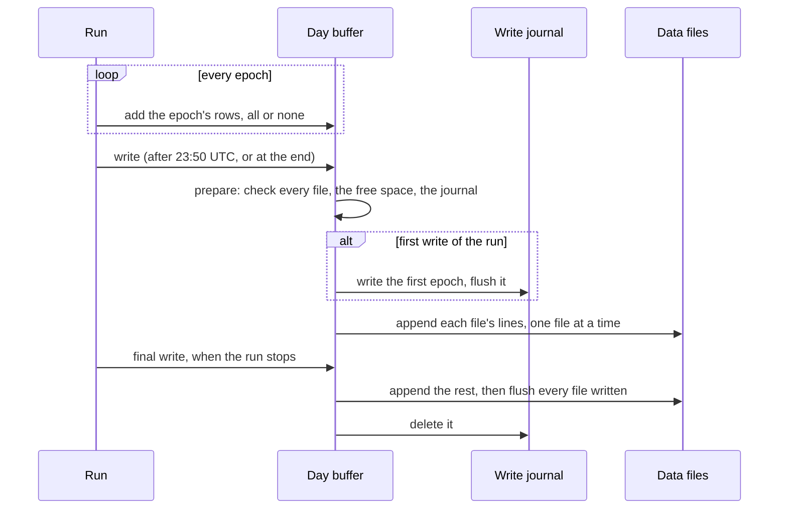

1. Compute. Every row of the epoch is computed in memory (§6.3), formatted, and kept as the next epoch will take it: as the file holds it, so a measurement row without its innovation. Every value is written in a form that gives it back exactly, so the row the next epoch takes from the buffer is the row a later run would read from the file (I5).
2. Prepare, with no file opened:
   - every existing file must be a regular file this process can write, of a length that is its header plus whole rows (§5.2);
   - the directory of every new file must be one this process can write into; at a run's first write, no write journal may be there, since one would mean an earlier run stopped before its final write;
   - the free space on each device must cover every byte to be written.
3. Write. At a run's first write, first the journal: write the first epoch of the buffered rows to `das_processor_<rf>.writing`, and flush it and its directory. Then the measurement files and then the double-difference files, each set in key order, one file open at a time, each given its buffered lines in one write, a new file's text starting with its header. No data file is flushed here.

An exception in steps 1 and 2 changes no file. When the run has not written yet, the next run computes the lost rows again; when it has, its journal is still there, and the next run cuts every file back to before the run's first epoch and computes everything the run wrote again (§6.7), byte for byte.
The run's final write does steps 2 and 3 for what is left, then flushes every data file written since the journal, measurement files first, then the directory of every new file, and only then deletes the journal.
So a file is flushed once a run, not once a day.

A failure in step 3 or in the final write, any failure or crash after the run's first write, or a power failure before the final write can leave files that disagree: some hold rows others lack, some lost rows the device never got, and one may end in a torn line.
The journal is still there, so the next run cuts every file back to before the journal's epoch (§6.7) and computes the rows again, which removes the torn line too.
A journal that is not whole was never flushed, so no data file was opened; it is ignored.

```python
class DayBuffer:
    """Rows computed since the last write: each file's lines, each series' newest row."""

    channel: RfChannel  # named in a new file's header
    journal: Path | None  # das_processor_<rf>.writing
    file_lines: dict[Path, list[str]]  # joined only when written
    last_rows: dict[SeriesKey, Row]
    last_z: dict[PairKey, int | None]  # each pair's newest z, for a disabled row
    earliest_epoch: datetime | None  # the earliest epoch buffered since the last write
    rows_added: int  # rows added since the buffer was made
    journal_written: bool
    unflushed_files: set[Path]
    unflushed_directories: set[Path]


def write_buffer(day_buffer):
    """Write the buffer to every file: all of it, or, on an error before writing, none."""
    file_bytes = prepare(day_buffer)  # step 2: every check; no file opened
    if not file_bytes:
        return
    if day_buffer.journal is not None and not day_buffer.journal_written:
        first_epoch = day_buffer.earliest_epoch.isoformat() + "\n"
        create_and_flush(day_buffer.journal, first_epoch)
        day_buffer.journal_written = True
    # Measurement files, then double-difference files, one open at a time.
    for data_file in sorted(file_bytes, key=write_order):
        append_or_create(data_file, file_bytes[data_file])  # not flushed here
        day_buffer.unflushed_files.add(data_file)
    day_buffer.file_lines.clear()  # last_rows stays: the next epoch needs it
    day_buffer.earliest_epoch = None


def write_final(day_buffer):
    """The run's last write: write the rest, flush every file written, end the journal."""
    write_buffer(day_buffer)
    for data_file in sorted(day_buffer.unflushed_files, key=write_order):
        flush(data_file)
    flush_directories(day_buffer.unflushed_directories)
    if day_buffer.journal_written:
        # Every row the run wrote is on the device.
        delete_and_flush_directory(day_buffer.journal)
```

Other programs read the archives only while the channel's lock is free (§6.1, §14).

## 6. Run control

### 6.1 Invocation

A scheduler starts das_processor for each RF channel every ten minutes, once the DAS has appended the epoch's lines to its daily file:

```sh
das_processor --config-file /srv/masterclock/etc/das_processor.ini --rf a
das_processor --config-file /srv/masterclock/etc/das_processor.ini --rf b
```

Each run processes its channel's epochs in order, up to the end of the DAS data (§6.2), and exits.
With `--steps N` it processes N epochs that write rows and exits.
An epoch that writes no row is not counted: once an epoch of a gap in the data writes none, no later epoch of the gap writes any, so a run of one epoch at a time goes on to the next epoch that writes, as a run in one go does (I5).
The two channels run independently: a fault in one never stops the other.

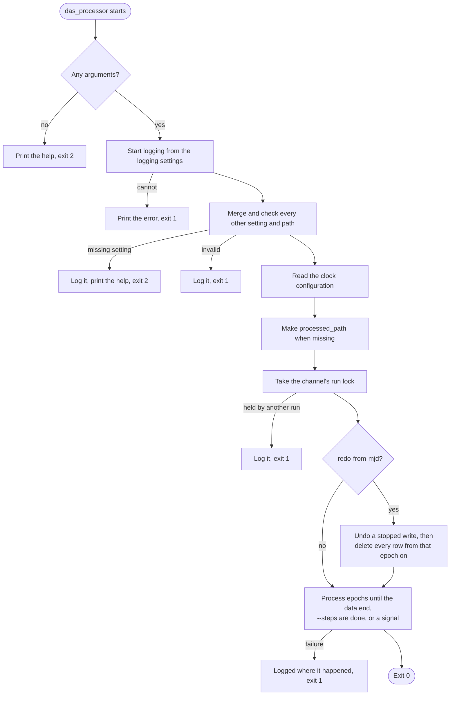

```python
def main(argv=None):
    """Run das_processor and give its exit status."""
    cli_options = parse_args(argv)  # no arguments: the full help, exit 2
    # 1. Logging first, from its own settings; if it cannot start, the error
    # is printed on standard error and the exit status is 1.
    logging_config = build_logging_config(cli_options)
    configure_logging(logging_config)
    # 2. The rest, every failure logged: a missing setting gives the help and
    # exit 2, an invalid one exit 1.
    config = build_config(cli_options)
    check_paths(config)
    try:
        clock_config = read_clock_config(config.processed.clock_config_file)
        # Made when missing, with every directory above it.
        make_processed_path(config.processed.processed_path)
        lock_name = f"das_processor_{config.das.rf}.lock"
        with (
            RunLock(config.processed.processed_path, lock_name),
            ShutdownHandler() as shutdown,
        ):
            # §6.5: before the run; command line only.
            if cli_options.redo_from_mjd is not None:
                # A write that stopped part way is undone first (§6.7).
                recover_stopped_write(config)
                redo_from(
                    every_file_of_the_channel(config),
                    epoch_containing(cli_options.redo_from_mjd),
                    config.das.rf,
                )
            if config.processed.num_workers is None:
                run(config, clock_config, cli_options.steps, shutdown)
            else:  # §6.8: the workers start after any redo
                with WorkerPool(
                    config.processed.num_workers,
                    config.processed.processed_path,
                    config.das.rf,
                ) as worker_pool:
                    run(config, clock_config, cli_options.steps, shutdown, worker_pool)
    except MasterClockError:
        return 1  # logged where it was raised
    return 0
```

- Lock: `RunLock` holds `das_processor_<rf>.lock` in `processed_path` for the whole run. A second run of the same channel stops at once with `RunLockError`, naming the holder's process. The operating system releases the lock however a run ends, so a crash never leaves a stale lock.
- Signals: `ShutdownHandler` turns SIGINT, SIGTERM and SIGHUP into a request that the run checks between epochs, so a signal never interrupts an epoch. The run then writes its day buffer (§5.8) and stops.
- Exit status: 0 for a run that finished; 2 for a usage error, above all a required setting given by neither source, after the full help; 1 for any other failure, which was logged where it happened. Logging starts from the logging settings alone, before anything else is checked, so every later error is logged at ERROR. An error that keeps logging from starting is printed on standard error, and so is an error in a setting or path when the log level is `None`, which logs nothing; any later failure is then shown by the exit status alone.

### 6.2 Where a run stops

A run processes epochs only as far as the DAS data go.

- End of the data: when no DAS data remain at or after the next epoch, the run stops. Nothing is written for an epoch the DAS has not reached.
- A gap in the data: an epoch with no DAS data, followed by a later epoch that has some, is processed as an epoch with no measurements. Every series it holds gets a predicted row (§13.1), until its gap limit.

The last block is whole when the run reads it: the DAS appends an epoch's lines before the scheduler starts das_processor (§6.1).
The stopping point depends only on the data, never on the clock of the machine, so it keeps I5.

### 6.3 Epoch sequence

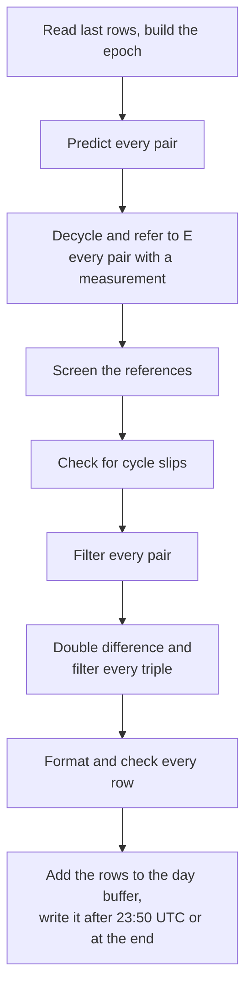

Only the run functions in `das_processor` take the configuration.
`build_epoch` resolves everything one epoch needs into an `Epoch` (§4.3), and every other function receives that `Epoch` or plain values.

```python
def run(config, clock_config, steps, shutdown, epoch_processor=None):
    # epoch_processor: a WorkerPool (§6.8), or None to work in this process.
    ensure_archives(config.processed.processed_path)  # meas/ and ddiff/
    epoch_start = next_epoch(config)  # §6.7, after any cut-back
    das_blocks = read_all_blocks(config.das.cd5m5m_path, datetime_to_mjd(epoch_start))
    next_das_block = next_block(das_blocks, epoch_start)  # at or after it
    if next_das_block is not None and no_pair_exists_yet(config):
        epoch_start = max(epoch_start, next_das_block.interpolated_datetime)  # §6.7
    day_buffer = DayBuffer(config.das.rf, journal_of(config))  # §5.8
    last_epoch = None  # the epoch before, whose settings may be kept
    steering_files = SteeringFiles(config.das.steering_path)  # each line read once
    epochs_done = 0
    while (
        next_das_block is not None
        and not shutdown.shutdown_requested
        and (steps is None or epochs_done < steps)
    ):
        rows_before = day_buffer.rows_added
        das_block = None  # a gap: the data resume later (§6.2)
        if next_das_block.interpolated_datetime == epoch_start:
            das_block = next_das_block
            next_das_block = next_block(das_blocks, epoch_start + T)
        # Or the WorkerPool's process_epoch: the same epoch, worked by workers.
        last_epoch = process_epoch(
            epoch_start,
            das_block,
            day_buffer,
            config,
            clock_config,
            last_epoch,
            steering_files,
        )
        # 23:50 UTC, the last epoch of a day: write the day.
        if (epoch_start + T).date() != epoch_start.date():
            write_buffer(day_buffer)
        epoch_start += T
        # An epoch that writes no row is not a step.
        epochs_done += day_buffer.rows_added > rows_before
    write_final(day_buffer)  # the one flush of the run


def build_epoch(
    epoch_start,
    das_block,
    earlier_series,
    config,
    clock_config,
    last_epoch,
    steering_files,
):
    """Everything epoch E needs, with all configuration resolved."""
    # §15.2: leave out every measurement and series of an unnamed clock.
    das_block, earlier_series = configured_only(das_block, earlier_series, clock_config)
    # Kept from the last epoch while no clock's entry takes effect.
    locations = clock_config.locations_at(epoch_start)
    # Each clock disabled or enabled again since E - T is logged at INFO.
    disabled = clock_config.disabled_at(epoch_start)  # §13.6
    refs = (refs_of(das_block) if das_block else frozenset()) - disabled  # §3.1
    pairs, triples = build_registry(das_block, refs, earlier_series, locations)
    steering_refs = sorted(
        {mc for series_key in pairs + triples for mc in signs(series_key)}
    )
    steering = {
        mc: steering_files.events(mc, epoch_start - T, epoch_start + T)
        for mc in steering_refs
    }
    # §8.1, §15.2; kept from the last epoch while nothing changes.
    series_params = clock_config.params_for_series(pairs + triples, epoch_start)
    return Epoch(
        epoch_start, das_block, refs, steering, pairs, triples, series_params, locations
    )


def process_epoch(
    epoch_start, das_block, day_buffer, config, clock_config, last_epoch, steering_files
):
    if not day_buffer.last_rows:
        # The newest row of every series, from its file (I4).
        day_buffer.last_rows.update(read_last_state(config))
    newest_rows = dict(day_buffer.last_rows)
    epoch = build_epoch(
        epoch_start,
        das_block,
        series_of(newest_rows),
        config,
        clock_config,
        last_epoch,
        steering_files,
    )
    last_rows = {
        key: row
        for key, row in newest_rows.items()
        if row.interpolated_datetime == epoch_start - T and "O" not in row.flags
    }
    # The others start cold, in the segment after their newest row's (§6.7);
    # a disabled pair's newest row is never a last row (§13.6).
    last_segments = {
        key: row.segment for key, row in newest_rows.items() if key not in last_rows
    }
    pair_step = process_pairs(epoch, last_rows, last_segments, day_buffer.last_z)
    triple_step = process_triples(epoch, last_rows, pair_step, last_segments)  # §12
    epoch_buffer = DayBuffer(day_buffer.channel)  # the epoch's rows, all or none
    # A dormant row with no measurement gives no record.
    for series_key, record in records_of(epoch, pair_step, triple_step):
        data_file = series_file(processed_path, rf, series_key)
        epoch_buffer.add(data_file, series_key, record)
    day_buffer.take(epoch_buffer)
    log_epoch(epoch, pair_step, triple_step, last_rows, rf)  # §16.2
    return epoch


def process_pairs(epoch, last_rows, last_segments, last_z):  # §7 to §11
    disabled = {pair for pair in epoch.pairs if epoch.series_params[pair].disabled}
    predictions = {  # §8.3; a disabled pair has none (§13.6)
        pair: None
        if pair in disabled
        else predict(last_rows.get(pair), steer_u(pair, epoch))
        for pair in epoch.pairs
    }
    measurements, disabled_readings = {}, {}
    readings = epoch.das_block.measurements if epoch.das_block else ()
    for reading in readings:  # §7
        pair = (reading.reference, reading.clock)
        if pair in disabled:  # kept as it is, with the z it carries
            disabled_readings[pair] = DisabledReading(
                reading.measurement_mjd,
                reading.measured_phase,
                reading.rms,
                last_z.get(pair),
            )
            continue
        measurements[pair] = measure_pair(
            reading,
            prediction=predictions[pair],
            w=steer_w(pair, epoch, reading.measurement_datetime),
            anchor=anchor_of(last_rows.get(pair)),
        )
    innovations = {
        pair: measurement.z - predictions[pair].x
        for pair, measurement in measurements.items()
        if predictions[pair]
    }
    scales = {
        pair: last_rows[pair].innovation_scale
        for pair in epoch.pairs
        if predictions[pair]
    }
    screening = screen_references(innovations, scales, epoch.refs)  # §10
    slips = slip_check(  # §11
        innovations, scales, last_flags(last_rows), epoch.refs, screening.excluded
    )
    for pair, cycles in slips.corrections.items():
        # n += k, z += kP, and the row carries S.
        measurements[pair] = measurements[pair].corrected(cycles)
    excluded_pairs = screening.excluded | slips.excluded
    step_results = {  # §9, §13
        pair: disabled_step(  # §13.6: an O row with a reading, else no row
            epoch.interpolated_datetime,
            epoch.series_params[pair],
            last_rows.get(pair),
            measured=pair in disabled_readings,
            last_segment=last_segments.get(pair),
        )
        if pair in disabled
        else filter_step(
            epoch.interpolated_datetime,
            epoch.series_params[pair],
            last_rows.get(pair),
            predictions[pair],
            measurements.get(pair),
            excluded=pair in excluded_pairs,
            last_segment=last_segments.get(pair),
        )
        for pair in epoch.pairs
    }
    return PairStep(
        step_results, measurements, predictions, screening, slips, disabled_readings
    )


def process_triples(epoch, last_rows, pair_step, last_segments):
    # Each pair's part, from its accepted measurement only (§12.8).
    components = {pair: component_of(pair_step, pair) for pair in epoch.pairs}
    for r, s, c in epoch.triples:  # for r = s, (r, s) and (s, r) are the self pair
        # PhaseError when a local triple does not collapse to its pair (§12.4).
        triple_value = double_difference(
            (r, s, c),
            components.get((s, c)),
            components.get((r, s)),
            components.get((s, r)),
        )
        prediction = predict(last_rows.get((r, s, c)), steer_u((r, s, c), epoch))
        # No rms test, and the scale's floor is σ_dd (§12.5).
        filter_step(
            epoch.interpolated_datetime,
            epoch.series_params[(r, s, c)],
            last_rows.get((r, s, c)),
            prediction,
            triple_value,
            last_segment=last_segments.get((r, s, c)),
        )
```

Series are processed in sorted key order, so identical inputs give identical rows (I5) and log their events in the same order.
The locations of the last epoch are kept while no clock's entry takes effect after it, up to E, and its settings while, besides, its series are the same.

### 6.4 Catch-up

After an outage, one run processes every epoch up to the end of the data, in order, or N of them with `--steps N`.
A catch-up stopped by a signal flushes its rows, and the next run goes on after them; one that fails or is killed after its first write leaves its journal, and the next run cuts every file back to before its first epoch and does that work again (§6.7). Either way its data files end byte-identical to those of an uninterrupted one (I5).

### 6.5 Reprocessing from an MJD

`--redo-from-mjd MJD`, given on the command line only, reprocesses from the epoch containing that MJD.
It has no configuration file entry: a redo is asked for once, and one left in the file would reprocess at every scheduled run.
Before any epoch is processed, a write that stopped part way is undone as at the start of a run (`recover_stopped_write`, §6.7), so a file it was creating is deleted and the journal with it.
Then `redo_from` checks every measurement and double-difference file of the channel (§5.7), and then deletes every row at or after that epoch from every one of them, which keeps the archives in step, as I1 requires.
Rows have a fixed width, so each file is truncated just before its first row at or after that epoch, and a file with no earlier row is deleted.
A redo never keeps a row after a damaged file's last good row: when that row comes before the redo epoch, every file is cut after it instead (`cut_epoch`, §6.7), so the files stay in step.
The run then goes on one epoch after the newest row left (§6.7): the redo epoch itself when some series has a row of the epoch before it.

`redo_from` can be repeated: if it is interrupted, running the same command again finishes the deletion before any epoch is processed.
A file that holds no whole row, or whose first row is damaged, stops the redo with `DataFileError` before any file is cut; once it is put right, the same command does the redo.
The rows to keep are found by a binary search over the file's rows, which are in time order though an epoch may have none; a line that is not a good row counts as after the epoch kept, since damage only follows good rows.
A redo is logged once at INFO, naming the channel and the epoch, with how many files it cut, deleted and left.

### 6.6 Failure during a run

| Failure | When | Result |
| --- | --- | --- |
| Any exception | Reading, computing, formatting, preparing (§5.8 steps 1 and 2) | No file changes. Before the run's first write, the next run computes the lost rows again; after it, the journal is still there, and the next run cuts every file back to before the run's first epoch (§6.7). |
| Device error, crash, SIGKILL, power loss | Writing (§5.8 step 3), or after the run's first write | Some files hold rows others lack, and one may end in a torn line. The write journal is still there, so the next run cuts every file back to before the journal's epoch and goes on from there (§6.7). |
| A damaged line in a file, found when a run starts | Checking the files (§5.2) | Every file of the channel is cut back to the last good row of the earliest damaged file, and the rows after it are computed again, byte-identical to an uninterrupted run's (§6.7). A file that holds no whole row, or whose first row is damaged, raises `DataFileError`, and no file changes. |
| SIGINT, SIGTERM, SIGHUP | Any point | The epoch finishes, the day buffer is written, and the run stops before the next epoch. |

After any failure, the run logs it and exits with status 1, and the next scheduled run tries again.
A persistent fault stops the channel at that epoch until an operator resolves it.
A line that `read_cd5m5m` refuses is not a failure: it is logged and skipped, and is not part of the epoch's data. A DAS file whose last line has no newline is malformed, though, and stops the run.

### 6.7 Next epoch and roll-back

A run starts by deciding which epoch comes next, after cutting back anything it cannot keep.

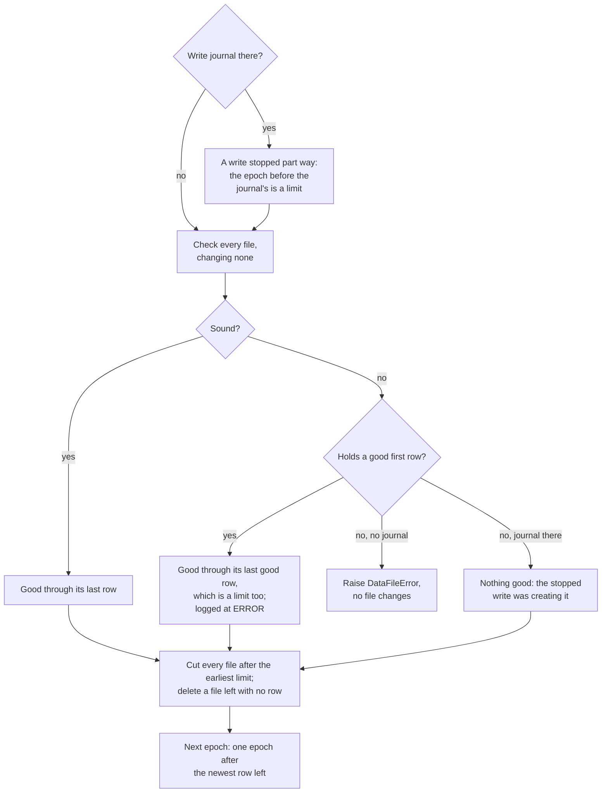

- Check. Every file is checked (§5.2, §5.7) before any is changed. A sound file is good through its last row; it is not read further, so a line damaged in the middle of a file whose length and last row are good is not found. A damaged file is good through the row before its first line that is not a good row. A file with no good first row, one holding no whole row included, cannot be placed in time: it raises `DataFileError`, the run stops without changing anything, and an operator resolves it. The write journal is read before any file is checked, and when it is there the case differs: such a file is one the stopped write was creating, so it holds nothing good, and it is deleted, to be made again.
- Cut epoch. Every file keeps its rows only up to the earliest of two limits: the epoch before the journal's, when the journal is there, and the last good row of every damaged file (`cut_epoch` in `das_processor/files.py`). A damaged file with nothing good sets no limit. So every file of the channel is cut back to the same epoch, and the files stay in step, as I1 requires.
- Roll-back. Each file is truncated just after its last row up to the cut epoch, which removes the damaged and torn lines, and a file with no such row is deleted. The rows written from there on are byte-identical to those of a run that never failed (I5). Each damaged file is logged once at ERROR, naming where it is damaged and why. The roll-back is logged once at WARNING when it changed a file or followed a stopped write: why, how many files it cut, deleted and left, and the newest row left. When the journal is there, it is deleted once every file is cut.
- Newest epoch. The run goes on one epoch after the newest row left among all files of the channel, measurement and double-difference. Files may end at different epochs: a series writes a row only for an epoch it is in, and not while it is dormant with no measurement (§13.3) or disabled with no reading (§13.6). A series whose newest row is not of the epoch before E starts cold at E, as a new series does, in the segment after its newest row's.
- Next epoch. One epoch after the newest row left. With no file holding a row, the epoch containing `start_from_mjd`. While no pair exists yet, the run starts at the first DAS data at or after that instead: an epoch before the data holds no series and writes nothing, so a run of one epoch would otherwise never get past it, and a long run would differ from runs of one epoch each.

```python
def next_epoch(config):
    """The epoch to process next, after cutting back what cannot be kept (§6.7)."""
    journal = config.processed.processed_path / f"das_processor_{config.das.rf}.writing"
    # None: no journal, or one never flushed.
    stopped_write_epoch = read_journal(journal)
    # (file, kind, series): the measurement files, then the double-difference ones.
    series_files = data_series(config)
    stopped_write = stopped_write_epoch is not None
    # Every file is checked before any is cut: a refused file changes none.
    file_checks = [
        check_file(data_file, file_kind, stopped_write=stopped_write)
        for data_file, file_kind, _ in series_files
    ]
    # A write stopped part way (§5.8) keeps nothing from the journal's epoch on.
    last_kept_epoch = cut_epoch(
        file_checks, stopped_write_epoch - T if stopped_write else None
    )
    kept_epochs = [
        file_check.good_through
        if file_check.good_through is None or last_kept_epoch is None
        else min(file_check.good_through, last_kept_epoch)
        for file_check in file_checks
    ]
    # Truncate each file after its last row up to its kept epoch, or delete it.
    cuts = [
        roll_back(data_file, file_kind, kept)
        for (data_file, file_kind, _), kept in zip(series_files, kept_epochs)
    ]
    log_roll_back_once(cuts)
    clear_journal(journal)
    newest_epoch = max((kept for kept in kept_epochs if kept is not None), default=None)
    if newest_epoch is None:
        return floor_to_ten_minutes(mjd_to_datetime(config.processed.start_from_mjd))
    return newest_epoch + T  # a file ending earlier starts cold when next in an epoch


def cut_epoch(file_checks, latest_epoch):
    """The last epoch every file of a channel may keep, so they stay in step."""
    # A damaged file with nothing good, which only a stopped write leaves,
    # sets no limit.
    limits = [
        file_check.good_through for file_check in file_checks if file_check.damaged
    ]
    limits.append(latest_epoch)  # None: no such limit
    return min((epoch for epoch in limits if epoch is not None), default=None)
```

A redo uses the same `cut_epoch`, with the epoch before the redo epoch as its limit (§6.5).

### 6.8 Worker processes

A run can work each epoch's series in worker processes.
`num_workers` (§15.1) set to N starts N of them; left out or `None`, the main process works every series itself.
Workers pay for long runs, such as a catch-up or reprocessing years of data.
For one epoch a run, starting them costs more than they save, so a scheduled run leaves `num_workers` out.

Each worker owns a fixed share of the series, chosen from each series' name alone (`owner_of` in `das_processor/workers.py`), so a series has the same owner in every run with as many workers.
A worker keeps its series' newest rows and settings from epoch to epoch, and each pair's newest z for a disabled row to carry (§13.6), so a series' state never crosses between processes, and it reads a series' last row from its file the first time it meets the series.
Workers are started from a clean server process, never as a copy of the main process with its open files and lock.
An epoch takes three exchanges with every worker:

```mermaid
sequenceDiagram
    participant Main as Main process
    participant W as Each worker
    Main->>Main: build the epoch (§6.3)
    Main->>W: its pairs, triples, readings, and settings it lacks
    W->>W: predict and decycle its pairs
    W-->>Main: innovations, scales, last flags
    Main->>Main: screen and check for slips, over every pair (§10, §11)
    Main->>W: its pairs' corrections and exclusions
    W->>W: filter its pairs
    W-->>Main: their lines and their parts in the triples
    Main->>W: every pair's part
    W->>W: double difference and filter its triples
    W-->>Main: their lines
    Main->>Main: add the lines to the day buffer; write the log
```

The main process adds the lines to the day buffer, and writes, cuts back and keeps the journal as without workers (§5.8, §6.7).
Every series is worked by the same functions with or without workers, so the data files are byte-identical either way (I5).

A worker never writes the log.
It keeps what each of its series logs, with the series, and the main process writes the records in the order a run without workers does (§16.2): screening first, then the pairs and the triples, each in key order, then the epoch's counts.
A worker logs at the main process's level, so nothing is worked out for a level the log leaves out.
A worker ignores SIGINT and SIGTERM: the main process stops between epochs (§6.6), then asks each worker to stop and ends one that does not. A worker does not ignore SIGHUP, so a hangup sent to the whole process group ends the workers, and the main process then stops with `WorkerError`.
A failure in a worker is logged there, sent back with its records, and raised again by the main process, which stops the run as any failure does.
A worker that stops answering, or gives an answer of the wrong kind, raises `WorkerError`.

## 7. Pair processing: steering input, decycling, referring to the epoch start

A reading of a pair shows only where in the period the phase falls, at the moment it was taken.
Before the estimator can use it, das_processor must put back the whole periods it lost, and move it to the start of its epoch so every reading of the epoch lines up.
Each pair measurement is decycled against the estimator's prediction at its own measurement time, then referred back to E.
Decycling against the prediction, not against the previous raw reading, keeps a single bad reading from passing a cycle error on.
Triples need neither step: their inputs are already decycled and referred to E.

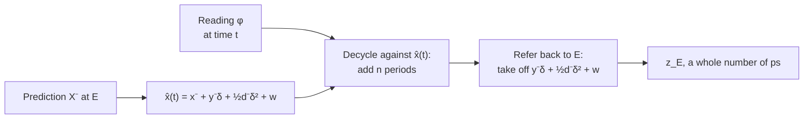

### 7.1 Steering input

Steering a reference is a known change, so it enters the prediction and never the innovation.
A series is moved by every reference in its effective difference, with the sign that reference has there:

| Series | Effective difference | References and signs |
| --- | --- | --- |
| Self pair (r, r) | x_r − x_r | none; the terms cancel |
| Link pair (r, s) | x_r − x_s | r: +1, s: −1 |
| Clock pair (s, c) | x_s − x_c | s: +1 |
| Triple (r, s, c), r = s included | x_r − x_c | r: +1 |

Input over the previous epoch: events at times t_m in (E − T, E] enter the prediction from E − T to E:

```latex
u_x = \sum_m s_m\left[\Delta x_m + \Delta y_m\,(E - t_m)\right], \qquad u_y = \sum_m s_m\,\Delta y_m, \qquad u_d = 0
```

Steering inside the current epoch: events at t_m in (E, t], where t is the measurement time, change the phase at t but not the state at E:

```latex
w(t) = \sum_m s_m\left[\Delta x_m + \Delta y_m\,(t - t_m)\right]
```

w is added to the prediction at t and taken off again when the measurement is referred to E.
The same events enter u in full at the next epoch, so nothing is counted twice.

```python
def signs(series_key):
    if len(series_key) == 3:
        return {series_key[0]: +1}  # triple: x_r - x_c
    first_clock, second_clock = series_key
    if first_clock == second_clock:
        return {}  # self pair
    return {
        name: sign
        for name, sign in ((first_clock, +1), (second_clock, -1))
        if is_reference(name)
    }


def steer_u(series_key, epoch_start, steering):  # (E - T, E]
    ux, uy = mpq(0), 0.0  # ux exact (§2.5); uy a rate
    for sign, event in signed_events(
        steering, series_key, epoch_start - T, epoch_start
    ):
        ux += sign * (
            exact(event.dx)
            + exact(event.dy) * seconds(epoch_start, event.applied_datetime)
        )
        uy += sign * event.dy
    return ux, uy


def steer_w(series_key, epoch_start, steering, measured_at):  # (E, t]
    w = mpq(0)
    for sign, event in signed_events(steering, series_key, epoch_start, measured_at):
        w += sign * (
            exact(event.dx)
            + exact(event.dy) * seconds(measured_at, event.applied_datetime)
        )
    return w
```

### 7.2 Prediction at the measurement time

X⁻ is the predicted state at E (§8.3), moved on to the measurement time:

```latex
\hat{x}(t) = x^- + y^-\delta + \tfrac{1}{2}\,d^-\delta^2 + w(t)
```

### 7.3 Decycling

```latex
n = \operatorname{round}\!\left(\frac{\hat{x}(t) - \varphi}{P}\right), \qquad x_u = \varphi + nP
```

Decycling is right while the true phase is within P/2 = 100 000 ps of x̂(t).
Three things keep it there:

- The gap limit (§13.2): a prediction is never used beyond G_max epochs.
- The gate (§9): a wrong cycle gives an innovation of the order of P, far beyond <!-- figure: K_OUT -->5<!-- end figure --> σ_ν.
- The slip check (§11): it corrects a wrong cycle when the clock is measured against two or more references.

### 7.4 Referring back to the epoch start

```latex
z_E = \operatorname{round\_even}\!\left(x_u - y^-\delta - \tfrac{1}{2}\,d^-\delta^2 - w(t)\right)
```

The error this leaves is (y − y⁻)δ: with a rate error of 10⁻¹⁵, 0.001 ps/s, it is at most 0.6 ps.

### 7.5 Pair without a valid state

A new or dormant pair has no prediction.
Its measurement is decycled against the last measurement z_b in its acquisition buffer (§13.3), or with n = 0 when the buffer is empty:

```latex
n = \operatorname{round}\!\left(\frac{z_b - \varphi + w(t)}{P}\right), \qquad z_E = \operatorname{round\_even}\left(\varphi + nP - w(t)\right)
```

The measurement then goes to the acquisition buffer (§13.3).

### 7.6 Pseudocode

```python
def decycle(phi, delta, w, prediction, anchor):
    """A reading decycled and referred to its epoch start (§7.2 to §7.5)."""
    check_reading(phi, delta)  # PhaseError: 0 <= phi <= PHASE_MAX, 0 <= delta < T
    if prediction is None:  # §7.5
        n = 0 if anchor is None else round_even((anchor - phi + w) / PHASE_PERIOD)
        return Decycled(cycle_count=n, z=round_even(phi + n * PHASE_PERIOD - w))
    # y⁻δ + ½d⁻δ², exact.
    motion = exact(prediction.y) * delta + exact(prediction.d) * delta * delta / 2
    predicted_phase = prediction.x + motion + w  # x̂(t), exact
    n = round_even((predicted_phase - phi) / PHASE_PERIOD)
    # Rounded once.
    return Decycled(cycle_count=n, z=round_even(phi + n * PHASE_PERIOD - motion - w))


def anchor_of(last_row):
    """The last buffered measurement of a dormant series, or None."""
    if last_row is None or "D" not in last_row.flags or not last_row.rejects:
        return None
    return round_even(exact(last_row.rejects[-1][1]))
```

`measure_pair` in `domain/measurements.py` takes the reading's MJD, its phase and its rms, with w, the prediction and the anchor.
It works out the measurement time from the MJD, E from that, and δ exactly, then calls `decycle` and builds the `PairMeasurement`.
Appendix A works one measurement through these steps, with the program's own numbers.

## 8. The estimator

Each series runs a small estimator that follows the clock's phase, rate and, for some clocks, drift from epoch to epoch.
Its prediction is what a reading is decycled and judged against, and its estimate is what the timescale uses as the clock's behaviour.

Every pair and triple runs its own critically damped state-space filter with fixed gains.
Critically damped means it settles after a disturbance as fast as it can without ringing: every pole of the closed loop sits at the same point, λ = e^(−1/M), so the time constant M, in epochs, alone sets how quickly it follows the clock and how much measurement noise it lets through.
Masers use a 3-state model with a triple pole at λ.
Cesium beams and rubidium fountains use a 2-state model with a double pole at λ.
References use the 1-state model, which passes an accepted measurement through as the estimate, with no filtering; self and link pairs therefore pass through too, since they take the reference's entry (§8.1).

### 8.1 Series parameters

A series takes its parameters from the configuration entry of its clock side:

- Pair (a, b): the entry of b. Self and link pairs therefore use the reference's entry, whose type is `mc`.
- Triple (r, s, c): the entry of c. A clock pair (s, c) and every triple (r, s, c) therefore share the same values.

Entries default by clock type, and a clock can override its type's default (§15.2).
A pair is disabled while either of its clocks is, and then runs no estimator (§13.6).
The model is set when the series is created and never changes: a 2-state series stays 2-state for the life of its file.
M and M_σ are copied into the row when a segment starts; every later row of the segment carries them, and each run reads them from the last row.
A change of M or M_σ takes effect through a warm segment start (§8.7).

### 8.2 State models

```latex
X_3 = \begin{bmatrix} x \\ y \\ d \end{bmatrix}, \quad \Phi_3 = \begin{bmatrix} 1 & T & T^2/2 \\ 0 & 1 & T \\ 0 & 0 & 1 \end{bmatrix}, \quad H_3 = \begin{bmatrix} 1 & 0 & 0 \end{bmatrix} \qquad X_2 = \begin{bmatrix} x \\ y \end{bmatrix}, \quad \Phi_2 = \begin{bmatrix} 1 & T \\ 0 & 1 \end{bmatrix}, \quad H_2 = \begin{bmatrix} 1 & 0 \end{bmatrix}
```

The 1-state model has X₁ = [x], Φ₁ = [1] and H₁ = [1].
In a 2-state row, d is written as 0.0; in a 1-state row, y and d are both written as 0.0.

### 8.3 Prediction

```latex
X^- = \Phi X + \begin{bmatrix} u_x \\ u_y \\ 0 \end{bmatrix}
```

X is the state in the last row, and u comes from §7.1.
A series whose last row is dormant, or that has no last row, has no prediction.

### 8.4 Update and fixed gains

```latex
\nu = z_E - x^-, \qquad X = X^- + K\,\nu, \qquad K_3 = \begin{bmatrix} g \\ h/T \\ 2k/T^2 \end{bmatrix}, \quad K_2 = \begin{bmatrix} g \\ h/T \end{bmatrix}
```

3-state gains place a triple pole at λ:

```latex
\lambda = e^{-1/M}, \qquad g = 1 - \lambda^3, \qquad h = \tfrac{3}{2}(1-\lambda)^2(1+\lambda), \qquad k = \tfrac{1}{2}(1-\lambda)^3
```

2-state gains place a double pole at λ:

```latex
g = 1 - \lambda^2, \qquad h = (1-\lambda)^2
```

The 1-state model has the one gain g = 1 and no time constant: an accepted measurement passes through exactly, x = z_E.
The gains are worked out from the M of the row's segment: the last row's, or the new one on a row that starts a segment. Every row of a segment carries the same M, so the gains are the same on every row of a segment.
The closed-loop matrix (I − KH)Φ has every eigenvalue equal to λ, which §17.1 tests.
The gains at a range of time constants, as the estimator works them out:

<!-- generated: gains -->

| M (epochs) | λ | 3-state g | 3-state h | 3-state k | 2-state g | 2-state h |
| --- | --- | --- | --- | --- | --- | --- |
| 10 | 0.904837 | 0.259182 | 0.0258751 | 0.000430892 | 0.181269 | 0.00905592 |
| 30 | 0.967216 | 0.0951626 | 0.0031715 | 1.76178e-05 | 0.064493 | 0.00107478 |
| 100 | 0.99005 | 0.0295545 | 0.00029554 | 4.92562e-07 | 0.0198013 | 9.90058e-05 |
| 300 | 0.996672 | 0.00995017 | 3.31672e-05 | 1.84262e-08 | 0.00664449 | 1.10741e-05 |
| 1000 | 0.999 | 0.0029955 | 2.9955e-06 | 4.99251e-10 | 0.001998 | 9.99001e-07 |

<!-- end generated -->

### 8.5 Rounding and storage

- Updated state: x = to_fs(x⁻ + gν), the sum formed exactly and rounded once to whole femtoseconds (§2.5); y and d are stored as floats.
- Predicted rows store to_fs(x⁻), with x⁻ formed exactly.
- The next prediction starts from the stored values exactly. The rows are the only state.

### 8.6 Cold start

A cold start begins a new segment from the current measurement alone.
It happens when a dormant series acquires (§13.3).

- State: X = [z_E, 0, 0]ᵀ for 3 states, [z_E, 0]ᵀ for 2 and [z_E] for 1.
- Innovation scale: σ_ν = σ₀.
- Segment: segment + 1, step_offset = 0, epochs_in_segment = 0, epochs_since_accept = 0, consecutive_rejects = 0, an empty reject buffer. A new series' dormant rows are in segment 0, so its first cold start begins segment 1.
- Parameters: M and M_σ from the entry in force at the epoch; the model is the series' own.
- Flags: A and N, and U for a 2- or 3-state series (§8.8).

### 8.7 Warm start

A warm start begins a new segment and carries the state across.
It happens on a frequency step (§9.4) and at the epoch a configuration change for the series' clock takes effect.

- State: X⁻ is carried, with the frequency-step corrections of §9.4 when they apply.
- Carried: σ_ν and step_offset.
- Reset: segment + 1, epochs_in_segment = 0.
- Flags: N, and U until epochs_in_segment reaches 5M under the new M.
- A configuration change takes its new M and M_σ from this row; the model does not change.

The configuration check runs first, before the measurement is processed, so a configuration warm start and a measurement outcome can share one row.

### 8.8 Settling

A row of a 2- or 3-state series carries U while epochs_in_segment < <!-- figure: SETTLE_FACTOR -->5<!-- end figure -->M.
A 1-state series has no settling and never carries U.
The timescale does not use U rows (§14).

The charts below run the program's own estimator, at M = 100, on a clock whose rate steps by 1 ps/s, with no noise.
The 3-state estimator overshoots before it settles; the 2-state one comes up to the step from below.

<!-- generated: settling-3-state -->

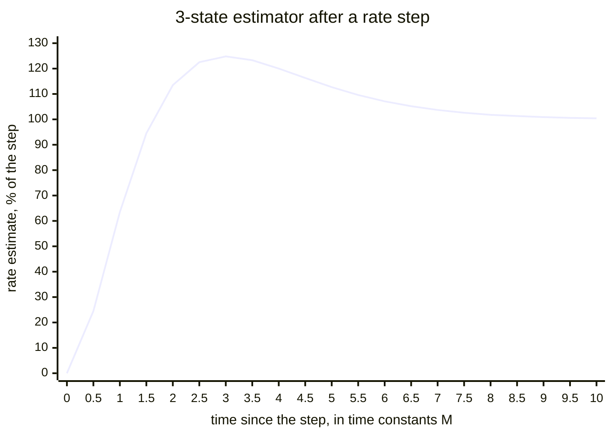

<!-- end generated -->

<!-- generated: settling-2-state -->

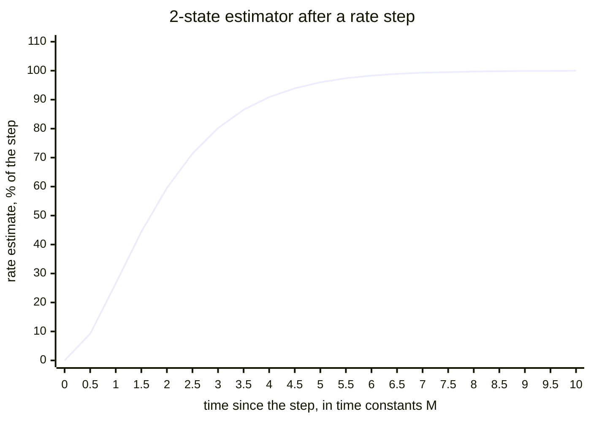

<!-- end generated -->

<!-- generated: settling-numbers -->

| Model | Largest overshoot (% of the step) | Reached at (time constants) | Error left at 5M (% of the step) | Within 1% for good from (time constants) |
| --- | --- | --- | --- | --- |
| 3-state | 24.8 | 3.0 | 12.7 | 8.8 |
| 2-state | none | - | -4.0 | 6.6 |

<!-- end generated -->

### 8.9 Pseudocode

```python
def gains(filter_states, M):
    if filter_states == 1:
        return (1.0, 0.0, 0.0)  # pass-through: x = z
    lam = math.exp(-1.0 / M)
    if filter_states == 3:
        return (1 - lam**3, 1.5 * (1 - lam) ** 2 * (1 + lam) / T, (1 - lam) ** 3 / T**2)
    return (1 - lam**2, (1 - lam) ** 2 / T, 0.0)  # (g, h/T, 2k/T^2)


def predict(last_row, u):
    if last_row is None or "D" in last_row.flags:
        return None
    ux, uy = u  # ux exact (§7.1)
    x = from_fs(last_row.x_fs)  # whole fs to exact ps (§2.5)
    if last_row.filter_states == 1:
        return State(x=x + ux, y=0.0)
    if last_row.filter_states == 3:
        return State(
            x=x + exact(last_row.y) * T + exact(last_row.d) * T * T / 2 + ux,
            y=last_row.y + last_row.d * T + uy,
            d=last_row.d,
        )
    return State(x=x + exact(last_row.y) * T + ux, y=last_row.y + uy)


def update(prediction, innovation, filter_states, M):
    # g as the exact fraction its float holds.
    g, h_over_t, two_k_over_t2 = exact_gains(filter_states, M)
    nu = float(innovation)
    return State(
        x=prediction.x + g * innovation,  # exact; rounded once when stored
        y=prediction.y + h_over_t * nu,
        d=prediction.d + two_k_over_t2 * nu if filter_states == 3 else 0.0,
    )
```

## 9. Outlier detection and step classification

A clock's record holds single bad readings, and also real, lasting changes: its phase can jump, or its rate can change.
A bad reading must be thrown out, and a real change must be followed.
das_processor tells them apart by waiting: one reading far from the prediction is rejected, but three in a row that agree with each other are taken as a step.

Every measurement of a series with a valid prediction passes through one gate.
A rejected measurement gives no update.
After three counted rejects in a row, the rejected innovations are classified as a phase step, a frequency step, or continued outliers, as long as none of the three was over its pair's RMS limit.

### 9.1 Gate

A measurement is accepted when all of these hold:

1. It is not excluded by screening or by the slip check (§10, §11).
2. For pairs only, its rms is no more than the pair's RMS limit (§15.2).
3. |ν| ≤ k_out σ_ν, with k_out = <!-- figure: K_OUT -->5<!-- end figure -->, compared exactly.

A pair's measurement whose RMS is over its limit is never accepted, not after a step (§9.4) and not by acquisition (§13.3).

### 9.2 Innovation scale

σ_ν, the innovation scale, is how large an innovation is expected to be.
It is updated on accepted rows only, from the innovation before the state update:

```latex
\sigma_\nu^2 \leftarrow \max\!\left[(1-w)\,\sigma_\nu^2 + w\,\nu^2,\; \sigma_{\mathrm{floor}}^2\right], \qquad w = 1/M_\sigma
```

σ_floor is the measurement's own rms for a pair, and σ_dd for a triple.
Rejected, excluded and predicted rows carry σ_ν unchanged, and a cold start sets σ_ν = σ₀.
M_σ sets how precise σ_ν is: an average with weight 1/M_σ has a relative error of about 1/√(2(2M_σ − 1)), so M_σ = 50 gives about 7%.

### 9.3 Counters and reject buffer

| Row outcome | consecutive_rejects | Reject buffer | epochs_since_accept |
| --- | --- | --- | --- |
| Accepted (A) | 0 | emptied | 0 |
| Counted reject (R) | + 1 | push (epoch, ν); keep the newest three, oldest first | + 1 |
| Counted reject over the pair's RMS limit (R) | + 1 | emptied | + 1 |
| Excluded, not counted (X) | unchanged | unchanged | + 1 |
| No measurement (P) | unchanged | unchanged | + 1 |
| Dormant, measurement buffered (R with D) | 0 | push (epoch, z); keep the newest three, oldest first | unchanged |
| Dormant, measurement over the pair's RMS limit (R with D) | 0 | emptied | unchanged |

### 9.4 Step classification

Classification runs on a counted reject when the buffer holds three rejects.
A pair's reading over its RMS limit is never accepted, by a step or otherwise: it is a counted reject that empties the buffer, so it is never one of the three, and the three a step is found in each passed the RMS limit.
It uses the buffer (e₁, ν₁), (e₂, ν₂), (e₃, ν₃), where ν₃ is the current innovation, and the times t_i from e₁ to e_i.
The tests are applied in order, with k_step = <!-- figure: K_STEP -->3<!-- end figure -->.
A 1-state series applies only the phase-step test, since it has no rate to correct.

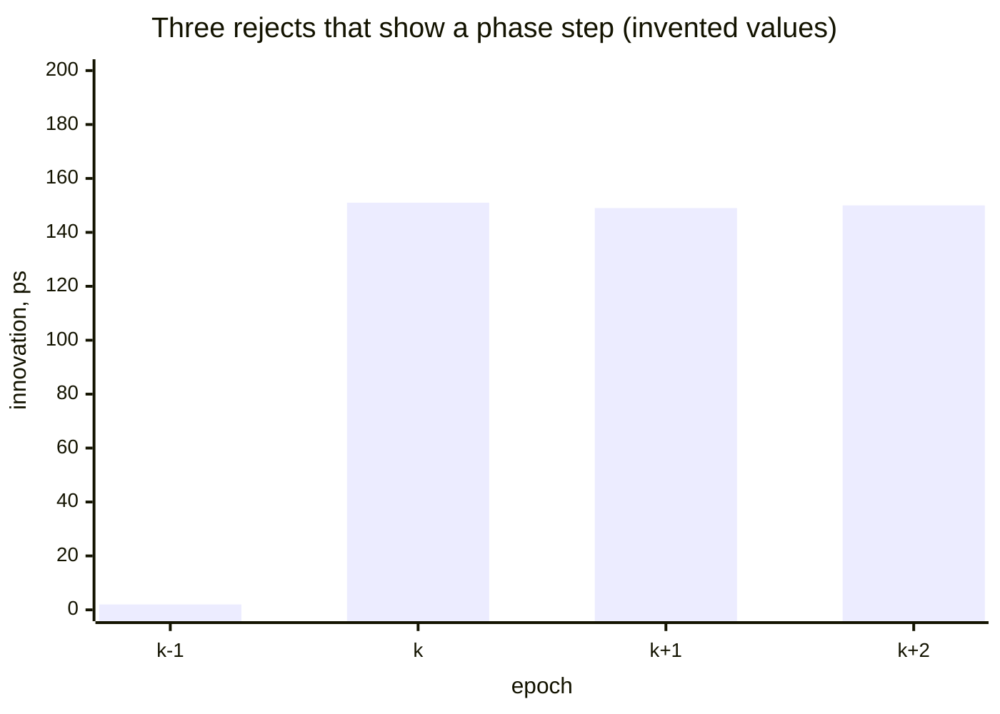

Phase step: the innovations agree.

```latex
\bar{\nu} = \tfrac{1}{3}\textstyle\sum_i \nu_i, \qquad \max_i |\nu_i - \bar{\nu}| < k_{\mathrm{step}}\,\sigma_\nu \;\Rightarrow\; \Delta_{\mathrm{step}} = \operatorname{round\_even}(\bar{\nu})
```

Δ_step is added to x⁻ and to step_offset, and the current measurement is accepted against the corrected prediction.
The segment goes on.

Frequency step: the innovations lie on a line fitted by least squares.

```latex
s = \frac{\sum_i (t_i - \bar{t})(\nu_i - \bar{\nu})}{\sum_i (t_i - \bar{t})^2}, \qquad a = \bar{\nu} - s\,\bar{t}, \qquad \max_i \left|\nu_i - a - s\,t_i\right| < k_{\mathrm{step}}\,\sigma_\nu
```

The prediction is moved onto the line at the current epoch, a warm segment starts (§8.7), and the current measurement is accepted:

```latex
x^- \leftarrow x^- + a + s\,t_3, \qquad y^- \leftarrow y^- + s
```

Neither: the row stays rejected.
When consecutive_rejects reaches N_break, the series goes dormant, and starts again only once it acquires (§13.3).

### 9.5 Excluded measurements

Screening (§10) and the slip check (§11) can exclude a pair measurement at one epoch.

- Inside the gate (|ν| ≤ k_out σ_ν): the row carries flag X and the predicted state. It is not counted and does not enter the buffer, so screening can prevent an acceptance but never makes evidence of a step.
- Outside the gate: the row is a counted reject (R), and classification runs as usual. Three consistent gate failures are a step even while screening excludes the pair.

### 9.6 Decision flow

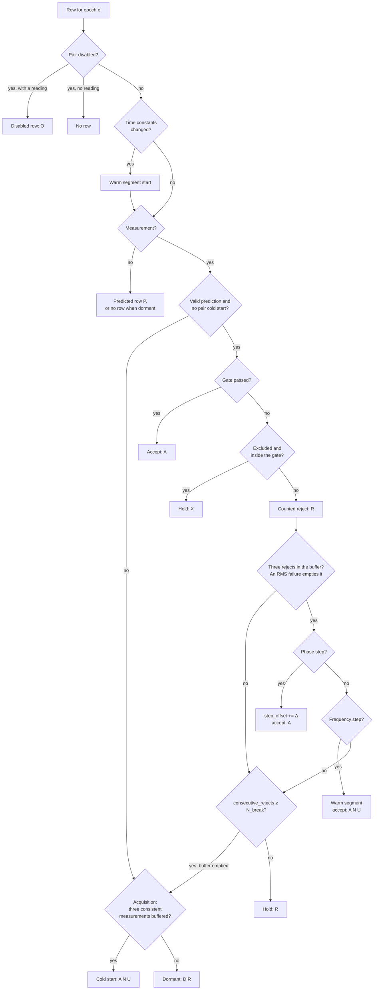

### 9.7 Pseudocode

```python
def filter_step(
    epoch_start,
    series_params,
    last_row,
    prediction,
    measurement,
    excluded=False,
    last_segment=None,
):
    slip = measurement is not None and measurement.slip
    # epochs_in_segment + 1.
    draft = carry(epoch_start, last_row, series_params, slip, last_segment)
    tracked = last_row is not None and "D" not in last_row.flags
    if tracked and params_changed(series_params, last_row):
        start_segment(draft, series_params, keep_offset=True)  # §8.7
    if measurement is None:  # §13.1
        return StepResult(hold(draft, prediction, "P", series_params), False)
    if measurement.pair_cold_started:  # §12.6: a pair of the triple restarted
        draft.rejects, prediction = (), None
    if prediction is None:  # new or dormant: acquisition (§13.3)
        in_limit = measurement.rms is None or measurement.rms <= series_params.rms_max
        row = acquire(draft, measurement.z, series_params, in_limit)
        return StepResult(row, cold_started="D" not in row.flags)
    row = gate(draft, prediction, measurement, series_params, excluded)
    return StepResult(row, cold_started=False)


def gate(draft, prediction, measurement, series_params, excluded):
    innovation = measurement.z - prediction.x  # exact (§2.5)
    draft.innovation = float(innovation)
    # |innovation| <= K_OUT * scale, compared exactly.
    in_gate = within_gate(innovation, draft.innovation_scale)
    # A triple has no rms test.
    in_limit = measurement.rms is None or measurement.rms <= series_params.rms_max
    if in_gate and in_limit and not excluded:
        return accept(draft, prediction, innovation, measurement.scale_floor)
    if in_gate and excluded:
        return hold(draft, prediction, "X", series_params)  # §9.5
    count_reject(draft, innovation)
    if not in_limit:  # never one of the three a step is found in (§9.4)
        draft.rejects = ()
    step_row = accept_step(  # only with three rejects in the buffer
        draft, prediction, measurement.z, measurement.scale_floor, series_params
    )
    if step_row is not None:
        return step_row
    if draft.consecutive_rejects >= series_params.n_break:  # dormant until it acquires
        draft.rejects = ()
        return acquire(draft, measurement.z, series_params, in_limit)
    return hold(draft, prediction, "R", series_params)


def accept(draft, prediction, innovation, scale_floor):
    nu = float(innovation)
    updated = update(prediction, innovation, draft.filter_states, draft.time_constant)
    w = 1.0 / draft.scale_time_constant
    scale_squared = (1 - w) * draft.innovation_scale**2 + w * nu**2
    draft.innovation_scale = math.sqrt(max(scale_squared, scale_floor**2))
    draft.x_fs, draft.y, draft.d = to_fs(updated.x), updated.y, updated.d
    draft.consecutive_rejects, draft.rejects, draft.epochs_since_accept = 0, (), 0
    return finish(draft, "A")


def hold(draft, prediction, outcome, series_params):  # R, X or P: no update
    draft.epochs_since_accept += 1
    if prediction is None or draft.epochs_since_accept > series_params.gmax:
        return dormant(draft, outcome)  # §13.3
    draft.x_fs, draft.y, draft.d = to_fs(prediction.x), prediction.y, prediction.d
    return finish(draft, outcome)


def finish(draft, outcome):
    flags = draft.flags + outcome
    settling = draft.epochs_in_segment < SETTLE_FACTOR * (draft.time_constant or 0)
    if "D" not in flags and draft.filter_states > 1 and settling:
        flags += "U"
    row = Row(**fields_of(draft), flags=in_flag_order(flags))  # built once, here
    check_row(row)  # and checked once, here (§1.4)
    return row
```

## 10. Reference screening

The references are what every clock is measured against, so a fault in a reference's measurement would show up in every pair measured against it.
Screening looks for such faults among the references, using the fact that the references are measured against each other in many ways that must agree.

Reference measurements are screened before any pair is filtered.
The tests run in order: self-measurement, reciprocity, closure.
All three work on the innovations ν = z_E − x⁻, so constant hardware delays drop out.
A pair takes part in a test when it has a measurement and a valid prediction at the epoch, and an earlier test did not exclude it.

| Test | Pairs | Finds | Excludes |
| --- | --- | --- | --- |
| Self (§10.1) | (r, r) | A fault in r's measurement system | The pairs (r, b) that share the self-measurement's shift |
| Reciprocity (§10.2) | (r, s) and (s, r) | An error in one direction of a link | The bad direction, or both |
| Closure (§10.3) | Two-way links around a triangle | An error in a link's two-way value | Both directions of the bad link |

Excluded pairs are treated as §9.5 says.

### 10.1 Self-measurement

(r, r) has a measurement file with its own estimator, and it is filtered as usual.
The self-measurement fails at an epoch when its innovation is outside the gate, |ν_(r,r)| > k_out σ_ν.
A failure means r's measurement system shifted by about ν_(r,r), and only the pairs of r that show the same shift are excluded, with k_shared = <!-- figure: K_SHARED -->3<!-- end figure -->:

```latex
\text{exclude } (r,b),\ b \neq r, \quad \text{if} \quad \left|\nu_{(r,b)} - \nu_{(r,r)}\right| \le k_{\mathrm{shared}}\sqrt{\sigma_{\nu,(r,b)}^2 + \sigma_{\nu,(r,r)}^2}
```

Two cases exclude nothing:

- an rms failure alone: (r, r) is rejected by its own gate;
- a missing self-measurement: (r, r) gets a predicted row, and a warning is logged.

A lasting shift in r's measurement system resolves itself: the excluded pairs whose innovations are outside the gate are counted rejects (§9.5), so after three epochs each is classified as a phase step and accepted.

### 10.2 Reciprocity

The two directions of a link carry opposite phases, so their innovations must cancel:

```latex
\rho_{rs} = \nu_{(r,s)} + \nu_{(s,r)}, \qquad \sigma_\rho = \sqrt{\sigma_{\nu,(r,s)}^2 + \sigma_{\nu,(s,r)}^2}, \qquad \text{fail if } |\rho_{rs}| > k_{\mathrm{out}}\,\sigma_\rho
```

On a failure, the bad direction is found by comparing each direction with an estimate of the link built from the other references.
The two-way innovation of a link and its scale are:

```latex
\bar{r}_{ab} = \tfrac{1}{2}\left[\nu_{(a,b)} - \nu_{(b,a)}\right], \qquad \sigma_{\bar{r},ab} = \tfrac{1}{2}\sqrt{\sigma_{\nu,(a,b)}^2 + \sigma_{\nu,(b,a)}^2}
```

Each third reference t with usable links s–t and t–r gives one estimate, and the closure estimate is the median over t:

```latex
\hat{r}^{(t)}_{rs} = -\left(\bar{r}_{st} + \bar{r}_{tr}\right), \qquad \sigma^{(t)} = \sqrt{\sigma_{\bar{r},st}^2 + \sigma_{\bar{r},tr}^2}, \qquad \hat{r}_{rs} = \operatorname{median}_t \hat{r}^{(t)}_{rs}, \qquad \sigma_{\hat{r}} = \operatorname{median}_t \sigma^{(t)}
```

```latex
(r,s) \text{ is bad if } \left|\nu_{(r,s)} - \hat{r}_{rs}\right| > k_{\mathrm{out}}\sqrt{\sigma_{\nu,(r,s)}^2 + \sigma_{\hat{r}}^2}, \qquad (s,r) \text{ is bad if } \left|-\nu_{(s,r)} - \hat{r}_{rs}\right| > k_{\mathrm{out}}\sqrt{\sigma_{\nu,(s,r)}^2 + \sigma_{\hat{r}}^2}
```

Exactly one bad direction excludes that direction.
Both bad, neither bad, or no estimate excludes both directions.

### 10.3 Closure

Going round a triangle of references and back must give zero.
For every triangle of references (r, s, t), in sorted order, with all three links usable both ways:

```latex
C_{rst} = \bar{r}_{rs} + \bar{r}_{st} + \bar{r}_{tr}, \qquad \sigma_C = \sqrt{\sigma_{\bar{r},rs}^2 + \sigma_{\bar{r},st}^2 + \sigma_{\bar{r},tr}^2}, \qquad \text{fail if } |C_{rst}| > k_{\mathrm{out}}\,\sigma_C
```

A link is excluded, both directions, when it is in every failing triangle and in no passing one.
With three references there is one triangle, so a failure excludes all three links.

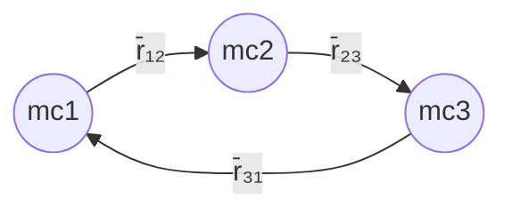

### 10.4 Pseudocode

```python
def screen_references(innovations, scales, refs):
    """Screen one epoch's reference measurements, in domain/screening.py.

    innovations: z - x⁻ of every pair with a measurement and a prediction;
    scales: σ_ν of every pair with a prediction; refs: REFS(e).
    """
    sorted_refs = sorted(refs)
    excluded, events = set(), []

    def nu(pair):
        return float(innovations[pair])  # statistics may be floats (§2.5)

    def usable(pair):
        return pair in innovations and pair not in excluded

    for r in sorted_refs:  # 10.1
        if (r, r) not in scales:  # no prediction: not tested
            continue
        if (r, r) not in innovations:
            events.append(ScreeningEvent("self_missing", (r,), ()))
            continue
        if within_gate(innovations[(r, r)], scales[(r, r)]):
            continue
        shared = {
            pair
            for pair in innovations
            if pair[0] == r
            and pair[1] != r
            and abs(nu(pair) - nu((r, r)))
            <= K_SHARED * math.hypot(scales[pair], scales[(r, r)])
        }
        excluded |= shared
        events.append(ScreeningEvent("self_fail", (r,), tuple(sorted(shared))))

    for r, s in combinations(sorted_refs, 2):  # 10.2
        if not (usable((r, s)) and usable((s, r))):
            continue
        limit = K_OUT * math.hypot(scales[(r, s)], scales[(s, r)])
        if abs(nu((r, s)) + nu((s, r))) > limit:
            # One direction, or both.
            bad = bad_directions(r, s, closure_estimates(r, s))
            excluded |= bad
            events.append(
                ScreeningEvent("reciprocity_fail", (r, s), tuple(sorted(bad)))
            )

    failing, passing = triangles(sorted_refs)  # 10.3
    for a, b in combinations(sorted_refs, 2):
        in_every_failing = failing and all({a, b} <= t for t in failing)
        if in_every_failing and not any({a, b} <= t for t in passing):
            excluded |= {(a, b), (b, a)}
            events.append(ScreeningEvent("closure_fail", (a, b), ((a, b), (b, a))))
    # Logged by das_processor (§16.2).
    return Screening(excluded=frozenset(excluded), events=tuple(events))
```

## 11. Cross-reference cycle-slip check

A *cycle slip* is a reading decycled with the wrong number of whole periods, so it is wrong by exactly P or a multiple of it.
A clock measured against two or more references shows a slip as a mismatch of a whole number of periods between its pairs' innovations.
The check runs after reference screening and before the pairs are filtered, and corrects the cycle count of the pair that slipped.
Every clock measured is checked, a reference measured as a clock by the other references included, so a slip on a link is found as on any pair.

### 11.1 Statistic

For clock c measured at an epoch against references r and s, r before s in sorted order, both clock pairs usable and the link usable both ways:

```latex
D_{rs}^{(c)} = \nu_{(r,c)} - \nu_{(s,c)} - \bar{r}_{rs}, \qquad \sigma_D = \sqrt{\sigma_{\nu,(r,c)}^2 + \sigma_{\nu,(s,c)}^2 + \sigma_{\bar{r},rs}^2}
```

With no slip, D is near zero.
D is flagged when:

```latex
m = \operatorname{round}(D/P) \neq 0 \quad\text{and}\quad \left|D - mP\right| < k_{\mathrm{out}}\,\sigma_D
```

### 11.2 Attribution

In a flagged D, a slipped first pair (r, c) needs a correction of −m cycles, and a slipped second pair (s, c) needs +m.

- Three or more references measure c: the slipped pair is the one pair in every flagged D and in no unflagged D, and every flagged D must give it the same correction.
- Two references measure c: the slipped pair is the one whose last row is not a settled acceptance: its flags contain P, R, X or U, or it is new. Exactly one of the two must qualify.
- Undecided: every clock pair in a flagged D is excluded for the epoch (§9.5).

### 11.3 Correction

The slipped pair's measurement is corrected before filtering, and its row carries flag S:

```latex
n \leftarrow n + k, \qquad z_E \leftarrow z_E + kP, \qquad k = \begin{cases} -m & \text{the slipped pair is } (r,c) \\ +m & \text{the slipped pair is } (s,c) \end{cases}
```

### 11.4 Pseudocode

```python
def slip_check(innovations, scales, last_flags, refs, excluded):
    """Find and place cycle slips, in domain/slips.py.

    innovations and scales as for screening (§10.4); last_flags: each pair's
    last row's flags, missing for a new pair; excluded: what screening excluded.
    """
    events = []
    # Every clock measured, a reference measured as one too.
    for c in sorted({pair[1] for pair in innovations}):
        usable_refs = [r for r in sorted(refs) if usable((r, c))]
        # (r, s, m) for every r < s whose link is usable both ways.
        flagged_ds, clean_ds = ds(usable_refs, c)
        if not flagged_ds:
            continue
        slipped = (
            attribute_many(flagged_ds, clean_ds)
            if len(usable_refs) >= 3
            else attribute_two(c, flagged_ds[0], last_flags)
        )
        if slipped is None:
            pairs = tuple(sorted({(x, c) for r, s, _ in flagged_ds for x in (r, s)}))
            events.append(SlipEvent("slip_undecided", c, pairs, cycles=0))
        else:
            q, k = slipped
            events.append(SlipEvent("slip_corrected", c, ((q, c),), cycles=k))
    return Slips(
        corrections={
            e.pairs[0]: e.cycles for e in events if e.finding == "slip_corrected"
        },
        excluded=frozenset(
            p for e in events if e.finding == "slip_undecided" for p in e.pairs
        ),
        events=tuple(events),
    )


def attribute_many(flagged_ds, clean_ds):
    common = set.intersection(*({r, s} for r, s, _ in flagged_ds))
    common -= {x for r, s, _ in clean_ds for x in (r, s)}
    if len(common) != 1:
        return None
    q = common.pop()
    ks = {-m if q == r else m for r, s, m in flagged_ds}
    return (q, ks.pop()) if len(ks) == 1 else None


def attribute_two(c, flagged_d, last_flags):
    r, s, m = flagged_d
    unsettled = [
        x
        for x in (r, s)
        if (x, c) not in last_flags or set(last_flags[(x, c)]) & set("PRXU")
    ]
    if len(unsettled) != 1:
        return None
    q = unsettled[0]
    return q, (-m if q == r else m)
```

## 12. Triples and local triples

A triple (r, s, c) turns the measurement (s, c), made against c's local reference s, into a measurement of x_r − x_c, as if c had been measured against r.
Its inputs are the accepted pair measurements z_E at the same epoch: pair rows with flag A.
The pairs' estimates never enter it, but for one case in §12.2.

### 12.1 Value

```latex
dd = z_{(s,c)} + \tfrac{1}{2}\left[z_{(r,s)} - z_{(s,r)}\right] = x_r - x_c + \text{const}
```

### 12.2 One link direction missing

When only one direction of the link between r and s is accepted, the missing one is replaced through the predicted round trip of the two link pairs, which keeps dd continuous when the components used change.
Both link pairs must have a valid prediction.

```latex
\hat{\rho}_{rs} = x^-_{(r,s)} + x^-_{(s,r)}, \qquad z_{(s,r)} \leftarrow \hat{\rho}_{rs} - z_{(r,s)} \quad\text{or}\quad z_{(r,s)} \leftarrow \hat{\rho}_{rs} - z_{(s,r)}
```

The triple has no measurement at the epoch when (s, c) is not accepted, when both link directions are missing, or when ρ̂ is needed and a link pair has no valid prediction.

### 12.3 Uncertainty

σ_ab is the rms of pair (a, b)'s measurement at the epoch.

| components_used | Components | dd | σ_dd² |
| --- | --- | --- | --- |
| 111 | (s,c), (r,s), (s,r) | z(s,c) + ½[z(r,s) − z(s,r)] | σ_sc² + ¼(σ_rs² + σ_sr²) |
| 110 | (s,c), (r,s) | z(s,c) + z(r,s) − ½ρ̂ | σ_sc² + σ_rs² |
| 101 | (s,c), (s,r) | z(s,c) − z(s,r) + ½ρ̂ | σ_sc² + σ_sr² |

### 12.4 Local triples

For a clock local to r, the local triple (r, r, c) uses (r, r) as both link directions, and the link term cancels exactly:

```latex
dd_{(r,r,c)} = z_{(r,c)} + \tfrac{1}{2}\left[z_{(r,r)} - z_{(r,r)}\right] = z_{(r,c)}, \qquad \sigma_{dd} = \sigma_{rc}
```

The two link terms are the same number, so they add no uncertainty, and the local triple needs only (r, c) accepted.
It evaluates the general formula and checks that dd = z(r,c) exactly, in whole picoseconds.
A mismatch is a fault that stops the run before the epoch is written (§6.6).

### 12.5 Filtering

A triple runs `filter_step` (§9.7) with these differences from a pair:

- Parameters: the configuration entry of clock c (§8.1).
- Steering input: reference r only (§7.1).
- Gate: no rms test.
- Innovation scale floor: σ_floor = σ_dd.

### 12.6 A pair's cold start passed on to its triples

When a pair that gave a value to a triple's dd cold-starts at an epoch, either (s, c) or a link pair whose z or prediction was used, that pair's cycle count starts again and dd jumps by an arbitrary amount.
The triple then goes dormant at that epoch and acquires again from its own measurements (§13.3).
Warm starts are not passed on, because z stays continuous.
Whether a row cold-started is not written: `filter_step` gives it beside the row, and the triple's measurement carries it on.

### 12.7 Pseudocode

```python
@dataclass(frozen=True, slots=True)
class Component:  # one pair's part in a triple at E
    accepted: bool  # row flag A
    z: int | None = None  # z_E, given exactly when accepted
    rms: int | None = None
    predicted_phase: mpq | None = None  # x⁻ at E; None without a valid prediction
    cold_started: bool = False


def double_difference(triple, sc, rs, sr):
    """A triple's measurement, in domain/double_difference.py.

    sc, rs, sr: the parts of (s, c), (r, s), (s, r); for r = s, the self pair
    as both.
    """
    r, s, c = triple
    if not sc.accepted:
        return None
    pair_cold_started = sc.cold_started or rs.cold_started or sr.cold_started
    if r == s:  # §12.4
        dd = round_even(sc.z + mpq((rs.z or 0) - (sr.z or 0), 2))
        if dd != sc.z:
            raise PhaseError(f"local triple {triple} does not collapse to its pair")
        return TripleValue(dd, float(sc.rms), "111", pair_cold_started)
    if rs.accepted and sr.accepted:
        dd = sc.z + mpq(rs.z - sr.z, 2)
        variance = sc.rms**2 + 0.25 * (rs.rms**2 + sr.rms**2)
        used = "111"
    elif rs.predicted_phase is None or sr.predicted_phase is None:
        return None
    elif rs.accepted:  # §12.2: the predicted round trip stands in for (s, r)
        rho = rs.predicted_phase + sr.predicted_phase
        dd, variance, used = sc.z + rs.z - rho / 2, sc.rms**2 + rs.rms**2, "110"
    elif sr.accepted:  # and for (r, s)
        rho = rs.predicted_phase + sr.predicted_phase
        dd, variance, used = sc.z - sr.z + rho / 2, sc.rms**2 + sr.rms**2, "101"
    else:
        return None
    return TripleValue(round_even(dd), math.sqrt(variance), used, pair_cold_started)
```

### 12.8 Measurements, not estimates

A double difference is built from the pairs' measurements z, never from their estimates x, for four reasons:

1. One estimator per series. The triple's own estimator, with clock c's model and time constant M, is the only filter its values pass through. Pair estimates fed into a triple would be filtered twice, and two filters in series are neither critically damped nor at time constant M.
2. Independent errors. Each z carries its own measurement noise, independent from epoch to epoch, so σ_dd (§12.3) is its true uncertainty, and the triple's gate and innovation scale (§9) hold. An estimate carries errors from many past epochs, so its successive values are correlated.
3. Only accepted measurements. On a held row (P, R or X), a pair's x is a prediction. A double difference exists only when its measurements were accepted, so a bad epoch on one link never enters the triples.
4. Different jobs. A pair's estimator conditions its measurements: it gives the prediction for decycling (§7), the innovations for screening and the slip check (§10, §11), and the gate and step handling (§9). The pair (s, c) contains reference s and its steering, so it is not where clock c is estimated. The double difference removes the local reference, and the triple's estimator then models clock c against remote reference r, which is what the timescale needs (§14).

The one place a pair's estimator enters a triple is a missing link direction (§12.2): there the predictions x⁻(r, s) + x⁻(s, r) stand in for the round trip, which was not measured at that epoch.

## 13. Gaps, dormancy and segment lifecycle

Clocks are switched off, moved, repaired and restarted, and the DAS has its own outages.
A series must carry on through short gaps, notice when a gap has lasted too long for its prediction to be trusted, and start again cleanly afterwards.

A series gets a row at every epoch that holds it, except while it is dormant with no measurement (I2, §13.3), or disabled with no reading (§13.6).
An epoch without a usable measurement gives a held row that carries the prediction forward.
When the prediction has run past G_max epochs, the state is no longer trustworthy for decycling, and the series goes dormant until it acquires again.

### 13.1 Held rows

A held row is written when the measurement is missing (P), excluded inside the gate (X), or rejected (R).
It stores the prediction X⁻ with x rounded, carries σ_ν, and adds one to epochs_since_accept, which counts rows since the last accepted measurement, not counting dormant rows that buffer a measurement.

### 13.2 Gap limit

A measurement arriving after n held rows is decycled against a prediction n + 1 epochs long.
G_max is the largest n for which that prediction stays inside the decycling bound with a 5σ margin:

```latex
G_{\max} = \max\left\{ n : 5\,\sigma_{x,\mathrm{pred}}\big((n+1)T\big) < \tfrac{P}{2} \right\}, \qquad \sigma_{x,\mathrm{pred}}(\tau) = 10^{12}\,\tau\,\sqrt{\sigma_{y,c}^2(\tau) + \sigma_{y,c}^2(MT)} \quad [\mathrm{ps}]
```

σ_y,c(τ) is the clock's Allan deviation model (§15.3), and σ_y,c(MT) stands for the uncertainty of the settled estimator's rate.
G_max is chosen for each clock and given as `gap_limit` (§15.2).
A 1-state prediction carries no rate, so a 1-state clock's gap limit bounds the phase change over the whole gap.
The configuration must have N_break ≤ G_max for every clock, so a run of rejects makes the series dormant (§13.3) before the gap limit is reached.

### 13.3 Dormant rows

A series is dormant when it has no valid state.
It becomes dormant:

- when it is created;
- when a held row's epochs_since_accept exceeds G_max (§13.2);
- when consecutive_rejects reaches N_break (§9.4);
- for a triple, when a pair it was built from cold-starts (§12.6).

A dormant row writes x, y, d and innovation_scale as `-`.
It carries flag D, with R when it has a measurement, or X or P as the outcome was.
A dormant row with no measurement (D with P) is not written (`writes_row` in `domain/filter.py`): a series whose measurements stop writes predicted rows up to G_max and then none, and a dormant series writes none at an epoch without a measurement.
A series with no row for the epoch before E starts at E as a new series does, in the segment after its newest row's (§6.7).
A new series starts in segment 0.

Acquisition: a dormant series starts again only once its measurements agree with each other again.
While it is dormant, its reject buffer holds its last measurements as (epoch, z) instead of innovations, and a pair decycles each new measurement against the last of them (§7.5).
A pair's reading over its RMS limit is never buffered: it empties the buffer, so the three a series acquires from each passed the RMS limit.
The series cold-starts (§8.6) from the current measurement when the buffer holds three measurements from consecutive epochs whose second difference passes:

```latex
\left| z_3 - 2z_2 + z_1 \right| \le 5\sqrt{6}\,\sigma_0
```

The second difference cancels any constant rate, so the test needs no estimate of the clock's frequency.
The second difference of three readings with independent noise σ₀ has a standard deviation of √6 σ₀, so the bound is five of those.
σ₀ is the clock's initial innovation scale, the size of a one-epoch innovation (§15.3).
An epoch without a measurement writes no row and keeps nothing, so the next measurement starts the buffer again.

### 13.4 Segment lifecycle

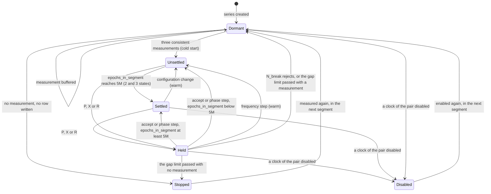

| Event | segment | State after | step_offset | Flags on the row |
| --- | --- | --- | --- | --- |
| Cold start: a dormant series acquires (§13.3) | + 1 | [z_E, 0, 0], σ_ν = σ₀ | 0 | A N |
| Frequency step | + 1 | X⁻ + (a + s t₃, s, 0), then updated | carried | A N |
| Configuration change | + 1 | X⁻ carried; same model | carried | N and the outcome |
| Phase step | same | X⁻ + (Δ, 0, 0), then updated | + Δ | A |
| Slip correction | same | updated from the corrected z_E | unchanged | S and the outcome |
| Held | same | X⁻ | unchanged | P, X or R |
| Dormant | same | none | unchanged | D and P, R or X |
| Disabled (§13.6) | same | none | 0 | O |

Besides these, every row of a 2- or 3-state series that is not dormant carries U while its segment is unsettled (§8.8); a 1-state row never does.

### 13.5 Pseudocode

```python
def carry(epoch_start, last_row, series_params, slip=False, last_segment=None):
    if last_row is None:
        # A new series: dormant, in segment 0; one starting again after a gap:
        # in the segment after its last row's.
        draft = RowDraft(
            epoch_start,
            innovation=None,
            x_fs=None,
            y=None,
            d=None,
            innovation_scale=None,
            segment=0 if last_segment is None else last_segment + 1,
            step_offset=0,
            epochs_in_segment=0,
            epochs_since_accept=0,
            consecutive_rejects=0,
            rejects=(),
            filter_states=series_params.filter_states,
            time_constant=series_params.M,
            scale_time_constant=series_params.M_sigma,
            flags="",
        )
    else:
        draft = RowDraft(
            **{
                **fields_of(last_row),
                "interpolated_datetime": epoch_start,
                "innovation": None,
                "epochs_in_segment": last_row.epochs_in_segment + 1,
                "flags": "",
            }
        )
    if slip:
        draft.flags += "S"
    return draft


def acquire(draft, z, series_params, in_limit=True):
    """Buffer a dormant series' measurement; cold-start on three consistent ones."""
    draft.consecutive_rejects = 0
    if not in_limit:  # a pair's reading over its RMS limit is never buffered
        return dormant(draft, "R")
    draft.rejects = (*draft.rejects, (draft.interpolated_datetime, float(z)))[-3:]
    if len(draft.rejects) == 3 and consecutive_epochs(draft.rejects):
        z1, z2, z3 = (exact(buffered_z) for _, buffered_z in draft.rejects)
        limit = exact(K_OUT * math.sqrt(6) * series_params.sigma0)  # compared exactly
        if abs(z3 - 2 * z2 + z1) <= limit:
            return cold_start(draft, z, series_params)
    return dormant(draft, "R", keep_buffer=True)


def dormant(draft, outcome, keep_buffer=False):
    draft.x_fs = draft.y = draft.d = draft.innovation_scale = None
    if not keep_buffer:
        draft.rejects = ()
    draft.flags += "D"
    return finish(draft, outcome)
```

### 13.6 Disabled clocks

A clock can be set aside from a date by its entries in the clock configuration (§15.2), and taken back from a later one.
While it is disabled, das_processor does not track it, and never uses its measurements.

- Pairs. A pair is disabled while either of its clocks is: a disabled clock's pairs, and every pair of a disabled reference, its self pair and links included. A disabled pair is not predicted, decycled, screened, checked for slips, gated or updated (`disabled_step` in `domain/filter.py`).
- Rows. At an epoch with a reading, a disabled pair writes a row of flag O alone. The row holds the reading's time, phase and RMS as the DAS gave them, no cycle count, and the z of the pair's newest row, or none when that row has none, so z runs on unchanged through the disabled epochs. It holds no state and no innovation, its counters are zero and its buffer empty, and it keeps the segment of the row before it. At an epoch with no reading, it writes no row.
- Everything else. Triples, screening and the slip check see a disabled clock as missing from the epoch's DAS data. A disabled reference is not in REFS(e), and a disabled pair is never accepted and has no prediction, so it gives a triple nothing (§12): a triple through it holds its prediction (P) up to its gap limit, and then stops (§13.3), as it does when its clock is not measured.
- Enabled again. A disabled pair's row is never a last row (§6.3), so when its clocks are enabled again the pair starts afresh, as a new series does, dormant in the segment after its O rows', until it acquires (§13.3).
- Log. Each clock is logged once at INFO at the epoch it is disabled, and at the one it is enabled again, from the configuration at that epoch and the one before, so a run of one epoch logs what a run of many does.

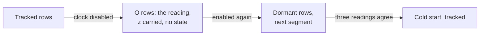

## 14. Timescale interface

The timescale reads the double-difference archive of both RF channels, and nothing from the measurement archive.
The same triple in `das_a` and `das_b` gives two independent measurements.

- Whole epochs only: the timescale reads a channel's archives only while that channel's lock is free (§6.1), so every epoch it reads is whole.
- Measurements of clock c against reference r: one triple (r, s, c) for each reference s that measures c, the local triple (r, r, c) included.
- Input each epoch: `innovation`, the measurement z with das_processor's prediction x⁻ (§8.3), steering included, taken off; on a row that accepts a phase step, the prediction corrected by the step. The prediction carries the clock's deterministic part, its rate and drift, as the estimator follows them.
- Deterministic model: y and d at E, the clock's current rate and drift. They follow the clock with time constant M, so behaviour slower than about M epochs appears in y and d rather than in the innovation.
- Uncertainty: `innovation_scale`.
- Usable rows: a row is used as a measurement only when its flags contain A and not U.
- Phase free of steps: x − step_offset.
- A new segment value starts a new series for that measurement, and the timescale starts its phase again for it.
- P, R, X, D and O rows are never used as measurements; P, R and X rows still carry the state forward.
- Correlation: triples (r, s, c) with the same (r, s), s ≠ r, share that link's error, so the timescale groups them by (r, s). Local triples share no link.

## 15. Configuration

das_processor's configuration has two parts, each read once at the start of a run:

- Settings: the INI file and the command line, merged by `app/config.py`.
- Clock configuration: one YAML file per deployment, giving each clock's estimator settings and location, and each pair's RMS limit.

### 15.1 Settings

Each setting is described once, in the `SETTINGS` table of `das_processor/config.py`, and merged by the project's rules:

- The command line wins where both sources give a setting.
- A required setting given by neither source is a usage error: the full help, and exit status 2.
- An optional setting given by neither source has no value, except `start_from_mjd`, which is then <!-- figure: START_FROM_MJD -->59500<!-- end figure -->.
- The literal `None`, from either source, sets no value for a setting that accepts it.
- A file naming a section or entry the program does not read, a `DEFAULT` section, or a value on more than one line is refused.
- Every path must be absolute.
- A value from the file is read as the command line reads the same setting, so a setting takes the same text from either source.

<!-- generated: settings -->

| Flag | INI file entry | Required | Takes `None` | What it gives |
| --- | --- | --- | --- | --- |
| `--config-file` | command line only | no | no | path to the INI configuration file (optional when every required setting is given on the command line) |
| `--rf` | `[DAS] rf` | yes | no | RF channel to process, overriding the config file's [DAS] rf (default: use the config file) |
| `--cd5m5m-path` | `[DAS] cd5m5m_path` | yes | no | path to the DAS 5 MHz phase data, overriding the config file's [DAS] cd5m5m_path (default: use the config file) |
| `--steering-path` | `[DAS] steering_path` | yes | no | path to the directory of steering files, one per reference clock, overriding the config file's [DAS] steering_path (default: use the config file) |
| `--processed-path` | `[PROCESSED] processed_path` | yes | no | path for processed results, each kind of file in a subdirectory of its own, overriding the config file's [PROCESSED] processed_path (default: use the config file) |
| `--redo-from-mjd` | command line only | no | no | reprocess data starting from this MJD, before the run; command line only, with no config-file entry (default: no reprocessing) |
| `--start-from-mjd` | `[PROCESSED] start_from_mjd` | no | no | MJD to start processing from when there are no processed files to read a previous measurement from (floored to its ten-minute mark), overriding the config file's [PROCESSED] start_from_mjd (default: use the config file, else MJD 59500) |
| `--clock-config-file` | `[PROCESSED] clock_config_file` | yes | no | path to the YAML clock configuration (each clock's estimator parameters and location, the pairs' RMS limits, and the clocks to ignore), overriding the config file's [PROCESSED] clock_config_file (default: use the config file) |
| `--num-workers` | `[PROCESSED] num_workers` | no | yes | number of worker processes to work each epoch's series, overriding the config file's [PROCESSED] num_workers; pass None to work them in the main process alone (default: use the config file) |
| `--steps` | command line only | no | no | process exactly this many ten-minute epochs that write rows and shut down, instead of every epoch not yet processed; an epoch of a data gap that writes no row is not counted; command line only, with no config-file entry (default: process every new epoch) |
| `--log-file` | `[LOGGING] log_file` | yes | yes | path to the log file, overriding the config file's [LOGGING] log_file; pass None to disable file logging (default: use the config file) |
| `--log-level` | `[LOGGING] log_level` | yes | yes | logging level, overriding the config file's [LOGGING] log_level; pass None to disable logging entirely (default: use the config file) |
| `--backup-count` | `[LOGGING] backup_count` | no | yes | number of rotated daily log files to keep, overriding the config file's [LOGGING] backup_count; pass None to keep every rotated file (default: use the config file) |

<!-- end generated -->

The [user manual](user_manual.md) gives a complete example file.

### 15.2 Clock configuration

The clock configuration gives each clock's estimator settings and location, and each pair's RMS limit.
`etc/clock_config.yaml.example` in the repository is a complete example with invented names and numbers, and the [user manual](user_manual.md) explains every key.

| Key | Holds | Used by |
| --- | --- | --- |
| `rejects_before_restart` | N_break | Step classification and dormancy (§9.4, §13.3) |
| `rms_limit` | The RMS limit of a pair, of a reference's pairs, and a default | The gate, pairs only (§9.1) |
| `types` | A default entry for each clock type | Every clock of that type |
| `clocks` | One or more entries for each clock | The clock's series: a pair takes the entry of its second clock, a triple the entry of its clock c (§8.1) |
| `ignore` | Clocks measured but of no use | Left out of every epoch |

`entry_for(clock, epoch_start)` starts from the type default of the clock's first entry.
A clock that fits no type gives every setting in its first entry instead, with no type and no `effective_mjd`, and those settings are its default.
It then applies, in order of `effective_mjd`, every entry for that clock in force at the mark: an entry without `effective_mjd` from the start, one with it from the first mark at or after it.
Each entry overrides only the fields it gives.
An entry may also give the clock's location, the number of the building it is in; a type never gives one.
An entry may disable the clock from its date, with `disabled: true` or `enabled: false`, and a later one enable it again, with `disabled: false` or `enabled: true`; an entry gives one of the two keys, not both, and a type gives neither (§13.6).
A clock that moves gets an entry with its new building from the MJD of the move, and a clock no entry in force places has no location (§3.3).

A clock the file does not name has no settings, so das_processor leaves out every measurement of it as the measured clock, and every series whose clock side, its last name, it is. It logs the clock at WARNING when it first finds it so in a run, and again whenever it returns after an epoch without it; the run goes on.
A clock listed under `ignore` is left out the same way, with nothing logged.

`read_clock_config` reads the file with a YAML loader that builds only plain data, validates it into frozen pydantic models, and raises `ConfigError` when:

- a key is repeated at any level, is a YAML merge key, or is not a key described here;
- a clock has no entry; its first entry gives a type the file does not define, or gives no type and has an `effective_mjd` or leaves a setting out; or a later entry gives a type;
- a reference's type is not <!-- figure: REFERENCE_TYPE -->`mc`<!-- end figure -->;
- an entry changes a clock's `filter_states`;
- `filter_states` is not 1, 2 or 3; `time_constant` is missing or below 1 for a 2- or 3-state clock, or given for a 1-state clock; or `scale_time_constant` is below 1;
- `initial_innovation_scale` is not above zero, or a location is not a whole number above zero;
- a clock under `ignore` is named twice, or also has entries;
- an entry gives both `disabled` and `enabled`, or either as other than `true` or `false`;
- `rejects_before_restart` is below 3, or above the gap limit of any type or of any clock at any date;
- an RMS limit is not a whole number above zero, a reference under `references` is not named as a reference, or a pair under `pairs` is not written `reference.clock`.

### 15.3 Choosing the time constants

Each clock needs its own time constant M, initial innovation scale σ₀ and gap limit G_max.
They come from a *characterization*: a study of how noisy the clock is over different averaging times, measured as its Allan deviation.

The data come from a characterization run: das_processor run over the DAS files into a `processed_path` of its own, with a characterization clock configuration:

- `filter_states` 1 for every clock: the pass-through needs no time constants.
- `initial_innovation_scale` at least the largest expected |rate| × 600 s / 5 of any clock. A 1-state prediction carries no rate, so every innovation includes rate × T, and a smaller σ₀ rejects nearly every row of a clock with a frequency offset.
- `scale_time_constant` and `gap_limit`: general values, with `gap_limit` at least `rejects_before_restart`.
- `rms_limit` and `rejects_before_restart`: the production values.

The references realize the timescale, so clock c measured against a reference r is clock c against the timescale.
Clock c has a local triple (r, r, c) for each reference r in its building; a clock with no location has none and is not characterized.
The input is the z column of each local triple from that run, each prepared on its own, over a span several times the longest crossover τ_c (below) expected, in these steps, in order:

1. Accepted rows only.
2. Split at cold starts. A cold start, a row flagged N after a dormant row, sets step_offset back to 0, and may start the cycle count again, so the rows from one cold start up to the next are treated on their own. From each row, subtract its step_offset, which carries every phase step since that cold start.
3. Drop days with no clock signal, or far off frequency. A DAS channel whose clock is off or disconnected still gives readings, but their phase is spread over the whole period, and their changes from one epoch to the next are tens of nanoseconds; a clock's are far smaller. For each UTC day, take the changes between rows one epoch apart that end in it, their median, and the median of their absolute differences from that median. Every row of a day where that is above 10 ns is dropped, and so is every row of a day whose median change is beyond 25 ns either way, which nears half the period between epochs. A day with no two rows one epoch apart cannot be judged, and is kept.
4. Move each value to its epoch start. A 1-state prediction has no rate to move a reading back to E, so z includes rate × δ. For the rows between cold starts, the rate is the median change between rows one epoch apart divided by T, and each value less rate × δ is used from here on, δ coming from the pair (r, c)'s `measurement_datetime`.
5. Drop outliers. For each UTC day, take every change between rows one epoch apart that ends in it, their median, and their robust spread: 1.4826 times the median of their absolute differences from that median. A row is dropped when its changes from both neighbours, one epoch either side, each differ from their day's median change by more than 5 of that day's robust spreads, in opposite directions; with only one neighbour, when that one change does.
6. Split at jumps. A jump that stays raises the Allan deviation at every τ that spans it. The rows are split before every row whose change from the row before, less its day's median change times the epochs between them, is more than 5 robust spreads times those epochs.
7. Remove drift, for the clocks the script's command line names as 3-state: a quadratic fitted to each piece's phase is subtracted from it.
8. Fit. The Allan variance of each piece is computed at τ = mT for m = 1, 2, 4, …, up to a third of the time the piece covers, from only the sets of three rows at epochs k, k + m and k + 2m that are all present. The pieces' variances are averaged at each τ, weighted by their numbers of terms, and then every reference's the same way. The result is fitted by least squares to a₋₂/τ² + σ²_y,c(τ), the measurement's white phase noise and the clock's model below, each τ weighted by (its terms ÷ m) ÷ (the model's value there)², every coefficient held at zero or above, and the fit repeated with the model's values from the fit before until the coefficients stop changing.

The clock's noise model, white, flicker and random-walk frequency noise:

```latex
\sigma_{y,c}^2(\tau) = \frac{a_{-1}}{\tau} + a_0 + a_1\,\tau
```

The measurement noise σ_meas, in ps, is √(a₋₂ / 3) × 10¹², from the fit's white phase term, never from the rms column the DAS reports, which does not match the phase's own scatter:

```latex
\sigma_{y,\mathrm{meas}}(\tau) = \frac{\sqrt{3}\,\sigma_{\mathrm{meas}}\cdot 10^{-12}}{\tau}
```

The settings follow:

- `time_constant` (M): the crossover of the measurement noise and the clock's noise, in epochs: √3 σ_meas 10⁻¹² / τ_c = σ_y,c(τ_c), M = max(1, round(τ_c / T)). Below τ_c the measurement's noise is the larger, so the estimator should average; above it the clock's own wander is, so the estimator should follow.
- `scale_time_constant` (M_σ): sets how precise σ_ν is (§9.2).
- `initial_innovation_scale` (σ₀): the size of a one-epoch innovation, √(σ²_meas + (T σ_y,c(T) × 10¹²)²).
- `gap_limit` (G_max): by §13.2, from the clock's own noise alone.

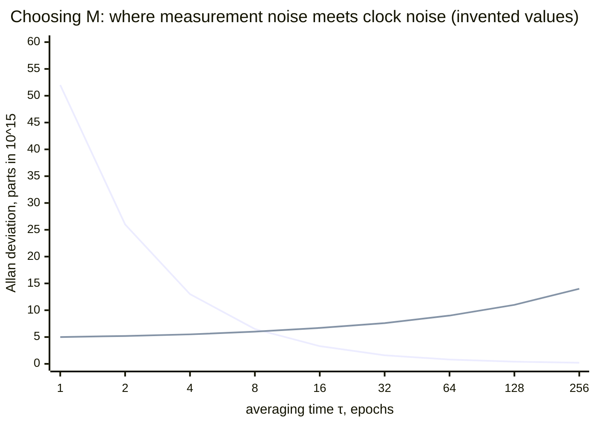

The falling line is the measurement's white phase noise and the rising line the clock's own noise; M is where they cross.
`scripts/characterize.py` carries out this section on a characterization run's files and prints one line per clock, with the days it dropped; a clock with fewer prepared rows than a given number of days' worth of epochs gets no settings, and the command line can change how many days that is.
It searches G_max up to a fixed limit, and gives −1 when even a gap of no epochs fails.

## 16. Error handling and logging

### 16.1 Errors

Every error the project defines is a subclass of `MasterClockError`, kept in its package's `exceptions` module, and logged at ERROR where it is raised, but for two kinds: a refused DAS line, logged at WARNING where it is skipped, and the errors in the settings, which the entry point logs, or prints when logging cannot start.
The entry point turns a failure into exit status 1, saying nothing more, and a required setting given by neither source into exit status 2 (§6.1).

<!-- generated: errors -->

| Error | Package | Based on | When it is raised |
| --- | --- | --- | --- |
| `MasterClockError` | app | `Exception` | Base class for all masterclock application errors. |
| `ConfigError` | app | `MasterClockError` | Raised when a configuration a run needs cannot be read or believed. |
| `MissingSettingsError` | app | `ConfigError` | Raised when a required setting is provided by neither source. |
| `RunLockError` | app | `MasterClockError` | Raised when a run lock cannot be acquired. |
| `LoggingError` | app | `MasterClockError` | Raised when the application's logging cannot be set up as intended. |
| `PhaseError` | domain | `MasterClockError` | Raised when the phase mathematics is given values it cannot use. |
| `FilterError` | domain | `MasterClockError` | Raised when the forward estimator is given values it cannot use. |
| `DataFileError` | das_processor | `MasterClockError` | Raised when a data file or directory cannot be used as a run needs. |
| `RefusedLineError` | das_processor | `MasterClockError` | Raised when a line of a data file must not be used. |
| `MalformedLineError` | das_processor | `RefusedLineError` | Raised when a line cannot be read as a record at all. |
| `InconsistentLineError` | das_processor | `RefusedLineError` | Raised when a line's columns contradict each other. |
| `WrongDayError` | das_processor | `RefusedLineError` | Raised when a measurement falls outside the day its file is named for. |
| `OutOfOrderError` | das_processor | `RefusedLineError` | Raised when a measurement is earlier than the one accepted before it. |
| `DuplicatePairError` | das_processor | `RefusedLineError` | Raised when a reference-clock pair is measured twice in one epoch. |
| `LateLineError` | das_processor | `RefusedLineError` | Raised when a measurement was taken too near the end of its epoch. |
| `WorkerError` | das_processor | `MasterClockError` | Raised when a worker process fails or stops answering. |

<!-- end generated -->

| Condition | Raised as |
| --- | --- |
| A DAS line refused for any reason of §5.3 | A `RefusedLineError` subclass; logged at WARNING and skipped, never a failure |
| A DAS file or directory that cannot be read; a last line with no newline | `DataFileError` |
| An output file that cannot be read or written, a file holding no whole row or a damaged first row with no write stopped part way (§6.7), a row that does not give itself back, a value too wide for its column | `DataFileError` |
| A steering file that cannot be read or parsed | `DataFileError` |
| An invalid setting or clock configuration | `ConfigError` |
| A required setting given by neither source | `MissingSettingsError`; a usage error, exit status 2 |
| A second run of the same channel | `RunLockError` |
| A local triple that does not collapse to its pair; a phase outside its range | `PhaseError` |
| A value that is not finite; a model that is not 1, 2 or 3 states; values from different models used together | `FilterError` |
| A worker that failed or stopped answering | `WorkerError` |

`LoggingError` is raised only for a logger name that is not a `MasterClockLogger`, a programming error found when a module is imported.

### 16.2 Logging

Logging is `app/log.py`, set up from the `[LOGGING]` settings.
Every module logs through `get_logger(__name__)`.
A record is one line, timed in UTC with the MJD beside it, whatever its message holds; a traceback keeps its own lines.
The log file rolls over at midnight UTC, and `backup_count` old files are kept, or all of them.
Besides the standard levels there is TRACE, below DEBUG.

```
2026-09-24 14:10:03.512 UTC, MJD 61307.590318 | WARNING | masterclock.das_processor.run: das_a.mc2.hm7 rejected: innovation 41.7 ps, scale 3.1 ps, 1 consecutive
2026-09-24 14:10:03.514 UTC, MJD 61307.590318 | INFO | masterclock.das_processor.run: epoch 2026-09-24 14:00:00+00:00: 29 pairs, 87 triples, 114 accepted, 2 held
2026-09-24 14:30:04.101 UTC, MJD 61307.604214 | INFO | masterclock.das_processor.run: das_a.mc2.hm7 phase step of 40 ps; step offset 40 ps
```

| Level | Events |
| --- | --- |
| ERROR | Every error, where it is raised; each damaged data file, once, with where and why (§6.7) |
| WARNING | Refused DAS lines; a DAS directory with no data files; a clock with no entry in the clock configuration and not ignored, once when found (§15.2); counted rejects; missing or failed self-measurements, reciprocity and closure failures; undecided slips; a roll-back, once for all its files (§6.7) |
| INFO | Each epoch processed, with its counts of rows written, accepted and held; corrected slips; phase steps, frequency steps, cold starts, dormancy, a series that stops writing rows, configuration changes; a clock disabled or enabled again, once at the epoch it happens (§13.6); a redo, once for all its files (§6.5) |
| DEBUG | Each series' flags at each epoch; a DAS directory entry passed over; the run lock taken and freed |
| TRACE | Each series' prediction, innovation and update |

The run logs an epoch's events once its rows are in the day buffer (`log_epoch` in `das_processor/run.py`), from what screening and the slip check gave and from each series' row beside its last row: a step, dormancy or a configuration change is read from how the row differs from the last, and a cold start from the filter step's result.
Series are logged in key order, pairs first.
Nothing is worked out for a level the log leaves out: when WARNING is not logged the epoch is not looked at, and a TRACE line is made only when TRACE is logged.

## 17. Testing and verification

### 17.1 Tests

The tests follow the project's layout and tools:

- Location: one test module per module, mirroring the source: `tests/masterclock/domain/test_filter.py` for `src/masterclock/domain/filter.py`, and so on.
- Isolation: every test module passes on its own (`scripts/check_test_modules_alone.py`).
- Layering: `tests/masterclock/test_layout.py` checks every module's imports.
- Doctests run as tests.
- Coverage: 100% of lines and branches, for the source, the scripts and the tests each.
- Property tests: Hypothesis covers decycling, formatting round trips and the estimator's rules. It also generates random deployments and runs each one in one run and one epoch per run; the data files must be byte-identical.
- Mutation testing: mutmut, run by hand over `src`.
- Timing: `scripts/epoch_timing.py` builds an invented deployment and times das_processor on it, one process per epoch as the scheduler runs it and one process for a whole day, against an epoch's 600 s.
- Test data: every test makes invented data in a temporary directory.

A test that carries one of these identifiers in its docstring is a test of that row.

| ID | Area | Test | Expected |
| --- | --- | --- | --- |
| U1 | Epochs | Measurements 1 µs either side of a ten-minute mark | The earlier falls in the previous epoch; δ = 0 at the mark |
| U2 | Rounding | round_even on 2.5, 3.5, −2.5 and on large values | 2, 4, −2; exact whole-number results |
| U3 | Decycling | Ramps with positive and negative rates and prediction errors up to 0.45P | The decycled phase equals the truth at every epoch |
| U4 | Steering | An event inside the epoch, before the measurement | z_E equals the true phase at E; the next epoch's u holds the event in full |
| U5 | Steering signs | signs() for self, link and clock pairs and triples | As the table in §7.1 |
| U6 | Gains | Eigenvalues of (I − KH)Φ for M = 10, 30, 100, 300, 1000 | Every eigenvalue within 10⁻⁴ of λ |
| U7 | Estimator | A noise-free phase ramp (2 states) and parabola (3 states) | \|ν\| ≤ 1 ps after 20M epochs |
| U8 | Gate | Innovations just inside and just outside 5σ_ν; rms just over the limit | A, then R; R |
| U9 | Phase step | A step of 50σ_ν at epoch k | R at k and k + 1; A at k + 2 with step_offset += Δ within 1 ps; same segment |
| U10 | Frequency step | A rate step of 10σ_ν per epoch at epoch k | R at k and k + 1; A N U at k + 2; segment + 1 |
| U11 | N_break | Large outliers that disagree with each other | Dormant when consecutive_rejects reaches N_break; a cold start only after three consistent measurements |
| U12 | Exclusion | An excluded measurement inside the gate | X; consecutive_rejects and buffer unchanged; epochs_since_accept + 1 |
| U13 | Gaps | No measurement for G_max epochs, then for G_max + 1 | First: an ordinary accept. Second: no row from G_max + 1 on; measured again, D rows in the next segment, then a cold start after three consistent measurements |
| U14 | Configuration change | A new entry with another M; a new entry with another model | A warm start at the entry's epoch with new gains; the model change refused when the file is read |
| U15 | Reciprocity | A delay added to one direction, then to both | Only that direction excluded; then both |
| U16 | Closure | Four references, an error in one link's two-way value | Only that link excluded |
| U17 | Slip | ±P added to one of three clock pairs; then two references with one not settled | Corrected with flag S; the pair not settled corrected |
| U18 | Components used | A constant link hardware offset, components_used 111 → 110 → 101 | dd changes by less than σ_dd across the switches |
| U19 | Local triple | Every epoch of an invented collection of clocks | dd = z(r,c) exactly |
| U20 | Format | Parse then format random rows | The same text on a second format |
| U21 | Recovery | A raise in every compute and prepare step; a kill before and after every write and flush; a power failure's lost rows before the final write | A raise changes no file. After a kill or a lost flush, the next run cuts every file back to before the journal's epoch, and the data files end byte-identical to an uninterrupted run's; a torn line is cut back the same way |
| U22 | Determinism | Run twice; run with a restart after every epoch; run one epoch per process, each with another hash seed | Byte-identical data files; logs not compared |
| U23 | Self-measurement | A shift in (r, r) shared by half of r's pairs; a shift in (r, r) alone; (r, r) missing | Only the sharing pairs excluded; then none; then none, with a warning |
| U24 | 1-state pass-through | A 1-state series given accepted measurements, outliers and a phase step | x = z exactly on every accepted row; y and d 0.0; no U flag; outliers rejected and the step accepted as for any series |
| U25 | Acquisition | A dormant series given scattered measurements, then a gap, then steady measurements with a large constant rate, a wrap included | Stays dormant through the scatter; cold-starts on the third steady measurement |
| U26 | File length | A file cut inside its last row; cut inside its header; holding only its header; with a row of the wrong length inside it; with a first row that does not parse | Every file cut back to the damaged file's last good row, the damage logged at ERROR, and the data files then byte-identical to an uninterrupted run's; a file with no whole row, or a damaged first row, raises `DataFileError` and changes no file |
| U27 | Exact phase | Prediction, referring back, update and double difference with phases beyond 2⁵³, and sums ending in exactly ½ | Every stored phase equals the same sum done exactly and rounded half to even |
| U28 | Series that stop | A clock's measurements stop for longer than G_max, then come back; a data gap no series writes; run in one go and one epoch per run, with and without workers | P rows up to G_max, then no row, and one INFO line when it stops; on its return, rows again in the next segment; an epoch that writes no row is not counted as a step; data files byte-identical every way |
| U29 | Disabled clocks | A clock disabled for three epochs, then enabled again; a disabled reference; run in one go and one epoch per run, with and without workers | O rows holding the reading and the carried z; the triples, screening and the other pairs as if the clock was missing; dormant in the next segment once enabled; one INFO line at each change; data files byte-identical every way |

Each invariant of §1.3 is held by these tests: I1 by U21 and U26, I2 by U13, U28 and U29, I3 and I8 by U21, I4 and I5 by U22, U28, U29 and the property tests, I6 by the epoch-loop tests, and I7 by U2 and U27.

### 17.2 Synthetic data

A simulator, left for a later version of the project, will generate inputs with a known truth: clocks with the noise model of §15.3, references with steering, measurements with noise and hardware delays, and injected outliers, steps, gaps, faults on one link direction and malformed lines.
The scenarios that need it, such as thirty clean days, tracking against the truth and every injection found at its epoch, wait for it.

## Appendix A. Worked epoch

This appendix takes one measurement through every step, with the program's own functions and numbers.
It starts from these invented values; with no steering, u = 0 and w = 0:

<!-- generated: worked-inputs -->

| Input | Value |
| --- | --- |
| Pair | (mc2, hm7), RF channel a |
| Estimator | 3-state, M = 100, M_σ = 50, σ₀ = 5 ps, RMS limit 80 ps |
| Pair's last row, 2025-09-23 05:50:00 UTC | x = 1 234 567 ps, y = 0.0123 ps/s, d = 0 ps/s², σ_ν = 3 ps |
| Steering | none |
| Links | z(mc1, mc2) = 5 432 100 ps, z(mc2, mc1) = -5 432 080 ps, rms 2 ps each, both accepted |
| Self pair | z(mc2, mc2) = 12 ps, accepted; it cancels in the local triple |
| Remote triple's last row, 2025-09-23 05:50:00 UTC | x = 6 666 660 ps, y = 0.0205 ps/s, d = 0 ps/s², σ_ν = 3.5 ps |
| Local triple's last row, 2025-09-23 05:50:00 UTC | the pair's last row |

<!-- end generated -->

The DAS line:

<!-- generated: worked-raw-line -->

```text
60941.251588     34579    3 2B07 hm7
```

<!-- end generated -->

<!-- generated: worked-steps -->

| Step | What is worked out | Result |
| --- | --- | --- |
| Epoch start | the measurement time rounded down to ten minutes | E = 2025-09-23 06:00:00 UTC, δ = 137.203 s |
| Predict | x⁻ = 1 234 567 + 0.0123 × 600 | x⁻ = 1 234 574.3800 |
| Prediction at the measurement time | x̂ = x⁻ + y⁻δ | x̂ = 1 234 576.0676 |
| Decycle | n = round((x̂ − 34579) / 200000) | n = 6 |
| Unwrapped phase | x_u = φ + nP | x_u = 1 234 579 |
| Refer back to E | z_E = round_even(x_u − y⁻δ) | z_E = round_even(1 234 577.3124) = 1 234 577 |
| Innovation | ν = z_E − x⁻ | ν = 2.6200 |
| Gate | \|ν\| ≤ 5 × 3, rms 3 ≤ 80 | flags A |
| Gains | λ = e^(−1/M) | g = 0.0295545, h/T = 4.92566e-07, 2k/T² = 2.73646e-12 |
| Update | x = x⁻ + gν, y = y⁻ + (h/T)ν, d = (2k/T²)ν | x = 1 234 574.4574, stored as 1 234 574.457; y = 0.01230129052352643; d = 7.169515400974333e-12 |
| Innovation scale | σ_ν² = max((1 − w)σ_ν² + wν², rms²), w = 1/M_σ | σ_ν = 3 |

<!-- end generated -->

The phase sums are exact; the decimals shown are rounded for reading.
The rows of the pair's measurement file for this epoch and for the next, which has no measurement:

<!-- generated: worked-meas-rows -->

```text
2025-09-23 06:00:00+00:00,  60941.250000, 2025-09-23 06:02:17.203200+00:00,  60941.251588,  34579,    3,            6,          1234577,          1234574.457, +1.2301290523526430e-02, +7.1695154009743332e-12, +3.0000000000000000e+00,         4,                0,       812,         0,         0,             -,                       -,             -,                       -,             -,                       -, 3, +1.0000000000000000e+02, +5.0000000000000000e+01,        A
2025-09-23 06:10:00+00:00,  60941.256944,                                -,             -,      -,    -,            -,                -,          1234581.838, +1.2301294825235671e-02, +7.1695154009743332e-12, +3.0000000000000000e+00,         4,                0,       813,         1,         0,             -,                       -,             -,                       -,             -,                       -, 3, +1.0000000000000000e+02, +5.0000000000000000e+01,        P
```

<!-- end generated -->

The remote triple (mc1, mc2, hm7) and the local triple (mc2, mc2, hm7) at the same epoch, by §12.1 and §12.4:

<!-- generated: worked-triples -->

| Triple | dd (ps) | σ_dd (ps) | Components used |
| --- | --- | --- | --- |
| (mc1, mc2, hm7), remote | 6 666 667 | 3.31662 | 111 |
| (mc2, mc2, hm7), local | 1 234 577 | 3 | 111 |

<!-- end generated -->

```latex
dd = z_{(\mathrm{mc2},\mathrm{hm7})} + \tfrac{1}{2}\left[z_{(\mathrm{mc1},\mathrm{mc2})} - z_{(\mathrm{mc2},\mathrm{mc1})}\right], \qquad \sigma_{dd} = \sqrt{\sigma_{\mathrm{mc2,hm7}}^2 + \tfrac{1}{4}\left(\sigma_{\mathrm{mc1,mc2}}^2 + \sigma_{\mathrm{mc2,mc1}}^2\right)}
```

Their rows, the remote triple's first; the local triple's estimate is its pair's, since it starts from the same row and its σ_dd is the pair's rms:

<!-- generated: worked-ddiff-rows -->

```text
2025-09-23 06:00:00+00:00,  60941.250000,          6666667, -5.3000000000000007e+00, +3.3166247903553998e+00, 111,          6666672.143, +2.0497389398973252e-02, -1.4503218177543500e-11, +3.5449682650201537e+00,         2,                0,      3107,         0,         0,             -,                       -,             -,                       -,             -,                       -, 3, +1.0000000000000000e+02, +5.0000000000000000e+01,        A
2025-09-23 06:00:00+00:00,  60941.250000,          1234577, +2.6200000000000001e+00, +3.0000000000000000e+00, 111,          1234574.457, +1.2301290523526430e-02, +7.1695154009743332e-12, +3.0000000000000000e+00,         4,                0,       812,         0,         0,             -,                       -,             -,                       -,             -,                       -, 3, +1.0000000000000000e+02, +5.0000000000000000e+01,        A
```

<!-- end generated -->

## Appendix B. Named constants

The constants this document names, with their values and meanings as the code gives them:

<!-- generated: constants -->

| Constant | Module | Value | Meaning |
| --- | --- | --- | --- |
| `PHASE_PERIOD` | domain.phase | 200 000 | One period of a 5 MHz signal, in picoseconds. |
| `PHASE_MAX` | domain.phase | 199 999 | The largest phase a reading can give, in picoseconds. |
| `FS_PER_PS` | domain.phase | 1000 | Femtoseconds in one picosecond. |
| `EPOCH_SECONDS` | domain.phase | 600 | How long one epoch lasts, in seconds: from one ten-minute mark to the next. |
| `REFERENCE_PREFIX` | domain.references | `mc` | What every reference clock's name begins with. |
| `FLAG_ORDER` | domain.series | `ARXPODSNU` | Every flag a row can carry, in the order they are written in a row. |
| `MAX_REJECTS` | domain.series | 3 | How many entries a row's reject buffer holds at most. |
| `K_OUT` | domain.filter | 5 | How many innovation scales wide the gate is, either way. |
| `K_STEP` | domain.filter | 3 | How many innovation scales each of three rejects may lie from a step's fit. |
| `SETTLE_FACTOR` | domain.filter | 5 | A segment is unsettled while it has run fewer than this many times M rows. |
| `K_SHARED` | domain.screening | 3 | How many combined scales a pair may lie from its self pair's shift and share it. |
| `FIRST_DAY` | das_processor.read_cd5m5m | 50000 | The earliest MJD day a data file can cover. |
| `LAST_DAY` | das_processor.read_cd5m5m | 99999 | The latest MJD day a data file can cover. |
| `RMS_MAX` | das_processor.read_cd5m5m | 9999 | The largest RMS a line may give, ps: the most its column holds. |
| `EPOCH_EDGE` | das_processor.read_cd5m5m | 10 s | How near the end of its epoch a measurement may not be taken. |
| `SKIPPED_REFERENCES` | das_processor.read_cd5m5m | `mc9` | References the DAS measures against that das_processor does not use. |
| `DATA_FILE_TEMPLATE` | das_processor.read_cd5m5m | `cd5m5m_<mjd>.dat` | Name of the daily DAS data file covering one MJD day. |
| `STEERING_FILE_TEMPLATE` | das_processor.read_steering | `steer_<mc>.dat` | The name of a reference's steering file, `mc` its name. |
| `START_FROM_MJD` | das_processor.cli | 59500 | The MJD a run starts from when it must start somewhere and is not told where. |
| `MEAS_SUBDIRECTORY` | das_processor.config | `meas` | The `processed_path` subdirectory holding the measurement files. |
| `DDIFF_SUBDIRECTORY` | das_processor.config | `ddiff` | The `processed_path` subdirectory holding the double-difference files. |
| `LOCK_FILE_TEMPLATE` | das_processor.config | `das_processor_<rf>.lock` | Name of the run lock file, directly in `processed_path`. |
| `JOURNAL_FILE_TEMPLATE` | das_processor.config | `das_processor_<rf>.writing` | The name of an RF channel's write journal in `processed_path`. |
| `REFERENCE_TYPE` | das_processor.clock_config | `mc` | The type every reference clock has. |

<!-- end generated -->
