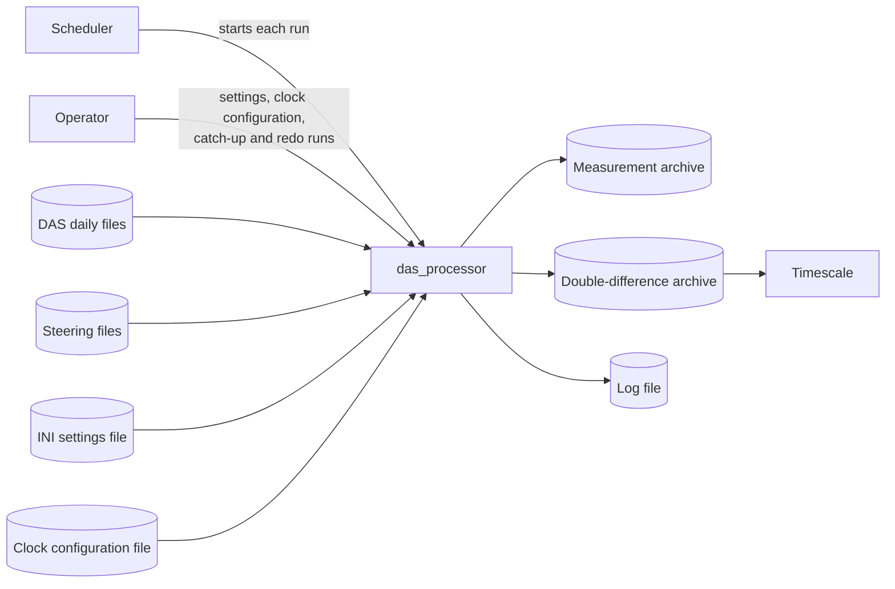

# das_processor requirements

**Date:** 2026-10-05 20:53:32 UTC

This document lists what `das_processor` must do, as numbered requirements a test or a reader can check.
The [design](design.md) says how it does each one, and the [user manual](user_manual.md) says how to use it.

## 1. About this document

### 1.1 Who it is for

It is written for someone new to the project and to timekeeping.
Section 2 gives the background and the words used, section 3 shows where `das_processor` sits among the systems around it, and section 4 holds the requirements.

### 1.2 How the requirements are written

Each requirement has an identifier made of a group and a number, such as IN-3.
An identifier never changes, and the number of a withdrawn requirement is never used again, so a gap in the numbers is expected.
Each requirement states behaviour that a change to the program could make untrue.
The Design column names the section of the [design](design.md) that carries it out.

| Group | Covers |
| --- | --- |
| IN | Input: what the program reads, and what it refuses |
| PR | Processing: what it works out from what it reads |
| OUT | Output: the files it writes |
| OP | Operation: how a run starts, stops, resumes and recovers |
| ER | Errors and logging: how it reports what went wrong and what it did |
| QU | Quality: properties of the program's code |

Numbers in a requirement that come from the code are written from the code and checked against it on every commit.

## 2. Background

### 2.1 The problem

A timekeeping laboratory keeps many atomic clocks and builds a *timescale*, a time steadier than any one clock, from all of them.
The laboratory's Data Acquisition System (DAS) compares every clock with a few *reference* clocks every ten minutes, and has done so for years.
Its record has gaps, restarted clocks, deliberate changes to the references, instrument faults and jumps.
`das_processor` turns that record into clean, screened, aligned measurements of every clock, ready for the timescale.

### 2.2 Words used

| Word | Meaning |
| --- | --- |
| Phase | How far one clock's 5 MHz signal is ahead of another's, in picoseconds (ps) |
| Period, P | One cycle of the 5 MHz signal: <!-- figure: PHASE_PERIOD -->200 000<!-- end figure --> ps; a reading shows only where in it the phase falls |
| Decycling | Putting back the whole periods a reading cannot show |
| Epoch | One ten-minute interval, from one ten-minute mark of the clock (00:00, 00:10, …) to the next, in UTC |
| Epoch start, E | The ten-minute mark an epoch begins at |
| MJD | Modified Julian Day: days since midnight UTC at the start of 17 November 1858, used by the DAS for times |
| Reference | A clock the DAS measures others against, named `mc` and one digit |
| Steering | A deliberate change to a reference's phase or rate, logged in its steering file |
| RF channel | One of the DAS's two independent copies, `a` and `b` |
| Pair (a, b) | Reference a measured against clock b; b may itself be a reference |
| Self pair (r, r) | A reference measured against itself through the measurement system |
| Link (r, s) | One reference measured against another |
| Triple (r, s, c) | Clock c compared with reference r through its local reference s, built from pairs |
| Local triple (r, r, c) | A triple whose reference is c's own local reference |
| Double difference | The value of a triple: the pair (s, c) plus half the difference of the links (r, s) and (s, r) |
| Series | The rows of one pair or one triple, one per epoch |
| Estimator | The small filter each series runs, following phase, rate and, for some clocks, drift |
| Innovation, ν | A measurement less the estimator's prediction of it |
| Gate | The test a measurement must pass to be accepted |
| Segment | A run of rows of a series between restarts of its estimator |
| Dormant | Having no estimate to predict from, so measurements are only gathered |
| Disabled | Set aside by the clock configuration from a date: a disabled clock is not tracked, and its measurements are never used |
| Building | Where a clock is; a triple needs its s and c in the same building |

## 3. Context

| Interface | Direction | Format | Owner |
| --- | --- | --- | --- |
| DAS daily files | in | One text file per MJD day, five columns a line | The DAS |
| Steering files | in | One text file per reference, three columns a line | The steering system |
| INI settings file and command line | in | INI sections `[DAS]`, `[PROCESSED]`, `[LOGGING]` | The operator |
| Clock configuration | in | YAML | The operator |
| Measurement and double-difference archives | out | Fixed-width text files, one per series | das_processor |
| Log | out | One line per record, UTC and MJD | das_processor |
| Exit status | out | 0, 1 or 2 | das_processor |

## 4. Requirements

### 4.1 Input (IN)

| ID | Requirement | Design |
| --- | --- | --- |
| IN-1 | das_processor reads the DAS data of a run from the files named <!-- figure: DATA_FILE_TEMPLATE -->`cd5m5m_<mjd>.dat`<!-- end figure --> in the data directory, for MJD days <!-- figure: FIRST_DAY -->50000<!-- end figure --> to <!-- figure: LAST_DAY -->99999<!-- end figure -->, in day order, as one continuous stream; it ignores every other entry of the directory. | §5.3 |
| IN-2 | It reads each DAS line as five columns: the MJD, written as five digits, a point and six decimals; the phase, a whole number of ps from 0 to one less than a period; the RMS, a whole number of ps up to <!-- figure: RMS_MAX -->9999<!-- end figure -->; the switch position, a digit, a capital letter and two digits; and the clock's name. The reference is `mc` followed by the switch position's digit. | §5.3 |
| IN-3 | It skips, and logs at WARNING with the reason, a DAS line that cannot be read as such a record, that falls outside the day its file is named for, that was taken within <!-- figure: EPOCH_EDGE -->10 s<!-- end figure --> of the end of its epoch, that is earlier than the line accepted before it, or that measures a reference and clock already measured in its epoch. A skipped line changes nothing that later lines are checked against. | §5.3 |
| IN-4 | It skips, with nothing logged, a DAS line measured against a reference it does not use: <!-- figure: SKIPPED_REFERENCES -->`mc9`<!-- end figure -->. | §5.3 |
| IN-5 | It stops the run when a DAS file cannot be read, or its last line has no newline. | §5.3, §16.1 |
| IN-6 | It reads each reference's steering events from the file <!-- figure: STEERING_FILE_TEMPLATE -->`steer_<mc>.dat`<!-- end figure --> in the steering directory, each line an MJD, a phase change in ps and a rate change in ps/s. A reference with no file has never been steered. It stops the run when a steering file that is there cannot be read as text, or has a line that does not parse, is earlier than the line before it, or ends without a newline. | §5.6 |
| IN-7 | It takes its settings from an INI file and from the command line, the command line winning where both give one. It refuses a file that names a section or entry it does not read, holds a `DEFAULT` section, or gives a value on more than one line. | §15.1 |
| IN-8 | It takes every path as given, and refuses a path that is not absolute. | §15.1 |
| IN-9 | For a setting that accepts it, the literal `None`, from either source, sets no value; an option left off the command line takes the file's value. | §15.1 |
| IN-10 | Before it changes anything, it refuses a run whose data or steering directory cannot be listed, whose clock configuration file cannot be read, or whose processed directory is there but is not a directory it can write into. | §6.1 |
| IN-11 | It reads the clock configuration once, at the start of a run, and refuses a file with a key repeated in any mapping, a YAML merge key, or a key it does not read. | §15.2 |
| IN-12 | It refuses a clock configuration in which a clock has no entry; a clock's first entry gives neither a type the file defines nor, undated, every setting itself; a later entry gives a type; an entry gives both `disabled` and `enabled`; a reference is not of type <!-- figure: REFERENCE_TYPE -->`mc`<!-- end figure -->; an entry changes a clock's number of estimator states; a time constant is missing for 2 or 3 states or given for 1; a value is out of its range; a clock is ignored twice or ignored and given entries; or the rejects that make a series dormant are fewer than 3 or more than any clock's gap limit at any date. | §15.2 |
| IN-13 | A clock's settings at an epoch are its type's default, or its first entry's own, with every entry in force at the epoch applied in date order; an entry's location places the clock in a building from the entry's date, and an entry's `disabled: true` or `enabled: false` disables the clock from its date, until an entry's `disabled: false` or `enabled: true` enables it again. | §15.2 |
| IN-14 | It leaves out every measurement and series of a clock the clock configuration does not name: silently when the configuration lists the clock to ignore, and otherwise logging the clock at WARNING when it is first found so in a run and whenever it returns after an epoch without it. A series is left out when its clock side, its last name, is such a clock. | §15.2, §16.2 |

### 4.2 Processing (PR)

| ID | Requirement | Design |
| --- | --- | --- |
| PR-1 | Each measurement belongs to the epoch whose ten-minute mark is the latest at or before the measurement's time; the program works in epochs of <!-- figure: EPOCH_SECONDS -->600<!-- end figure --> seconds. | §2.4 |
| PR-2 | It processes epochs in increasing order, skipping none, from where its files end up to the last epoch the DAS data reach. An epoch with no DAS data before the data resume is processed with no measurements. | §6.2, §6.3 |
| PR-3 | A pair exists from the first epoch in which its reference measured its clock, and is never removed. | §3.4 |
| PR-4 | A triple (r, s, c) is in an epoch when the pair (s, c) exists, r is a reference of the epoch, and the links (r, s) and (s, r) both exist, or when it was in an earlier epoch; in either case only while s and c both have a location and it is the same building. For r = s the self pair (r, r) stands for both links. | §3.3, §3.4 |
| PR-5 | It decycles a pair's reading against the phase the pair's estimator predicts at the reading's time; with no prediction, against the last measurement it gathered while dormant, or with no whole periods when it has none. | §7.3, §7.5 |
| PR-6 | It refers each decycled reading back to its epoch start with the predicted rate and drift, and takes off the steering applied inside the epoch before the reading. | §7.4 |
| PR-7 | Every phase is a whole number of ps, except the estimator's phase, a whole number of femtoseconds. Where a phase is combined with a fractional value, the sum is formed exactly and rounded once, a value exactly half way going to the even whole number. | §2.5 |
| PR-8 | A reference's steering enters the prediction of every series it is part of, with the sign it has there, and never the innovation. | §7.1 |
| PR-9 | Each series runs a 1-, 2- or 3-state estimator, fixed for the life of its file, with gains that place every closed-loop pole at e^(−1/M) for its time constant M. A 1-state estimator passes an accepted measurement through as its estimate. | §8 |
| PR-10 | A pair takes its estimator settings from the entry of its second clock, and a triple from the entry of its clock c. | §8.1 |
| PR-11 | Other than as a step (PR-13), it accepts a measurement that has a prediction only when screening and the slip check did not exclude it, it is within <!-- figure: K_OUT -->5<!-- end figure --> innovation scales of the prediction, and, for a pair, its RMS is no more than the pair's RMS limit. It never accepts a pair's measurement whose RMS is over the limit, by a step, a restart or otherwise. | §9.1, §9.4, §13.3 |
| PR-12 | It updates the innovation scale on accepted rows only, by an exponential average with weight 1/M_σ, never below the measurement's own RMS for a pair or σ_dd for a triple. | §9.2 |
| PR-13 | After three counted rejects in a row, each of a pair's within its RMS limit, it accepts the third as a phase step when the three innovations agree within <!-- figure: K_STEP -->3<!-- end figure --> innovation scales of their mean, or, for a 2- or 3-state series, as a frequency step when they lie that close to a fitted line, starting a new segment. | §9.4 |
| PR-14 | A series goes dormant when its counted rejects in a row reach the configured number, when it has gone more epochs than its gap limit without an accepted measurement, or, for a triple, when a pair it was built from restarts. | §13.3, §12.6 |
| PR-15 | A dormant series restarts from its current measurement once it has three measurements from consecutive epochs, each of a pair's within its RMS limit, whose second difference is within 5√6 times its initial innovation scale. | §13.3 |
| PR-16 | A change to a clock's time constants starts a new segment of each of its series at the change's epoch, carrying the estimate across. | §8.7 |
| PR-17 | A row of a 2- or 3-state series is marked unsettled while its segment has run fewer than <!-- figure: SETTLE_FACTOR -->5<!-- end figure --> times M rows. | §8.8 |
| PR-18 | Before any pair is filtered, it screens the references: a reference whose self pair falls outside the gate has the pairs sharing that shift excluded; a link whose two directions do not cancel has its bad direction, or both, excluded; and a link in every failing triangle of references and no passing one is excluded both ways. | §10 |
| PR-19 | When a clock measured against two or more references shows a whole number of periods between its pairs, it corrects the pair that slipped and marks its row, or, when it cannot tell which, excludes those pairs for the epoch. | §11 |
| PR-20 | A triple's value is the accepted measurement of (s, c) plus half the difference of the accepted measurements of (r, s) and (s, r); with one link direction missing, the predicted round trip of the link stands in for it. A triple is built only from accepted pair measurements, never from the pairs' estimates. | §12 |
| PR-21 | A local triple's value is its pair's measurement exactly; any other value stops the run before the epoch is written. | §12.4 |
| PR-22 | A pair is disabled at an epoch when either of its clocks is. A disabled pair is not predicted, decycled, screened, checked for slips, gated or updated, and its reading is never accepted. | §13.6 |
| PR-23 | Triples, screening and the slip check treat a disabled clock as if it was missing from the epoch's DAS data; a disabled reference is not one of the epoch's references. | §13.6 |
| PR-24 | A pair whose clocks are enabled again starts afresh, dormant, in the segment after its last row's. | §13.6 |

### 4.3 Output (OUT)

| ID | Requirement | Design |
| --- | --- | --- |
| OUT-1 | It writes each pair's rows to its own file in the <!-- figure: MEAS_SUBDIRECTORY -->`meas`<!-- end figure --> directory and each triple's to its own file in the <!-- figure: DDIFF_SUBDIRECTORY -->`ddiff`<!-- end figure --> directory under the processed directory, each file named for its RF channel and its series. | §5.1 |
| OUT-2 | Every line of an output file, its header included, is ASCII text of one fixed width for its kind of file, ending in a newline. | §5.2 |
| OUT-3 | A file's header, written with its first row, says what the file holds and what every column means, and warns that only das_processor may change it. | §5.2 |
| OUT-4 | Each row of a series holds the series' epoch, its measurement when it has one, its estimate, its counters and its flags, in the columns of its kind of file; every value read back from a row gives the same row again exactly. | §5.4, §5.5 |
| OUT-5 | A series writes one row for every epoch it is in, except while it is dormant with no measurement or disabled with no reading. | §13.3, §13.6 |
| OUT-6 | A row is never changed once written. Rows are removed only by a redo, a recovery from a stopped write, or the cut-back that follows a damaged file, and each removes the same epochs from every file of the channel. | §1.3, §6.5, §6.7 |
| OUT-7 | The data files are byte-for-byte the same whether the epochs were processed in one run or one epoch per run, whether or not a run was interrupted and resumed, and with or without worker processes. | §1.3, §6.4, §6.8 |
| OUT-8 | It writes rows to the files once a UTC day, after the day's last epoch, and when a run stops, and flushes the files to the storage device only when the run stops. | §5.8 |
| OUT-9 | A disabled pair's row holds the reading's time, phase and RMS, no cycle count, the z of the pair's newest row or none when that row has none, no estimate, and the single flag O. | §5.4, §13.6 |

### 4.4 Operation (OP)

| ID | Requirement | Design |
| --- | --- | --- |
| OP-1 | A run processes one RF channel, and holds the channel's lock file <!-- figure: LOCK_FILE_TEMPLATE -->`das_processor_<rf>.lock`<!-- end figure --> for the whole run; a second run of the same channel stops at once. | §6.1 |
| OP-2 | It makes the processed directory, and every directory above it, when they are missing. | §6.1 |
| OP-3 | On SIGINT, SIGTERM or SIGHUP, it finishes the epoch it is on, writes its rows and stops. | §6.1 |
| OP-4 | A run with `--steps N` stops after N epochs that wrote rows; an epoch that writes no row is not counted. | §6.1 |
| OP-5 | A run starts one epoch after the newest row any file of the channel holds. With no file holding a row, it starts at the epoch containing the configured start MJD, or <!-- figure: START_FROM_MJD -->59500<!-- end figure --> when none is configured, or at the first epoch of DAS data after it. | §6.7 |
| OP-6 | A run given `--redo-from-mjd` first undoes a write that stopped part way, as OP-7 says, then removes every row at or after that epoch from every file of the channel, or every row after a damaged file's last good row when that comes earlier, and then processes from one epoch after the newest row left. It checks every file before it removes any row. The option is taken from the command line only, and repeating an interrupted redo finishes it. | §6.5 |
| OP-7 | A run that stops after its first write and before flushing every file leaves a journal, <!-- figure: JOURNAL_FILE_TEMPLATE -->`das_processor_<rf>.writing`<!-- end figure -->; the next run cuts every file back to before the journal's epoch and computes those rows again. | §5.8, §6.7 |
| OP-8 | When a run starts and finds a file damaged, it cuts every file of the channel back to the damaged file's last good row, the earliest of them when several are damaged, and computes the rows after it again. With no journal, a file that holds no whole row, or whose first row is damaged, stops the run with no file changed. | §6.7 |
| OP-9 | With `num_workers` set to N, it works each epoch's series in N worker processes. | §6.8 |
| OP-10 | It does not depend on the working directory or the command search path. | §15.1 |
| OP-11 | Run with no arguments at all, it prints its full help and exits with status 2. | §6.1 |

### 4.5 Errors and logging (ER)

| ID | Requirement | Design |
| --- | --- | --- |
| ER-1 | It exits with status 0 when a run finishes, 2 for a usage error such as a required setting given by neither source, and 1 for any other failure. | §6.1 |
| ER-2 | It starts logging from the logging settings before checking any other setting, so every later failure is logged at ERROR. A failure that keeps logging from starting, or a failure in a setting or path when the log level is `None`, is printed on standard error. | §6.1, §16 |
| ER-3 | Every log record is one line, timed in UTC with the MJD beside it; the log file rolls over at midnight UTC and keeps the configured number of old files, or all of them. | §16.2 |
| ER-4 | It logs at WARNING each refused DAS line, each counted reject that ends in neither a step nor dormancy, each screening and undecided slip finding, and each cut-back of files; at INFO each epoch's counts and each step, restart, dormancy, stop, configuration change, clock disabled or enabled again, corrected slip and redo; at DEBUG each series' outcome; and at TRACE each prediction and update. | §16.2 |
| ER-5 | A failure before an epoch's rows are written changes no file. | §5.8, §6.6 |
| ER-6 | It checks that every value fits its column, every file it will append to is whole, and the free space covers every byte, before writing any byte. | §5.8 |

### 4.6 Quality (QU)

| ID | Requirement | Design |
| --- | --- | --- |
| QU-1 | The program runs on Python 3.14. | §4.4 |
| QU-2 | Its run-time dependencies are only those listed in the project's `pyproject.toml`. | §4.4 |
| QU-3 | Everything entering from outside the program is checked by frozen pydantic models that refuse unknown fields. | §4.3 |
| QU-4 | Every module, class and function, private ones included, has a docstring in the numpy convention. | §4.4 |
| QU-5 | Its tests cover every line and branch of the package. | §17 |
| QU-6 | Every test module passes when run on its own. | §17 |
| QU-7 | The repository holds no real data, operational configuration, logs or details of a real machine; every example value is invented. | §17 |
| QU-8 | No function is more complex than McCabe 12 or xenon rank B, and every module and the average are rank A. | §4.4 |
| QU-9 | bandit finds no high-severity issue. | §4.4 |
| QU-10 | Every function, attribute and module variable is annotated with the narrowest type, and mypy in strict mode passes. | §4.4 |
| QU-11 | `app` imports nothing else of the project, `domain` imports only `app` and itself, and a program imports only `app`, `domain` and itself. | §4.2 |
