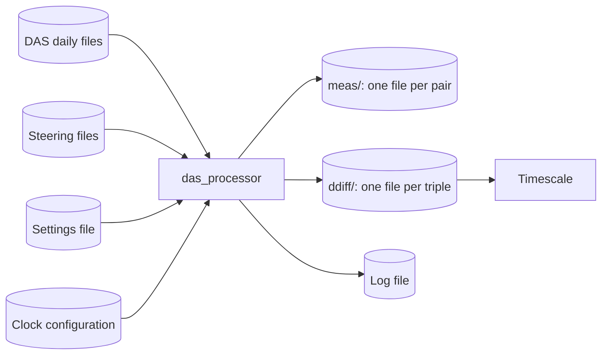

# das_processor user manual

**Date:** 2026-10-05 02:27:34 UTC

This manual tells you how to set up, run and look after `das_processor`, and how to read what it writes.
It assumes no knowledge of the project or of timekeeping; the [README](../../README.md) gives the subject in brief.
The [requirements](requirements.md) say what the program must do, and the [design](design.md) says how it does it.

## 1. What das_processor does

The laboratory's Data Acquisition System (DAS) compares every atomic clock with a few *reference* clocks once every ten minutes, and appends each reading to a daily file.
`das_processor` reads those files and, for every comparison, cleans up the readings, follows each clock with a small estimator, and writes one row every ten minutes to a file for that comparison.
A timescale is then built from those files.



## 2. Ideas you need first

| Idea | What it means here |
| --- | --- |
| Epoch | A ten-minute interval of UTC, starting at a mark such as 06:00, 06:10, 06:20. Every reading belongs to the epoch it was taken in, and every output row is for one epoch. |
| MJD | Modified Julian Day, the day count the DAS uses for times. MJD 60941.25 is 06:00 UTC on 23 September 2025; the fraction is the part of the day gone. |
| Reference | A clock other clocks are measured against, named `mc` and one digit. |
| RF channel | The DAS is built twice, as channels `a` and `b`. Each run of das_processor handles one channel, and the channels never share anything. |
| Pair (a, b) | Reference a measured against clock b. Its rows go to a *measurement file*. |
| Triple (r, s, c) | Clock c compared with reference r, through s, the reference in c's own building. Its rows go to a *double-difference file*, and are what the timescale reads. |
| Steering | A deliberate change made to a reference, logged in that reference's steering file, so das_processor can allow for it. |
| Building | Where a clock is. Triples are built only for clocks in the same building as their reference s, so every clock needs its building in the clock configuration. |

A run processes epochs in order, starting just after the last epoch its files hold, and stops at the end of the DAS data.
Run every ten minutes, it does one epoch each time.
Run after a long outage, it catches up through every epoch it missed.
Either way it writes exactly the same files.

## 3. Installing

You need Python 3.14 and [uv](https://docs.astral.sh/uv/).

```sh
git clone <repository> masterclock
cd masterclock
uv sync
uv run --frozen das_processor --version
```

`uv sync` builds the environment from the lock file, so every machine gets the same versions.
Run the program through `uv run --frozen das_processor` from the project folder, or point the scheduler at the project environment's `bin/das_processor`.
das_processor itself never depends on the folder it is started from: every path it is given must be absolute.

## 4. Configuring

A run needs two files:

1. a *settings file*, in INI format, saying where the data are and how to run;
2. a *clock configuration*, in YAML, saying what is known about each clock.

Keep both under `etc/` in the project folder, or anywhere else; only the `.example` files under `etc/` are part of the repository.

### 4.1 The settings file

Every setting can be given in the settings file, on the command line, or both; the command line wins.
A complete settings file, with invented paths:

```ini
[DAS]
rf = a
cd5m5m_path = /srv/das/cd5m5m
steering_path = /srv/das/steering

[PROCESSED]
processed_path = /srv/masterclock/processed/a
clock_config_file = /srv/masterclock/etc/clock_config.yaml
start_from_mjd = 60941.0
num_workers = None

[LOGGING]
log_file = /srv/masterclock/logs/das_processor_a.log
log_level = INFO
backup_count = 30
```

Every option of the command line, the settings-file entry it overrides, whether some source must give it, and whether it takes `None`:

<!-- generated: settings -->

| Flag | INI file entry | Required | Takes `None` | What it gives |
| --- | --- | --- | --- | --- |
| `--config-file` | command line only | no | no | path to the INI configuration file (optional when every required setting is given on the command line) |
| `--rf` | `[DAS] rf` | yes | no | RF channel to process, overriding the config file's [DAS] rf (default: use the config file) |
| `--cd5m5m-path` | `[DAS] cd5m5m_path` | yes | no | path to the DAS 5 MHz phase data, overriding the config file's [DAS] cd5m5m_path (default: use the config file) |
| `--steering-path` | `[DAS] steering_path` | yes | no | path to the directory of steering files, one per reference clock, overriding the config file's [DAS] steering_path (default: use the config file) |
| `--processed-path` | `[PROCESSED] processed_path` | yes | no | path for processed results, each kind of file in a subdirectory of its own, overriding the config file's [PROCESSED] processed_path (default: use the config file) |
| `--redo-from-mjd` | command line only | no | no | reprocess data starting from this MJD, before the run; command line only, with no config-file entry (default: no reprocessing) |
| `--start-from-mjd` | `[PROCESSED] start_from_mjd` | no | no | MJD to start processing from when there are no processed files to read a previous measurement from (floored to its ten-minute mark), overriding the config file's [PROCESSED] start_from_mjd (default: use the config file, else MJD 59500) |
| `--clock-config-file` | `[PROCESSED] clock_config_file` | yes | no | path to the YAML clock configuration (each clock's estimator parameters and location, the pairs' RMS limits, and the clocks to ignore), overriding the config file's [PROCESSED] clock_config_file (default: use the config file) |
| `--num-workers` | `[PROCESSED] num_workers` | no | yes | number of worker processes to work each epoch's series, overriding the config file's [PROCESSED] num_workers; pass None to work them in the main process alone (default: use the config file) |
| `--steps` | command line only | no | no | process exactly this many ten-minute epochs that write rows and shut down, instead of every epoch not yet processed; an epoch of a data gap that writes no row is not counted; command line only, with no config-file entry (default: process every new epoch) |
| `--log-file` | `[LOGGING] log_file` | yes | yes | path to the log file, overriding the config file's [LOGGING] log_file; pass None to disable file logging (default: use the config file) |
| `--log-level` | `[LOGGING] log_level` | yes | yes | logging level, overriding the config file's [LOGGING] log_level; pass None to disable logging entirely (default: use the config file) |
| `--backup-count` | `[LOGGING] backup_count` | no | yes | number of rotated daily log files to keep, overriding the config file's [LOGGING] backup_count; pass None to keep every rotated file (default: use the config file) |

<!-- end generated -->

The rules, which the program enforces:

- A required setting given neither in the file nor on the command line is a usage error: the program prints its full help and exits with status 2, naming what is missing.
- The literal `None`, spelled exactly so, means "no value" for a setting that takes it: no log file, no logging at all, no worker processes, or no limit on how many old log files are kept. `--log-file None` on the command line clears a log file the settings file gives.
- An option left off the command line takes the file's value.
- A section or entry the program does not read, a `[DEFAULT]` section, or a value spread over more than one line is refused, so a misspelt entry is never quietly ignored.
- Every path must be absolute.
- `%(entry)s` in a value is replaced by another entry of the same section; write `%%` for a single `%`.
- `start_from_mjd` matters only for a channel with no files yet: it is where the first run starts. Left out, it is <!-- figure: START_FROM_MJD -->59500<!-- end figure -->. A run starts at the first DAS data at or after it.
- `--steps` and `--redo-from-mjd` are command line only: they are ways of running the program once, and one left in the settings file would act on every scheduled run.

### 4.2 The clock configuration

The clock configuration tells das_processor, for each clock, how its estimator should behave and which building it is in.
`etc/clock_config.yaml.example` is a complete example with invented clocks; copy it and edit it.
Its parts:

```yaml
rejects_before_restart: 36
```

`rejects_before_restart` is the number of readings rejected in a row at which das_processor gives up on a series' estimate and starts it again from fresh readings.
It must be at least 3, and no more than any clock's `gap_limit`.

```yaml
rms_limit:
  default: 50
  references: {mc2: 40}
  pairs: {mc2.hm7: 80}
```

Each DAS reading comes with an RMS, the instrument's own measure of its noise, in picoseconds.
A pair's reading with an RMS over the pair's limit is rejected.
The limit is the pair's own (written `reference.clock`), else its reference's, else the default.

```yaml
types:
  maser:    {filter_states: 3, time_constant: 100.0, scale_time_constant: 50.0, initial_innovation_scale: 5.0, gap_limit: 432}
  cesium:   {filter_states: 2, time_constant: 30.0,  scale_time_constant: 50.0, initial_innovation_scale: 5.0, gap_limit: 432}
  mc:       {filter_states: 1, scale_time_constant: 50.0, initial_innovation_scale: 5.0, gap_limit: 432}
```

Each type gives the default estimator settings for its clocks:

| Setting | Meaning | Unit |
| --- | --- | --- |
| `filter_states` | 3 follows phase, rate and drift (masers); 2 follows phase and rate (cesium beams, rubidium fountains); 1 takes each accepted reading as it is (references) | — |
| `time_constant` | How many epochs the estimator averages over: larger is smoother but slower to follow the clock. Given for 2 or 3 states only, at least 1 | epochs |
| `scale_time_constant` | How many epochs the expected size of an innovation is averaged over, at least 1 | epochs |
| `initial_innovation_scale` | How large a one-epoch difference from the prediction is expected to be, when an estimate starts | ps |
| `gap_limit` | How many epochs an estimate may run on predictions alone before it can no longer be trusted | epochs |

Every reference must have the type `mc`.

```yaml
ignore: [gps9]

clocks:
  mc1:  [{type: mc, location: 3}]
  cs3:  [{type: cesium}, {effective_mjd: 60950.0, location: 7}]
  ox6:  [{filter_states: 2, time_constant: 60.0, scale_time_constant: 50.0, initial_innovation_scale: 5.0, gap_limit: 432, location: 9}]
  hm7:
    - {type: maser, location: 7}
    - {effective_mjd: 60980.0, time_constant: 150.0}
    - {effective_mjd: 61000.0, location: 3}
```

Each clock has a list of *entries*:

- The first entry gives the clock's type, and usually its `location`, the number of the building it is in. A clock that fits no type gives every setting itself in its first entry, with no type and no date, as `ox6` does.
- A later entry has an `effective_mjd`, and changes the settings it names from the first epoch at or after that MJD: a new time constant (`hm7` at MJD 60980), or a move to another building (`hm7` at MJD 61000). A later entry never gives a type and never changes `filter_states`.
- A clock with no `location` gets no triples.
- `ignore` lists clocks the DAS measures that are of no use. Their readings are left out with nothing logged.
- A clock the DAS measures that the file neither lists nor ignores is left out too, with a warning in the log when a run first sees it, and again whenever it comes back after an epoch without it.

The file is checked in full when a run starts, and a run never starts on a configuration it cannot use.
A repeated key, an unknown key, a type that is not defined, a reference not of type `mc`, a missing time constant and every other mistake listed in [design §15.2](design.md#152-clock-configuration) stop the run with a message naming the problem.

A changed time constant takes effect at its `effective_mjd`.
To apply a change to data already processed, reprocess from that MJD (§5.5).

### 4.3 Choosing each clock's settings

Good values of `time_constant`, `initial_innovation_scale` and `gap_limit` depend on how noisy each clock is.
`scripts/characterize.py` works them out from a *characterization run*: das_processor run over the data into a `processed_path` of its own, with every clock at `filter_states: 1`.
[Design §15.3](design.md#153-choosing-the-time-constants) describes the method.

```sh
uv run --frozen python scripts/characterize.py /srv/masterclock/characterization/a --rf a --three-state hm
```

It prints a line naming each field, then a line for each clock with a local triple, references left out: the references it used, the rows and days of data it used and dropped, the noise it fitted, and the suggested time constant, initial innovation scale and gap limit.

## 5. Running

### 5.1 The command line

<!-- generated: help -->

```text
usage: das_processor [-h] [--version] [--config-file PATH] [--rf {a,b}]
                     [--cd5m5m-path PATH] [--steering-path PATH]
                     [--processed-path PATH] [--redo-from-mjd MJD]
                     [--start-from-mjd MJD] [--clock-config-file PATH]
                     [--num-workers N] [--steps N] [--log-file PATH]
                     [--log-level {TRACE,DEBUG,INFO,WARNING,ERROR,CRITICAL,None}]
                     [--backup-count N]

Process 5 MHz phase measurements from the Data Acquisition System (DAS).

options:
  -h, --help            show this help message and exit
  --version             show program's version number and exit
  --config-file PATH    path to the INI configuration file (optional when every
                        required setting is given on the command line)
  --rf {a,b}            RF channel to process, overriding the config file's
                        [DAS] rf (default: use the config file)
  --cd5m5m-path PATH    path to the DAS 5 MHz phase data, overriding the config
                        file's [DAS] cd5m5m_path (default: use the config file)
  --steering-path PATH  path to the directory of steering files, one per
                        reference clock, overriding the config file's [DAS]
                        steering_path (default: use the config file)
  --processed-path PATH
                        path for processed results, each kind of file in a
                        subdirectory of its own, overriding the config file's
                        [PROCESSED] processed_path (default: use the config
                        file)
  --redo-from-mjd MJD   reprocess data starting from this MJD, before the run;
                        command line only, with no config-file entry (default:
                        no reprocessing)
  --start-from-mjd MJD  MJD to start processing from when there are no processed
                        files to read a previous measurement from (floored to
                        its ten-minute mark), overriding the config file's
                        [PROCESSED] start_from_mjd (default: use the config
                        file, else MJD 59500)
  --clock-config-file PATH
                        path to the YAML clock configuration (each clock's
                        estimator parameters and location, the pairs' RMS
                        limits, and the clocks to ignore), overriding the config
                        file's [PROCESSED] clock_config_file (default: use the
                        config file)
  --num-workers N       number of worker processes to work each epoch's series,
                        overriding the config file's [PROCESSED] num_workers;
                        pass None to work them in the main process alone
                        (default: use the config file)
  --steps N             process exactly this many ten-minute epochs that write
                        rows and shut down, instead of every epoch not yet
                        processed; an epoch of a data gap that writes no row is
                        not counted; command line only, with no config-file
                        entry (default: process every new epoch)
  --log-file PATH       path to the log file, overriding the config file's
                        [LOGGING] log_file; pass None to disable file logging
                        (default: use the config file)
  --log-level {TRACE,DEBUG,INFO,WARNING,ERROR,CRITICAL,None}
                        logging level, overriding the config file's [LOGGING]
                        log_level; pass None to disable logging entirely
                        (default: use the config file)
  --backup-count N      number of rotated daily log files to keep, overriding
                        the config file's [LOGGING] backup_count; pass None to
                        keep every rotated file (default: use the config file)
```

<!-- end generated -->

Run with no arguments at all, das_processor prints this help and exits with status 2.
Each option may be given once, and only under its full name.

### 5.2 Scheduled runs

In normal operation a scheduler starts das_processor for each channel every ten minutes, once the DAS has finished writing the epoch's readings:

```sh
das_processor --config-file /srv/masterclock/etc/das_processor.ini --rf a
das_processor --config-file /srv/masterclock/etc/das_processor.ini --rf b
```

Keep one settings file per channel, or one for both with `--rf` given on the command line, as above.
Both channels may share one `processed_path`: every file, lock and journal carries its channel's letter in its name.
A run that finds another run of the same channel still going stops at once, logs which process holds the lock, and exits with status 1; the next scheduled run carries on.

### 5.3 The first run of a channel

On its first run, a channel has no files.
das_processor makes `processed_path` and its `meas/` and `ddiff/` folders, and starts at `start_from_mjd`, or at the first DAS data after it.
Every series starts *dormant*: it gathers readings until three in a row agree, then starts its estimate.
So the first rows of each file carry the flag D, and the first accepted row carries A, N and, for a 2- or 3-state clock, U.

### 5.4 Catching up

After an outage, a run processes every epoch it missed, in order, up to the end of the DAS data.
This can take a while for months of data, and needs no special option.
To do it in parts, give `--steps N`: the run stops after N epochs that wrote rows.
Rows are written to the files a day at a time and flushed when the run stops. A catch-up stopped by a signal flushes its rows, and the next run goes on after them. One that fails or is killed after its first write leaves its journal, and the next run cuts every file back to before that run's first epoch and does its work again. Either way its files end exactly as an uninterrupted one's would.

### 5.5 Reprocessing from an MJD

```sh
das_processor --config-file /srv/masterclock/etc/das_processor.ini --rf a --redo-from-mjd 60950
```

`--redo-from-mjd` deletes every row at or after the epoch containing that MJD from every file of the channel, and then processes from there.
If it finds a damaged file whose last good row comes before that epoch, it deletes every row after that row instead, so the files stay in step.
Use it after changing the clock configuration for a past date, or after the DAS data for past days were corrected.
If a redo is interrupted, run the same command again: it finishes the deletion before it processes anything.
A redo is logged at INFO, with how many files it cut, deleted and left.

Pause the scheduler for that channel while a redo runs, then start it again: the redo holds the channel's lock, so every scheduled run in the meantime stops at once with the lock error and exit status 1.

### 5.6 Worker processes

For a long catch-up or a redo over years, `--num-workers N` spreads each epoch's series over N worker processes, giving the same files faster.
Starting workers costs more than they save for a run of one epoch, so leave `num_workers` out, or `None`, for scheduled runs.

```sh
das_processor --config-file /srv/masterclock/etc/das_processor.ini --rf a --num-workers 8
```

### 5.7 Stopping a run

Send the run SIGINT (Ctrl+C), SIGTERM or SIGHUP.
It finishes the epoch it is on, writes and flushes its rows, and exits with status 0.
A run killed outright, or one that loses power, is put right by the next run (§7.3).

### 5.8 Exit status

| Status | Meaning |
| --- | --- |
| 0 | The run finished: it reached the end of the data, did its `--steps`, or was asked to stop. |
| 1 | The run failed. The log says why, at ERROR. |
| 2 | A usage error, such as a required setting given by neither source or an option that does not exist. The help and the reason are printed. |

## 6. Reading the output

### 6.1 Where the files are

```
<processed_path>/
    meas/das_a.mc2.hm7.dat        one file per pair: reference mc2 measured against clock hm7
    ddiff/das_a.mc1.mc2.hm7.dat   one file per triple: hm7 against mc1, through mc2
    das_processor_a.lock            the run lock of channel a
    das_processor_a.writing         there only while a run has rows not yet flushed
```

A file's name gives its channel and its series, the names separated by dots.
The timescale reads the `ddiff/` files; the `meas/` files are kept for checking and for the program itself.

Never edit, copy over, or truncate these files, and read them only while the channel's lock is free, that is, while no run of the channel is going.
das_processor checks every file when it starts. When it finds one damaged, it cuts every file of the channel back to that file's last good row, or to the earliest such row when several are damaged, so the files stay in step, and computes the rows after it again.

### 6.2 What a file looks like

Every line of a file, header included, has the same width, so a file is easy to read with any tool that splits on `, `.

<!-- generated: line-widths -->

| File | Line width W (characters, newline not counted) | Header lines |
| --- | --- | --- |
| Measurement file | 477 | 33 |
| Double-difference file | 455 | 31 |

<!-- end generated -->

The header says what the file is and what every column holds:

<!-- generated: ddiff-header -->

```text
# das_processor double-difference file, format 1
# WARNING: do not modify this file. Only das_processor may write it; any other change damages the archive.
# RF channel a. Triple (mc1, mc2, hm7).
# Clock hm7 against remote reference mc1, through local reference mc2.
# One row per 10-minute epoch; '-' marks an empty field.
# Columns: right-justified, fixed width, separated by ', '.
#   interpolated_datetime   epoch start E, UTC
#   interpolated_mjd        epoch start E, MJD
#   z                       double difference dd at E, ps
#   innovation              innovation: z minus the prediction, ps
#   double_difference_sigma measurement sigma of dd, ps
#   components_used         components used: (s,c) (r,s) (s,r)
#   x                       estimated phase at E, ps, to the femtosecond
#   y                       estimated rate, ps/s
#   d                       estimated drift, ps/s^2; 0 for a 1- or 2-state estimator
#   innovation_scale        innovation scale, ps
#   segment                 segment number
#   step_offset             sum of phase steps in this segment, ps
#   epochs_in_segment       rows since the segment started
#   epochs_since_accept     rows since the last accepted measurement, not counting dormant rows that buffer a measurement
#   consecutive_rejects     consecutive counted rejects
#   reject1_mjd             reject buffer, oldest: epoch start, MJD
#   reject1_innovation      reject buffer, oldest: innovation, ps
#   reject2_mjd             reject buffer, middle: epoch start, MJD
#   reject2_innovation      reject buffer, middle: innovation, ps
#   reject3_mjd             reject buffer, newest: epoch start, MJD
#   reject3_innovation      reject buffer, newest: innovation, ps
#   filter_states           estimator states: 1, 2 or 3
#   time_constant           estimator time constant, epochs
#   scale_time_constant     innovation-scale averaging constant, epochs
#   flags                   A accepted, R rejected, X excluded, P predicted, D dormant, S slip corrected, N new segment, U unsettled
```

<!-- end generated -->

Then one row per epoch.
`-` marks an empty field.
These are the rows of a measurement file for an epoch with a reading and the next epoch without one, as das_processor writes them for the worked example in [design Appendix A](design.md#appendix-a-worked-epoch):

<!-- generated: worked-meas-rows -->

```text
2025-09-23 06:00:00+00:00,  60941.250000, 2025-09-23 06:02:17.203200+00:00,  60941.251588,  34579,    3,            6,          1234577,          1234574.457, +1.2301290523526430e-02, +7.1695154009743332e-12, +3.0000000000000000e+00,         4,                0,       812,         0,         0,             -,                       -,             -,                       -,             -,                       -, 3, +1.0000000000000000e+02, +5.0000000000000000e+01,        A
2025-09-23 06:10:00+00:00,  60941.256944,                                -,             -,      -,    -,            -,                -,          1234581.838, +1.2301294825235671e-02, +7.1695154009743332e-12, +3.0000000000000000e+00,         4,                0,       813,         1,         0,             -,                       -,             -,                       -,             -,                       -, 3, +1.0000000000000000e+02, +5.0000000000000000e+01,        P
```

<!-- end generated -->

The [design](design.md#54-measurement-file-output) lists every column of both kinds of file.
The columns most users want:

| Column | What it is |
| --- | --- |
| `interpolated_datetime`, `interpolated_mjd` | The epoch the row is for |
| `z` | The measurement, in ps, referred to the start of the epoch |
| `innovation` (triples) | The measurement less das_processor's prediction of it, in ps |
| `x`, `y`, `d` | The estimated phase (ps), rate (ps/s) and drift (ps/s²) at the start of the epoch |
| `innovation_scale` | How large an innovation is expected to be, in ps |
| `segment` | Which run of the estimator this row belongs to; it goes up each time the estimator starts again |
| `step_offset` | The phase steps accepted in this segment, in ps; x − step_offset is the phase free of steps |
| `flags` | What happened at this epoch (below) |

### 6.3 Flags

<!-- generated: flags -->

| Flag | Meaning |
| --- | --- |
| `A` | accepted |
| `R` | rejected |
| `X` | excluded |
| `P` | predicted |
| `D` | dormant |
| `S` | slip corrected |
| `N` | new segment |
| `U` | unsettled |

<!-- end generated -->

Every row carries exactly one of A, R, X and P:

- **A**: the reading was accepted and updated the estimate.
- **R**: the reading was too far from the prediction, or too noisy, and was rejected.
- **X**: the reading was set aside because another check found a fault in a reference or a slip of a whole period.
- **P**: there was no reading this epoch; the row holds the prediction.

The others are added to it:

- **D**: the series is dormant, with no estimate; x, y, d and innovation_scale are empty.
- **S**: the reading was a whole period out, and was put right.
- **N**: a new segment starts here.
- **U**: the estimator has not yet settled since the segment started.

A row is a usable measurement when its flags hold A and not U.

### 6.4 Gaps in a file

A series writes a row every epoch while it has an estimate, carrying the prediction through short gaps in its readings with P rows.
When its readings stop for longer than its `gap_limit`, it stops writing rows; when they come back, it starts again in a new segment.
So the files of a channel can end at different epochs, and a file can have gaps.
The log says when a series stops writing.

## 7. The log

### 7.1 What a log line looks like

```
2026-09-24 14:10:03.512 UTC, MJD 61307.590318 | INFO | masterclock.das_processor.run: epoch 2026-09-24 14:00:00+00:00: 29 pairs, 87 triples, 114 accepted, 2 held
```

Every line has the time in UTC and as an MJD, the level, the part of the program that wrote it, and the message.
A message always fits on one line.
The log file starts a new file at midnight UTC and keeps `backup_count` old ones.

### 7.2 Levels

`log_level` sets the least important level written.

| Level | What it shows |
| --- | --- |
| ERROR | Every failure, and each damaged output file |
| WARNING | Refused DAS lines, unknown clocks, rejected readings, reference faults, undecided slips, files cut back |
| INFO | Each epoch's counts, and every step, restart, dormancy, stop, configuration change, corrected slip and redo |
| DEBUG | Each series' flags at each epoch |
| TRACE | Each series' prediction and update; very large |

`INFO` suits routine operation; `WARNING` keeps the log small.

### 7.3 Messages and what to do

| Message | What it means | What to do |
| --- | --- | --- |
| `skipping <word> line … of …` | A DAS line was refused and left out; the word says why ([design §5.3](design.md#53-das-daily-files-input)) | Nothing, unless they are frequent; then look at the DAS |
| `clock … has no entry in the clock configuration: its measurements are ignored` | The DAS measured a clock the clock configuration does not list | Add the clock with its type and building, or list it under `ignore`; then reprocess if its past data matter |
| `… rejected: innovation … ps, scale … ps, … consecutive` | A reading was far from the prediction | Nothing; three that agree are taken as a step |
| `self-measurement of … failed`, `reciprocity of … failed`, `closure of link … failed` | A reference's measurements disagree with the others | Look at the reference's hardware if it repeats |
| `… phase step of … ps`, `… frequency step`, `… cold start`, `… dormant`, `… stops: no row until it is measured again` | The estimator followed a change in a clock | Nothing; worth a look if a clock does it often |
| `cut back the files of channel … after a write that stopped part way` | The last run stopped before flushing; the files were put back to before its first epoch | Nothing; the rows are computed again |
| `data file … is damaged …` | A file holds a line that is not a row das_processor wrote | Find out what changed the file; das_processor has cut every file of the channel back to that file's last good row, and computes the rows after it again |
| `cut back the files of channel … after damaged files, each logged at ERROR` | The files were put back to the last good row of a damaged file | Nothing more than for the damaged file above |
| `… has a damaged first row, so its rows cannot be placed in time` | A file's first row is not readable, or the file holds no whole row | Move the file aside and run again; its series starts afresh |
| `another run (pid …) already holds the run lock …` | A run of the same channel is still going | Wait for it to finish; the operating system frees the lock however a run ends, so it is never left behind |
| `these settings must be provided by the config file or the command line: …` | A required setting is missing | Add it to the settings file or the command line |
| `… bytes to write in …, only … free` | The disk is full; nothing was written | Free space; the next run carries on |
| `steering file …` followed by a problem | A steering file has a line that cannot be read, or is out of order | Correct the steering file; das_processor stops until it can trust it |
| `no cd5m5m data files found in …` | The data directory holds no DAS files | Check `cd5m5m_path` |

### 7.4 When a run stops on an error

Every failure is logged at ERROR, and the run exits with status 1.
A failure before the run's first write changes no file, and the next run tries again from the same place.
A run that failed, was killed or lost power after its first write leaves its journal, `das_processor_<rf>.writing`; the next run sees it, cuts every file back to before the epoch the journal names, and computes those rows again, so the files end exactly as if nothing had gone wrong.
Never delete the journal by hand.
A fault that persists stops the channel at that epoch until it is put right. A data file that holds no whole row, or whose first row is damaged, stops only its own channel; a bad steering line stops both, since they share the steering files.

## 8. Quick reference

| To | Do |
| --- | --- |
| Run one channel now | `das_processor --config-file FILE --rf a` |
| See every option | `das_processor --help` |
| Process at most N epochs that write rows | add `--steps N` |
| Reprocess from an MJD | add `--redo-from-mjd MJD`, with the scheduler paused |
| Catch up faster | add `--num-workers N` |
| Log to the terminal only | add `--log-file None` |
| Turn logging off | add `--log-level None`; an error in a setting or path is then printed on standard error, and any other failure shows only in the exit status |
| Stop a run cleanly | send SIGINT, SIGTERM or SIGHUP |
| Choose clock settings | `uv run --frozen python scripts/characterize.py RUN --rf a` on a characterization run |
