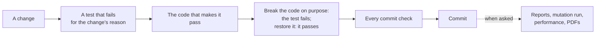

# masterclock test plan

**Date:** 2026-10-05 21:52:09 UTC

This plan says how masterclock is tested: what is tested, by which kinds of test, how the tests are laid out and named, which checks run on every commit and which are run by hand, and what a change must pass before it is committed.
The [das_processor design](das_processor/design.md#17-testing-and-verification) lists the program's own test cases, U1 onwards, and the reports in `docs/reports/` (§5) give the latest measurements.

## 1. What is tested

| Part | Where | Tested by |
| --- | --- | --- |
| The shared program code | `src/masterclock/app/` | Its tests in `tests/masterclock/app/` |
| The subject matter | `src/masterclock/domain/` | Its tests in `tests/masterclock/domain/` |
| das_processor | `src/masterclock/das_processor/` | Its tests in `tests/masterclock/das_processor/`, the design's test cases among them |
| The project's scripts | `scripts/` | Their tests in `tests/scripts/` |
| The tests themselves | `tests/` | Coverage of the tests, and each test module run on its own |
| The documents | `README.md`, `docs/` | `scripts/documents.py --check`: their generated tables and figures against the code, and their dates against git |

What the tests must show is in the [das_processor requirements](das_processor/requirements.md); the design's test cases are grouped by the part of the program they check, and its §17.1 says which cases hold each invariant.

## 2. Kinds of test

| Kind | What it does | Tool |
| --- | --- | --- |
| Example test | Gives chosen inputs and checks the exact result | pytest |
| Property test | Gives many generated inputs and checks a rule holds for every one, such as a row reading back as itself | Hypothesis |
| Doctest | Runs the example in a docstring and checks its printed result | pytest, `--doctest-modules` over `src`, `scripts` and `tests` |
| Round trip | Writes a value and reads it back, or formats a line and parses it, and checks nothing changed | pytest and Hypothesis |
| Same files every way | Runs das_processor in one go, one epoch per run, with a restart after every epoch, and with worker processes, and checks the data files are byte for byte the same | pytest |
| Recovery | Stops a run at every point it can stop, by an error, a kill or a lost flush, and checks the next run ends with the files an uninterrupted run writes | pytest |
| Deliberate break | Breaks the code on purpose and checks a test fails, then restores it and checks the tests pass | By hand, for every new check |
| Mutation run | Changes the code one small change at a time and checks a test fails for each | mutmut, by hand |



## 3. Rules for tests

- A feature or a fix starts with a test that fails for the reason the work exists.
- The test tree mirrors the source tree: `tests/masterclock/domain/test_filter.py` tests `src/masterclock/domain/filter.py`, and `tests/scripts/test_documents.py` tests `scripts/documents.py`.
- Each test module's docstring says which rules of its module it covers.
- Each test is named for the behaviour it checks, and its docstring says what it checks in a sentence; a test of one of the design's cases carries the case's identifier, such as U22.
- A new test says what gap it closes, and the break it is proved against is run on the whole suite, to show whether another test already caught it.
- Every test module passes when it runs alone, and in any order with the others; a test that changes something shared, such as the logging, puts it back.
- Tests use invented data only, made in a temporary folder; the only files of the repository a test may read as data are the committed `.example` files, to check them against the code.
- A skipped test is always reported by name, with its reason.
- A check is trusted only once it has been seen to fail on a deliberate break, one that still parses, run with bytecode writing off, and to pass again with the code restored.

## 4. Checks on every commit

Every commit runs every check below over the whole project, through the hooks in `.pre-commit-config.yaml`, and is refused when one fails.

| Check | What must hold |
| --- | --- |
| `uv lock --check` | The lock file matches `pyproject.toml` |
| ruff format | Every file is formatted |
| ruff check | No finding with the project's rule set; McCabe complexity at most 12 |
| mypy, strict | No type error in `scripts`, `src` or `tests` |
| bandit | No high-severity finding |
| radon and xenon | No block over rank B, no module or average over rank A |
| `scripts/check_docstrings.py` | A numpy docstring on every module, class and function |
| pytest with coverage | Every test, doctest included, passes |
| coverage of `src`, `scripts` and `tests` | 100% of lines and branches in each, apart |
| `scripts/check_test_modules_alone.py` | Every test module passes run alone |
| `scripts/documents.py --check` | The documents hold what the code gives, dated as git says |

To run them by hand:

```sh
uv run --frozen pytest
uv run --frozen pre-commit run --all-files
```

A result is judged from the exit status and the tool's whole summary, never from part of its output.

## 5. Checks run by hand

| Check | How | When |
| --- | --- | --- |
| Mutation run | `uv run --frozen mutmut run`, then `uv run --frozen mutmut export-cicd-stats` | When asked; each surviving mutant gets a test, when it would change behaviour someone could see, or its reason in the mutation report |
| Timing | `scripts/epoch_timing.py`, on the disk the real runs write to | When asked, and after a change that could slow a run |
| Reports | `scripts/reports.py . NAME…` writes the named reports in `docs/reports/` | When asked |
| PDFs | `scripts/pdfs.py . FOLDER --chrome PATH` | When asked; never committed |

The reports, each with its context, the measured block and what it means:

| Report | Measures |
| --- | --- |
| [Test and coverage](reports/test_coverage.md) | The test run and the coverage of each folder |
| [Formatting and linting](reports/formatting_linting.md) | ruff's findings and every suppression |
| [Security](reports/security.md) | bandit's findings at every severity |
| [Complexity](reports/complexity.md) | radon's ranks and xenon's result |
| [Performance](reports/performance.md) | das_processor's run times on the laboratory's numbers of clocks |
| [Mutation](reports/mutation.md) | The last mutation run and its surviving mutants |

## 6. When a change is done

A change is done when its tests were written first and failed for its reason, each new check was seen to fail on a deliberate break, every commit check passes, and every document says what the code now does, in the same commit.
